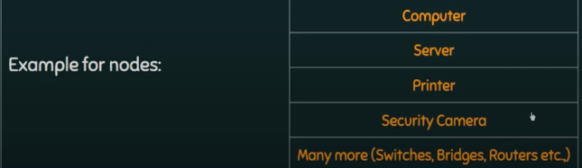
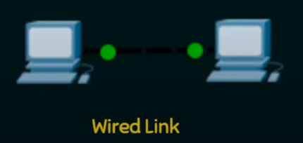
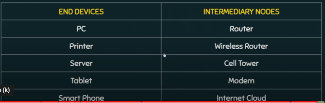
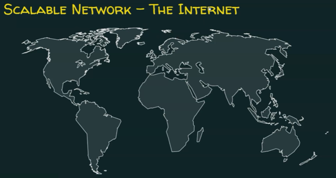
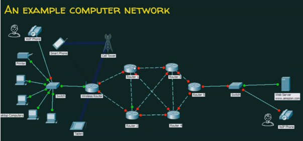
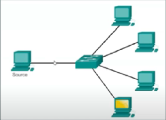
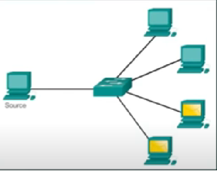
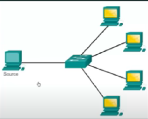

# Inleiding tot netwerken - Algemene begrippen

## Netwerken zijn alomtegenwoordig
Netwerken ondersteunen:
- Hoe we leren
- Hoe we communiceren
- Hoe we werken
- Hoe we 'spelen' (vrije tijd)

## Wat is een computernetwerk?
Een computernetwerk is een groep van twee of meer knooppunten (nodes) die met elkaar kunnen communiceren. De knooppunten (nodes) in kwestie zijn verbonden door communicatieverbindingen (communication links).

## Wat is een knooppunt (node)?
Een knooppunt (node) is een computer, printer of gelijk welk ander apparaat dat in staat is om gegevens (data) te zenden en/of ontvangen van/aan een ander knooppunt (node) in het netwerk.

## Voorbeelden van knooppunten?

## Communicatieverbindingen
Een communicatieverbinding (communication link) kan:
- een bedrade verbinding zijn (wired link)
- een draadloze verbinding zijn (wireless link)

De communicatieverbinding vervoert de gegevens (data)

## Eindapparaten en tussenapparaten
- We maken een onderscheid tussen eindapparaten (end devices) en tussenapparaten (intermediate devices).
- Eindapparaten (end devices) zijn bron of bestemming in de communicatie.
- Tussenapparaten (intermediate devices) geven gegevens (data) door.

Voorbeelden van eindapparaten (end devices) en tussenapparaten (intermediate devices):

## Basiskarakteristieken van een goed computernetwerk
Een computernetwerk moet het volgende bieden:
- Fault tolerance (fouttolerantie)
- Scalability (schaalbaarheid)
- Quality of Service (kwaliteit van dienstverlening)
- Security (beveiliging/veiligheid)

### Fault tolerance
Fault tolerance (fouttolerantie) is de mogelijkheid van een computernetwerk om: 
- Te blijven functioneren ondanks een defect
- De dienstverlening te blijven garanderen

### Scalability
Scalability (schaalbaarheid) is de mogelijkheid van een computernetwerk om:
- Uitgebreid te kunnen worden als de behoeften dit vereisen
- Goed te blijven presteren na een dergelijke uitbreiding

### Quality of Service (QoS)
Quality of Service is de mogelijkheid van een computernetwerk om:
- Om te gaan met prrioriteiten
- Gegevensstromen goed te beheren om gegevens verlies, vertragingen, ... te vermijden

Voorbeeld: VoIP Phone (Voice over IP Phone) heeft een prioriteit.

### Security
Security is de mogelikheid van een computernetwerk om:
- Ongeoorloofde toegang (unauthorized access) en misbruik (bijvoorbeeld hacking) te verhinderen
- Vertrouwelijkheid (confidentiality), integriteit (integrity) en beschrikbaarheid (availability) te garanderen

## Wat is datacommunicatie?
Datacommunicatie is de uitwisseling van gegevens (data) tussen twee knooppunten (nodes) langs een transmissiemedium zoals bijvoorbeeld een kabel.

## Data flow (gegevensstromen)?
Data flow betekent dat gegevens (data) stromen van een knooppunt (node) naar een ander knooppunt.

We onderscheiden drie types data flow:
- Simplex
- Half-duplex
- Duplex

### Simplex data flow
We spreken van simplex data flow als de gegevensstroom steeds in één richting verloopt (unidirectional). Één apparaat is de zender en een ander apparaat is de ontvanger.

Voorbeelden: 
- Computermuis
- Toetsenbord
- Beeldscherm

### Half duplex data flow
We spreken van half duplex als de gegevensstroom in beide richtingen verloopt, maar niet tegelijkertijd.

Voorbeeld:
- Walkie-talkies

### Full duplex data flow
We spreken van full duplex als de gegevensstroom in beide richtingen tegelijkertijd verloopt. Een toestel kan tegelijkertijd zenden en ontvangen.

Voorbeeld:
- Telefonie

## Waarom protocollen?
Zinvolle commmunicatie is maar mogelijk, als er duidelijke afspraken gemaakt worden. Dat geldt bijvoorbeeld in het dagelijkse leven bij communicatie tussen mensen.

Ook bij datacommunicatie moeten belangrijke afspraken gemaakt worden om zinvolle communicatie mogelijk te maken. 

Zo'n verzameling afspraken noemen we een protocol.

Een protocol bepaalt:
- Wat gecommuniceerd wordt
- Hoe het gecommuniceerd wordt
- Wanneer het gecommuniceerd wordt

## Protocollen
Afspraken bij communicatie tussen mensen in het dagelijkse leven:
- Wie wanneer het woord neemt
- Gemeenschappelijke taal
- Hoe snel en hoe luid we spreken
- Bevestiging dat de boodschap begrepen is

Afspraken bij datacommunicatie gaan over:
- De codering van berichten (message encoding)
- Formattering (formatting) en inkapseling (encapsulation) van berichten
- Timing van berichten (message timing)
- Grootte van berichten (message size)
- Opties inzake bezorging van het bericht (message delivery options)

### Message encoding

### Formatting en inkapseling
Message formatting en encapsulation:
- Afgesproken formattering
- Informatie inkapselen om de zender en ontvanger te kunnen identificeren

### Berichtgrootte (message size)
Berichtgrootte (message size):
- Lange berichten worden opgesplitst in kleinere stukken om over het netwerk vervoerd te worden.

### Message timing
Timing van berichten (message timing) houdt in:
- Flow control (controle over gegevensstroom): o.a. snelheid van verzenden, controleren of bericht aankomt
- Response timeout (hoelang wachten op ontvangstbevestiging)

### Message delivery options
Drie mogelijkheden:
- Unicast: één zender en één ontvanger
- Multicast: één zender en een set van ontvangers
- Broadcast: één zender naar alle deelnemers in het netwerk

#### Unicast

#### Multicast

#### Broadcast

---