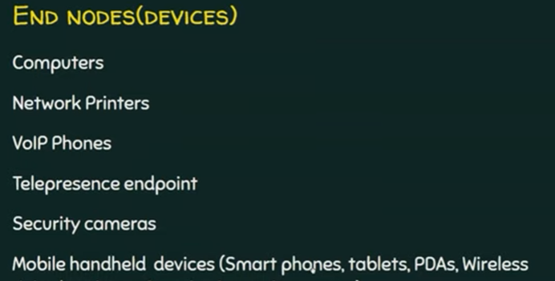
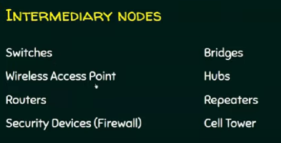
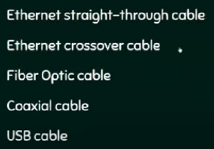
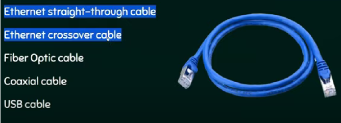
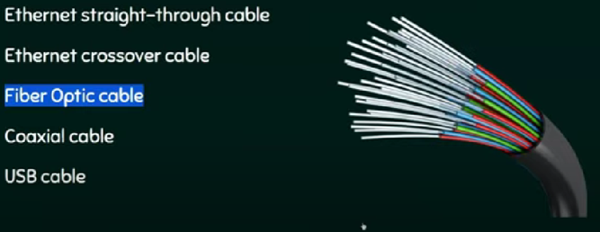
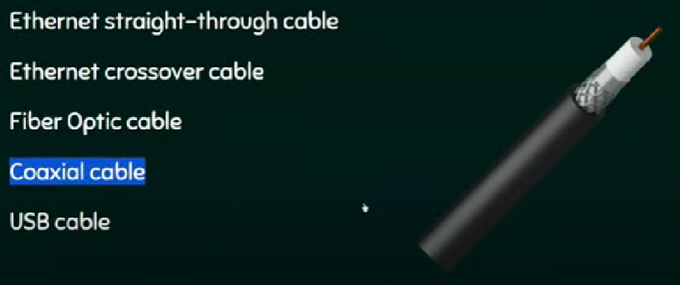
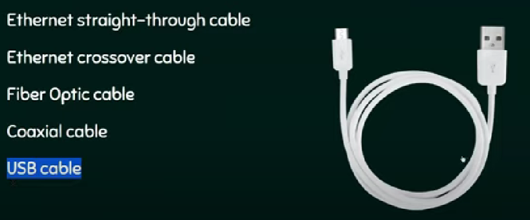
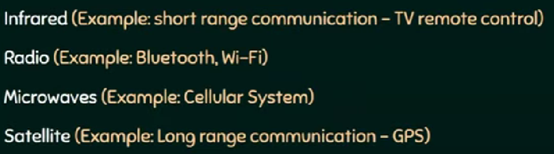

# Componenten van een computernetwerk

---

Een computernetwerk heeft volgende componenten:
- Knooppunten (nodes)
- Communicatieverbindingen (links)
- Services (diensten)

## Knooppunten
Knooppunen (nodes) kunnen gegevens (data) zenden en/of ontvangen:
- Eindknooppunten (end nodes) = Eindapparaten (end devices)
- Tussenknooppunten (intermediary node) = Tussenapparaat (intermediary device)

## Eindknooppunten (end nodes)
- Eindknooppunten (end nodes) zijn het startpunt of eindpunt van een communicatie.

## Tussenknooppunten (intermediary nodes)

## Communicatieverbindingen (links)
- Bedrade verbindingen (wired link)
- Draadloze verbindingen (wireless link)

## Bedrade verbindingen

## Ethernetkabels

- Ethernetkabels vervoeren elektrische signalen.

## Glasvezelkabels

- Glasvezelkabels vervoeren optische signalen.
- Snelste bedrade communicatie.

## Coaxiale kabels

- Vooral gebruikt voor audio- en videocommunicatie
- Vervoert elektrische signalen.

## USB-kabels

- Universial Serial Bus
- Verbinding van computer met smartphone
- Vervoert elektrische signalen

## Draadloze verbindingen

- De lucht is het transmissiemedium (i.p.v. kabel)
- De gegevens (data) worden omgezet in golven

## Services (diensten)
- Voorbeelden van diensten die kunnen worden aangeboden in een computernetwerk:

