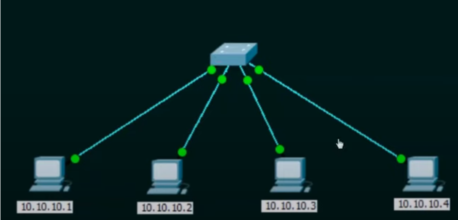
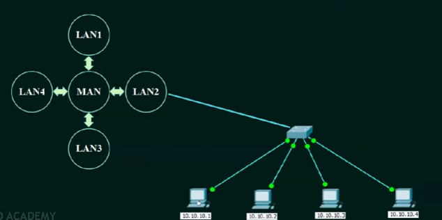
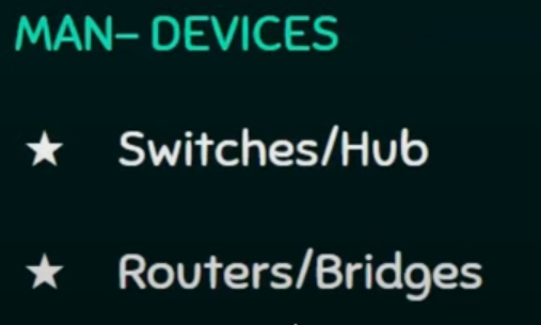
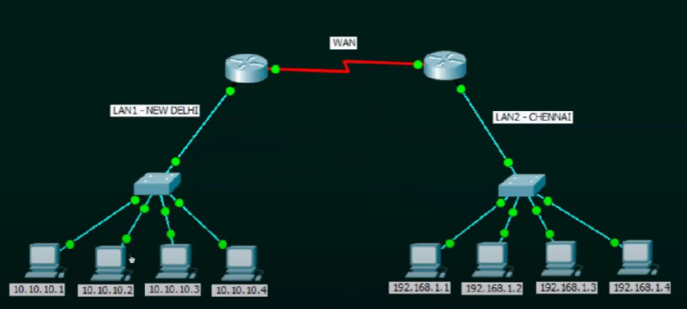
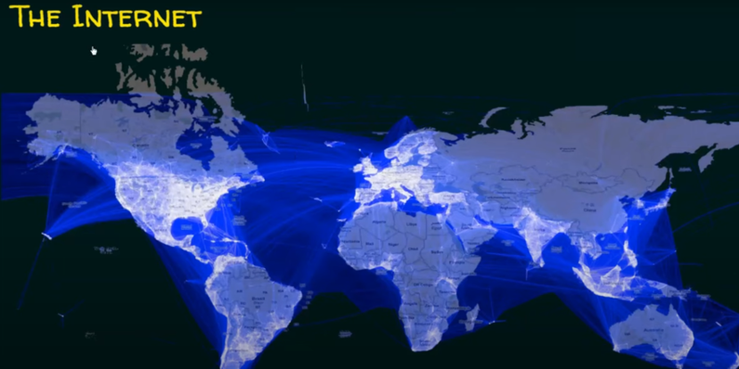
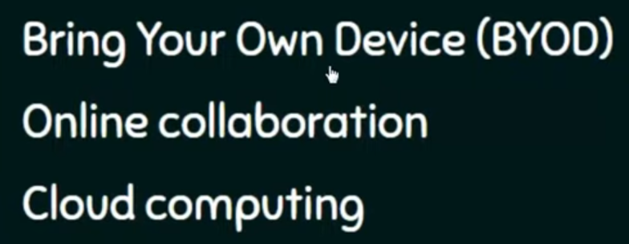

# Classificatie van computernetwerken

---

## Classificatie van computernetwerken (op basis van geografisch bereik)
- Klasse 1: LAN (Local Area Network)
- Klasse 2: MAN (Metropolitan Area Network)
- Klasse 3: WAN (Wide Area Network)

## LAN (Local Area Network)

- Definitie:
    - Een LAN is een computernetwerk dat computers verbindt binnen een gebouw campus of bedrijventerrein, zoals een woning, een appartementsgebouw, een school, een universiteits- of hogeschoolcampus, een ziekenhuis, een kantoorgebouw, ...

- Een LAN kan bedraad of draadloos zijn.

## MAN (Metropolitan Area Network)

- Definitie:
    - Een MAN is een computernetwerk dat computers verbindt binnen een (groot)stedelijk gebied. Vaak verbindt een MAN meerdere LAN's binnen een (groot)stedelijk gebied.

## WAN (Wide Area Network)

- Definitie:
    - Een WAN is een overkoepelend computernetwerk dat zich uitstrekt over een groot geografisch gebied (dat kan een land zijn, maar ook een continent of zelfs de ganse wereld).

- Typisch is een WAN een verbinding van meerdere LAN's en of MAN's.

- Een bank, inclusief haar filialen en geldautomaten, is een voorbeeld van een organisatie die een WAN gebruikt. De vestigingen kunnen zich in meerdere Amerikaanse staten of zelfs op mondiale locaties bevinden, maar ze zijn allemaal verbonden via verschillende beveiligde verbindingen. Zowel bankmedewerkers als klanten zijn gebruikers.

- Het internet is het voorbeeld bij uitstek van een WAN.

## Nieuwe trends binnen computernetworking

### BOYD (Bring Your Own Device)
- Tegenwoordig gebeurt het vaak dat werknemers, leerlingen, studenten, lesgevers hun eigen toestel (laptop of tablet) meebrengen naar kantoor of school, om deze aan te sluiten op het aanwezige bedrijfsnetwerk of schoolnetwerk. Dit noemen we BYOD (Bring Your Own Device).

### Online collaboration
- Bij online collaboration werken mensen samen aan projecten door gebruik te maken van digitale tools over een computernetwerk. Voorbeelden van dergelijke tools:
    - Microsoft Teams
    - Zoom
    - Google Classroom
    - Google Drive
    - Google Docs
    - ...

### Cloud computing
- Cloudcomputing of clouddienst is het via een netwerk, meestal het internet, op aanvraag beschikbaar stellen van hardware, software en gegevens. Het gaat hier vooral over het beschikbaar stellen van opslagcapaciteit (data storage) en computerkracht (computer power). De gebruiker hoef zich hierbij niet te bekommeren om het actieve beheer.

- Voorbeelden cloudcomputing
    - Op gebied van foto-opslag zijn er talloze bedrijven actief. Sites als Flickr en Picasa hosten bijvoorbeeld miljoenen digitale foto's. Gebruikers maken online fotoalbums door foto's rechtstreeks naar de cloud-servers van deze bedrijven te uploaden. Of neem YouTube, dat miljoenen door gebruikers geüploade videobestanden host. Daarnaast kun je ook denken aan sociale mediabedrijven als Facebook, waarbij door gebruikers geplaatste content in de cloud wordt opgeslagen.
    - Google Drive. Bij deze cloud computing-service kunnen gebruikers hun bestanden in de cloud opslaan. Vervolgen kunnen ze de bestanden bewerken met de bijbehorende cloud-apps, zoals Google Docs en Google Sheets. Je kunt Drive openen op je pc, maar ook op je tablet en smartphone. Voor die laatste apparaten bestaan er ook afzonderlijke apps voor onder meer Docs en Sheets. De meeste services van Google zijn trouens goede voorbeelden van cloud computing. Denk aan het eerder genoemde Gmail, maar ook aan Google Agenda en Google Maps.

---