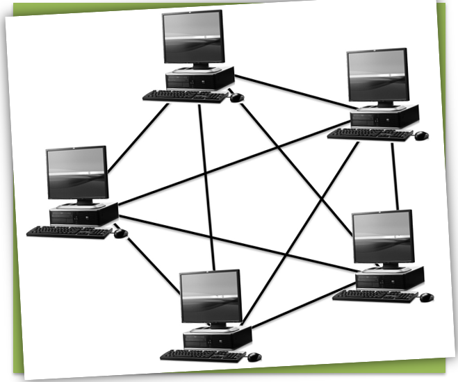
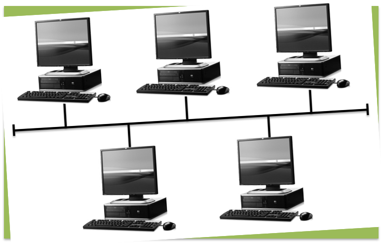
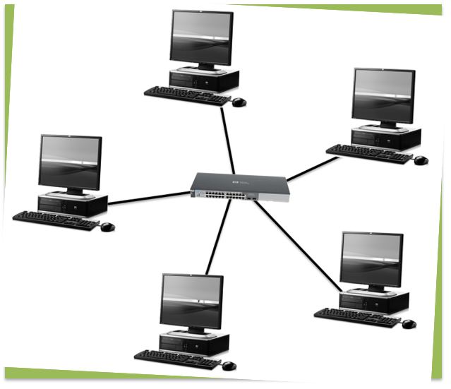
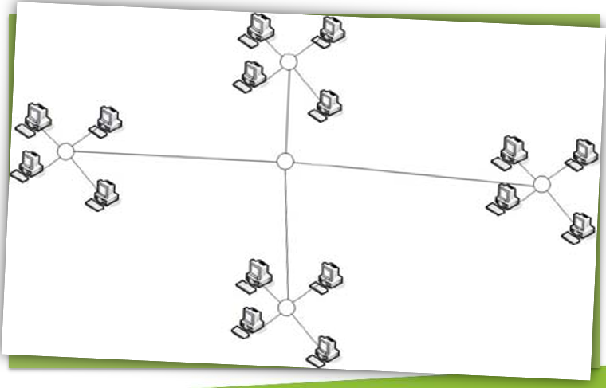

# Netwerktopologieën

---

Netwerktopologie = **De lay-out van een computernetwerk**

## Soorten netwerktopologieën
- Maastopologie (Mesh topology)
- Ringtopologie (Ring topology)
- Bus topologie (Bus topology)
- Stertopologie (Star topology)
- Hedendaagse netwerktopologieën

## Maastopologie (Mesh topology)

- Elke computer rechtstreeks verbonden met andere
- Indien geen rechtstreekse verbinding toch communicatie mogelijk via tussenliggende pc's
- Vergelijking: wegennet
- Centraal beheer = onmogelijk
- Niet geschikt voor lokale netwerken
- Wel voor verbindingen tussen netwerken

## Ringtopologie (Ring topology)

- Één verbinding van computer naar computer
- Doorgaans coaxiale kabel
- Elke computer ontvangt berichten en geeft door
- Enkel ontvanger leest het bericht effectief in
- Bericht wordt doorgegeven tot bij afzender
- Unidrirectioneel dataverkeer
- Actieve topologie
- Slechts één computer kan tegelijk zenden
- Hoe groter het netwerk, hoe groter de wachttijd
- Een defecte computer = netwerk plat
- Token passing ring-netwerk (gesynchroniseerd)
- Token wordt rondgestuurd
- Indien token vrij: zenden is mogelijk
- Bij niet-gesynchroniseerde netwerken: jitter
- Weinig stabiel  en nog zelden toegepast

## Bustopologie (Bus topology)

- Één verbinding van computer naar computer
- Weerstand aan begin en einde ("terminator")
- Bidirectioneel dataverkeer
- Passieve topologie
- Defecte computer legt niet hele netwerk plat

## Stertopologie (Star topology)

- Centraal netwerkverdeeldoos (hub / switch)
- Doorgaans UTP-bekabeling
- Passieve hubs: bericht naar alle computers
- Actieve switches: bericht enkel naar bestemming
- Hub of switch defect = hele netwerk plat
- Een computer defect: geen invloed op netwerk

UTP = **Unshielded Twisted Pair**

## Boomtopologie

- Boomtopologie / hiërarchische stertopologie

## Hedendaagse netwerktopologieën
- Maas-, ring- en busnetwerken zijn achterhaald
- Combinatie van netwerktopologieën:
    - Voorbeeld: ster-busnetwerk
    - Hubs met computes in ster daaromheen
    - Hubs verbonden in busnetwerk
- Fysieke en logische topologie kunnen verschillen

---