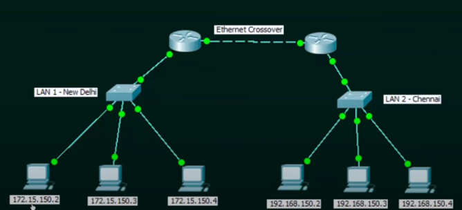
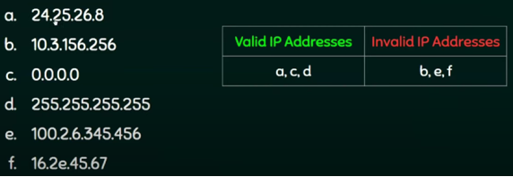

# IP-adressering

---

- IP staat voor **Internet Protocol**.
- Elk knooppunt (node) in het computernetwerk wordt geïdentificeerd met behulp van zijn IP-adres.

## IP-adres (IPv4)
- Is een logisch adres (niet in hardware ingebakken);
- Kan wijzigen op basis van de locatie
- Wordt manueel of dynamisch toegekend
- Wordt uitgedrukt in 4 decimale getallen (octets) gescheiden door een punt
- 0.0.0.0 tot 255.255.255.255

## Hoe het IP-adres van een pc opzoeken?
1. Druk op de Windows-toets en typ cmd om de opdrachtprompt (command prompt) te bekomen.

2. Typ ipconfig

## Geldige / ongeldige IP-adressen

---