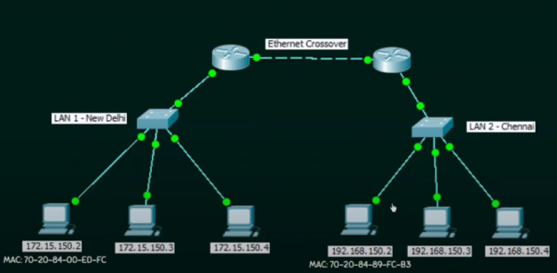
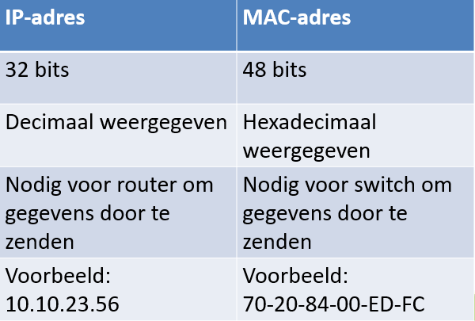
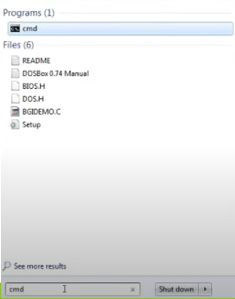
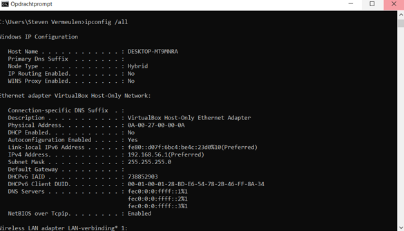

# MAC-adressering

---

- MAC staat voor **Media Access Control**
- Elk knooppunt (node) in een LAN wordt geïdentificeerd met behulp van zijn MAC-adres

## Elk knooppunt (node) in een LAN wordt geïdentificeerd met behulp van zijn MAC-adres

## IP-adres vs MAC-adres
- IP-adressen zijn 'router-vriendelijk'. Routers zenden pakketten door op basis van het IP-adres
- MAC-adressen zijn 'switch-vriendelijk'. Switches zenden pakketten door op basis van het MAC-adres

## MAC-adres
- Is een fysiek adres (wel in hardware ingebakken)
- Wordt toegekend door de fabrikant (wereldwijd uniek en niet wijzigbaar)
- Wordt uitgedrukt in 6 hexadecimale getallen, gescheiden door koppelteken (-), punt (.) of dubbelpunt (:)

## IP-adres vs MAC-adres

## Hoe het MAC-adres van een pc opzoeken?
1. Druk op de Windows-toets en typ cmd om de opdrachtprompt (command prompt) te bekomen. 

2. Typ ipconfig /all

---