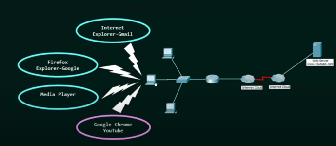
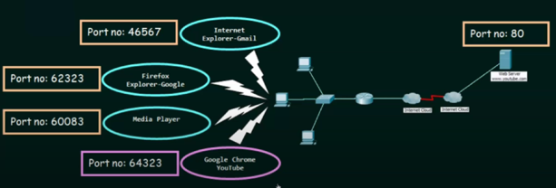
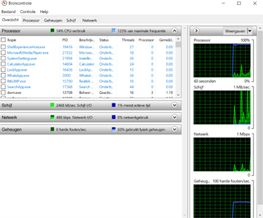
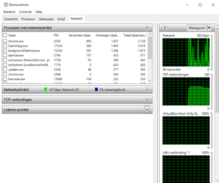
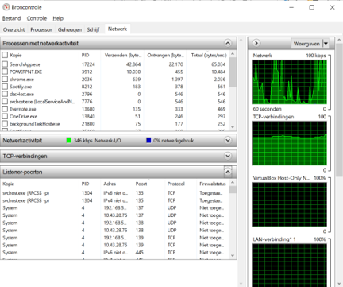

# Poort-adressering

---

## Poortnummer (port number)
- IP-adres en MAC-adres zorgen ervoor dat een bericht op de juiste pc terechtkomt
- Het poortnummer zorgt ervoor dat het bericht bij het juiste proces terechtkomt
- In een knooppunt kunnen heel wat processen actief zijn
- Gegevens moeten verzonden/ontvangen worden door het juiste proces
- Elk proces wordt geïdentificeerd door zijn poortnummer
- De poort is het eindpunt van de communicatie
- Er zijn vaste en dynamische poortnummers (0-65535)

## Poort-adressering (port addressing)

## Hoe de poortnummers op je pc opzoeken?
1. Druk op de Windows-toets en typ resmon en start resmon (resource monitoring, broncontrole) op 

2. Klik op het tabje Netwerk in de Broncontrole

3. Klik onderdeel Listener-poorten open.

## Conclusie
Als een knooppunt een bericht verstuurt, bevat dit bericht:
- IP-adres van bron en IP-adres van bestemming (nodig voor router)
- MAC-adres van bron en MAC-adres van bestemming (nodig voor switch)
- Poortnummer van bron en poortnummer van bestemming (nodig voor besturingssysteem)

---