# Trajet 2

---

## Vocabulaire

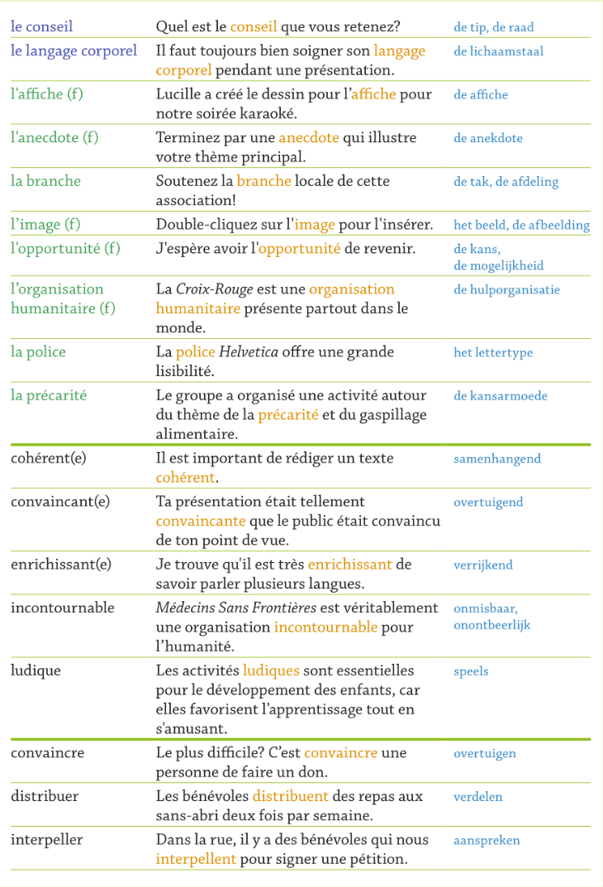

## Actes De Parole

## Grammaire
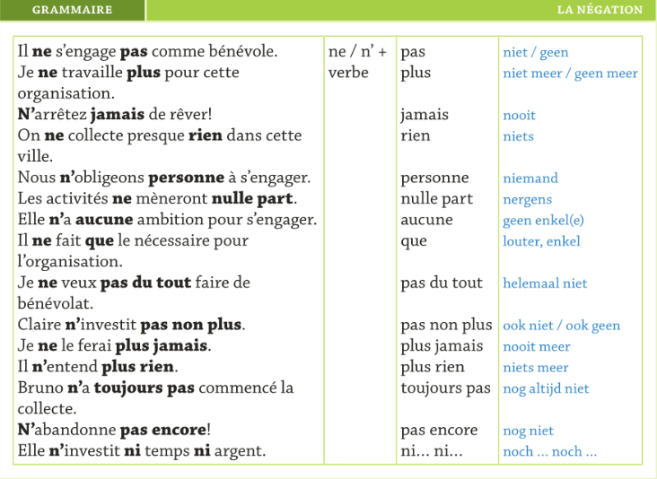

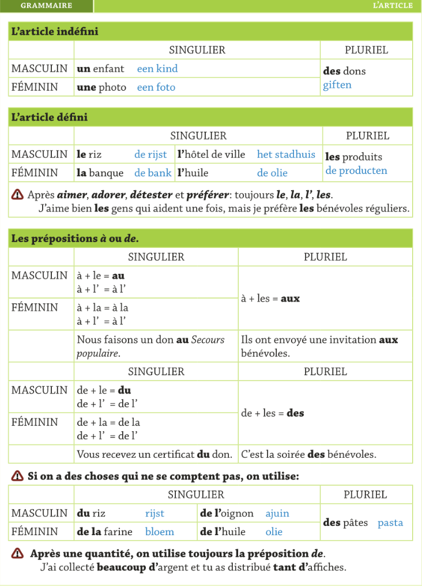

---

# Trajet 3

---

## Vocabulaire
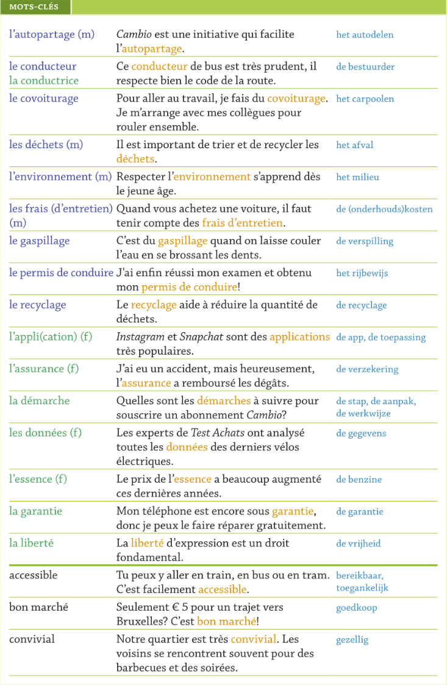
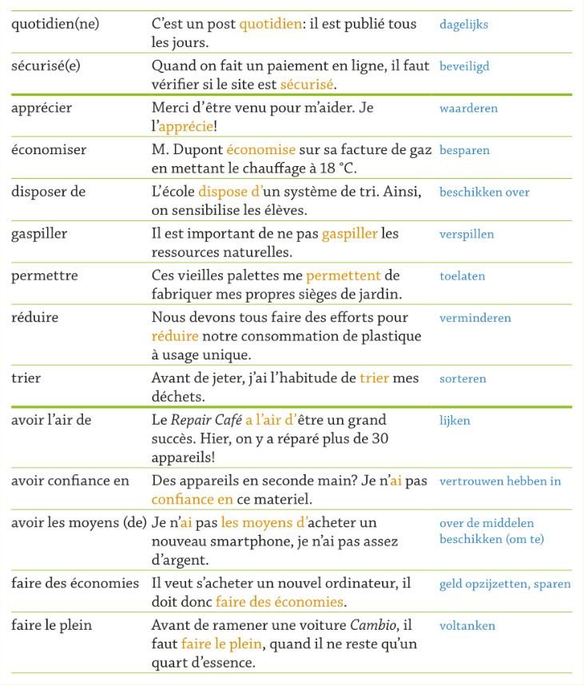
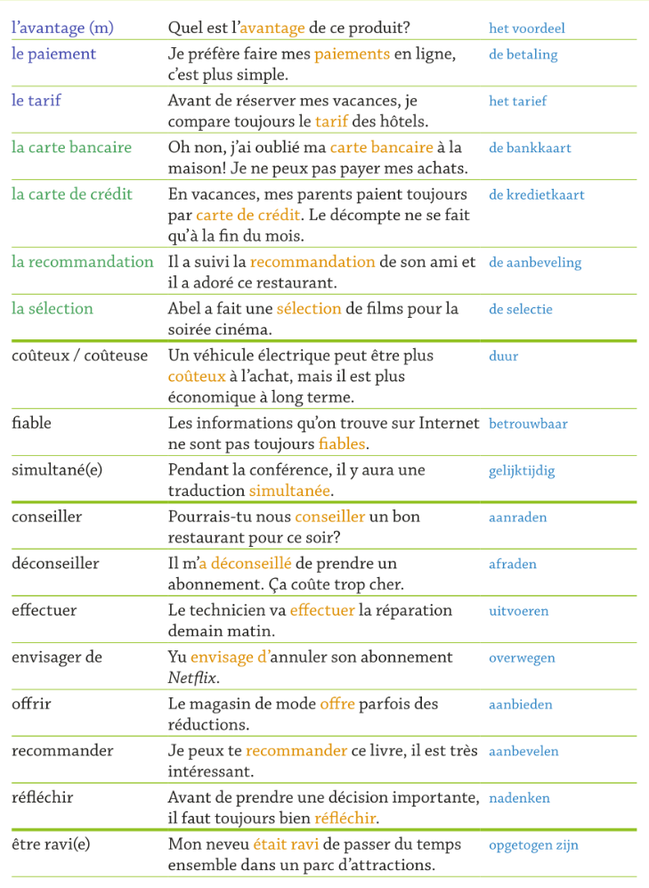

## Actes De Parole
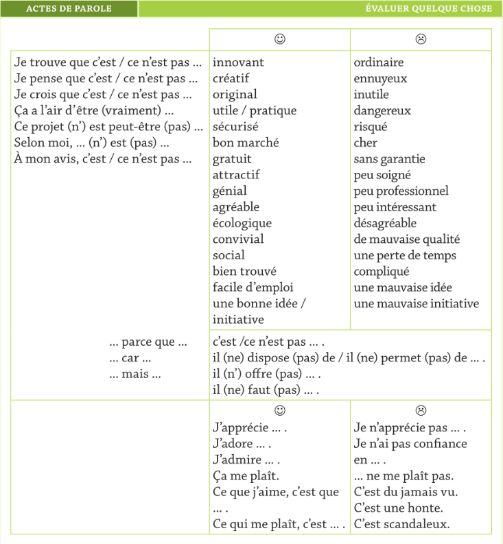
conseiller.png)

## Grammaire

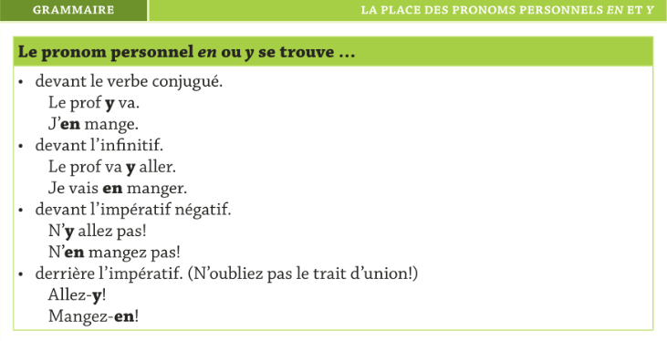

---

# Trajet 4

---

## Vocabulaire
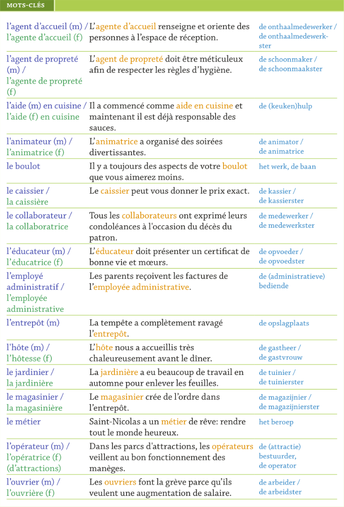

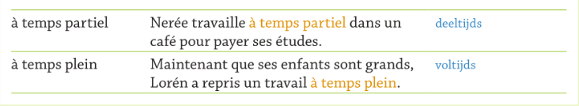

## Actes De Parole
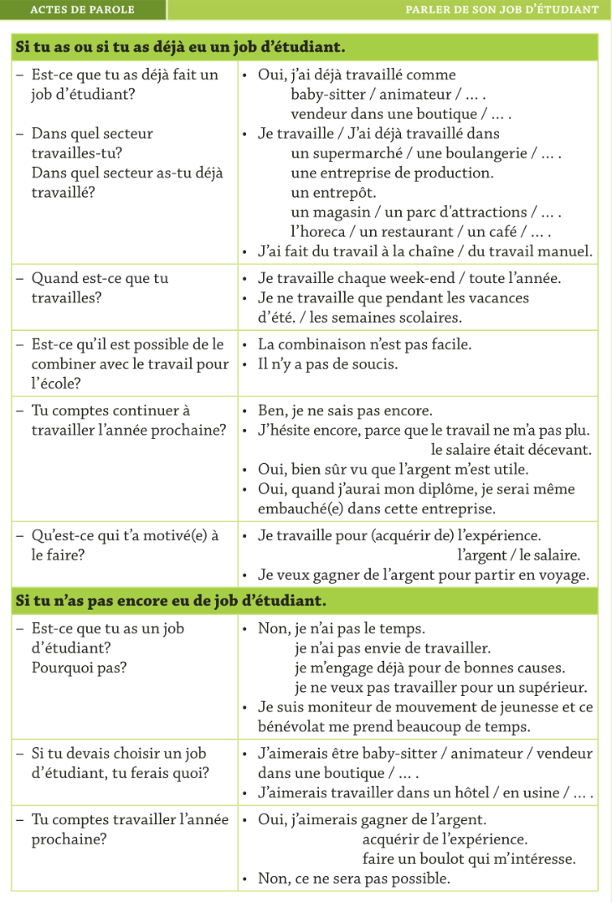

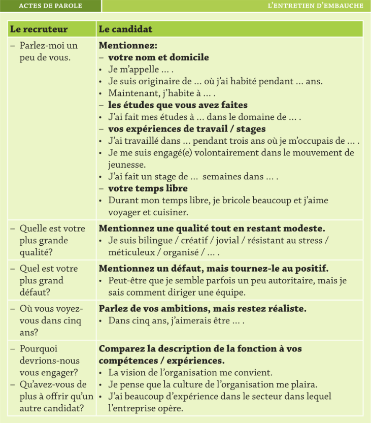

## Outils

---