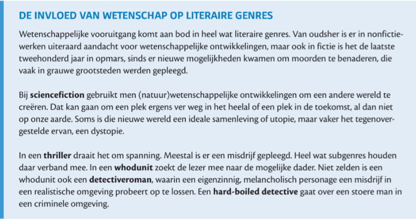
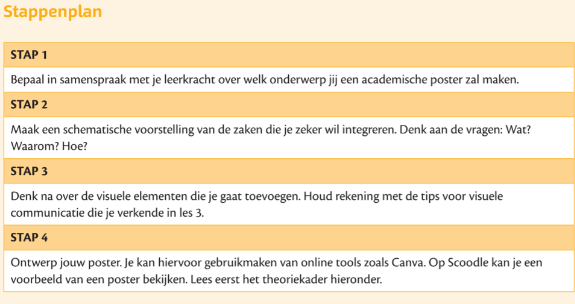
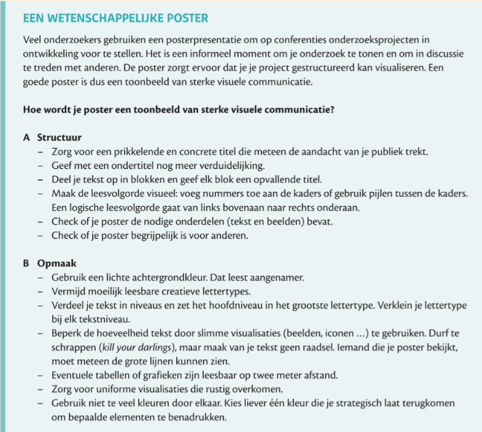
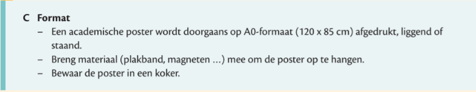
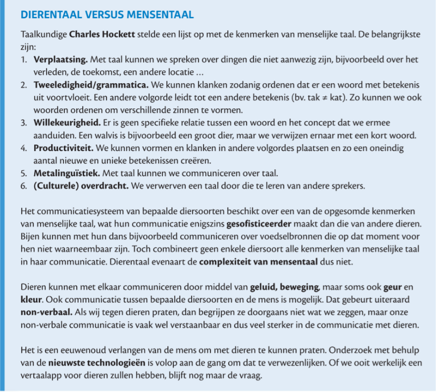

# Nederlands - Examen 2

## Deel 1 - Les 7 LitAtelier: wetenschap en literatuur

---

### Literatuur OVER wetenschap: sciencefiction

Sciencefiction ontstond onder invloed van **wetenschappelijke ontwikkelingen**.

- Het verhaal speelt zich af in een **wereld of heelal ver weg**, of in de **toekomst**.
- Auteurs gebruiken wetenschappelijke kennis om deze wereld op te bouwen.

> Voorbeeld: *Dune* — Frank Herbert

**Thema: klonen**

- Wetenschap is vandaag verder gevorderd dan vroeger: klonen van muizen én mensen gebeurt in een **gecontroleerde context** (er komt zelfs geen eicelmeer aan te pas).
- Ethische bezwaren:
  - Je creëert leven waarvan je weet dat je het voortijdig zal moeten afbreken.
  - Risico op een maatschappij met 'robots': baby's die voorgeprogrammeerd uit proefbuizen komen.

**Dystopie**

Een dystopisch verhaal verbeeldt een samenleving die op het eerste gezicht ideaal lijkt, maar in werkelijkheid beklemmend en onderdrukkend is. Kenmerken die terugkomen in sciencefiction én dystopie overlappen sterk.

---

### Literatuur OVER wetenschap: detectives

De detective als genre ontstond onder de impuls van nieuwe methodes in **politieonderzoek**.

- Spannend verhaaltype waarin een **misdrijf** centraal staat.
- Subgenres:

| Subgenre | Omschrijving |
|---|---|
| **Whodunit** | Op zoek naar de dader van het misdrijf |
| **Detectiveroman** | Een eigenzinnig, zonderling personage lost een misdrijf op |
| **Hard-boiled detective** | Het personage is een stoere, mannelijke antiheld |

**Voorbeeld: *De Moorden in de Rue Morgue* — Edgar Allan Poe (1841)**

- Beschouwd als het **allereerste detectieverhaal ooit**.
- Centraal mysterie: alle uitgangen van het huis zijn van binnenuit afgesloten, maar nergens is een moordenaar te bespeuren.
- Hedendaagse wetenschap die een rol kan spelen: vingerafdrukken, tandafdrukken, DNA-onderzoek, bloedsporen.

**Romantiek vs. realisme in het detectiveverhaal**

| | **Romantiek** | **Realisme** |
|---|---|---|
| **Kern** | Vlucht weg van de werkelijkheid | De harde realiteit wordt benadrukt |
| **Vluchtoorden** | Religie, drugs, dood, exotisme, verleden, nationalisme, onbereikbare liefde, fantasie, droomwerelden | — |

- De **detective** is een **romantisch personage**: hij vlucht in literatuur en verbeelding, is somber, woont in een afgelegen herenhuis en aanbidt de nacht en de duisternis.
- De **setting** (normaal Parijs) is **realistisch**: geen bovennatuurlijke elementen, het mysterie heeft een logische verklaring.

---

### Literatuur DOOR wetenschap: artificiële intelligentie

- **AI-tekstgeneratoren** kunnen een verhaal schrijven op basis van een instructie (prompt).
- Een tekstgenerator bouwt zinnen op basis van **kansberekening**: het resultaat varieert naargelang de vraag en de voorgaande woorden.
- Vraag: slaagt een tekstgenerator erin om **echte literatuur** te produceren?

**Literatuur OVER vs. DOOR wetenschap**

| | Uitleg |
|---|---|
| **Over wetenschap** | Het verhaal gaat inhoudelijk over wetenschappelijke thema's (bv. klonen) |
| **Door wetenschap** | Het verhaal is geschreven mét behulp van wetenschappelijke middelen (bv. AI) |

> Een door AI geschreven verhaal over klonen is zowel **door** wetenschap (geschreven door AI) als **over** wetenschap (het kloon-element als thema).

---

> **Samenvatting**
>
> Literatuur en wetenschap beïnvloeden elkaar op twee manieren. **Literatuur over wetenschap** gebruikt wetenschappelijke thema's als inhoud — denk aan sciencefiction (toekomstige werelden, klonen, dystopie) en de detective (politiemethoden, forensisch onderzoek). **Literatuur door wetenschap** wordt gecreëerd met wetenschappelijke middelen, zoals AI-tekstgeneratoren. Het detectiveverhaal combineert romantische personages met realistische settings. *De Moorden in de Rue Morgue* van Edgar Allan Poe (1841) geldt als het allereerste detectieverhaal.

---

## Deel 1 - Een wetenschappelijke poster

## Deel 2 - Verruiming lexicon: ecologie

### Woordenlijst

| Woord | Betekenis |
|---|---|
| **greenwashing** | Doen alsof een product of bedrijf goed is voor het milieu, terwijl dat eigenlijk niet (helemaal) zo is. |
| **duurzaamheidsclaims** | Uitspraken die zeggen dat iets weinig of geen schade doet aan het milieu en het klimaat. |
| **corebusiness** | Het belangrijkste werk van een bedrijf of organisatie. |
| **fossiele brandstoffen** | Vervuilende energiebronnen zoals aardgas, aardolie en steenkool. Bij verbranding komt er CO₂ vrij. |
| **energietransitie** | De overstap van vervuilende energie (zoals olie en gas) naar schone energie (zoals zon, wind en water). |
| **biologische landbouw** | Een manier van landbouw die goed is voor het milieu, de natuur en het welzijn van dieren. |
| **biodiversiteit** | Hoeveel verschillende planten, dieren en andere levende wezens er ergens voorkomen. |
| **genetisch gemodificeerde organismen (GMO)** | Planten, dieren of andere organismen waarvan het DNA kunstmatig is aangepast. |
| **rotatie van gewassen** | Elk jaar een ander gewas op hetzelfde stuk grond planten, zodat de bodem gezond blijft. |
| **landbouwareaal** | De totale oppervlakte van de grond die gebruikt wordt voor landbouw. |
| **klimaatrobuust** | Bestand tegen de gevolgen van klimaatverandering, zoals droogte of veel regen. |
| **precisielandbouw** | Landbouw waarbij technologie gebruikt wordt om gewassen en bodem heel precies te verzorgen. |
| **agro-ecologisch** | Landbouw waarbij rekening gehouden wordt met de natuur. |
| **proeftuin** | Een plek waar nieuwe technieken of ideeën uitgetest worden. |
| **percelen** | Stukken landbouwgrond met een duidelijke grens. |
| **resolutie** | Hoe scherp of gedetailleerd een beeld of gegevensbestand is. |
| **satellietdata** | Informatie die satellieten verzamelen, bijvoorbeeld over hoe gewassen groeien of hoe goed de bodem is. |
| **innovatief** | Vernieuwend; met nieuwe ideeën of technieken. |
| **Gemeenschappelijk Landbouwbeleid (GLB)** | De regels van de Europese Unie om landbouw efficiënter, duurzamer en klimaatbestendiger te maken. |
| **klimaatklevers** | Klimaatactivisten die zich vastplakken aan kunstwerken of gebouwen om te protesteren voor het klimaat. |
| **energietoerisme** | Naar een ander land reizen omdat energie daar goedkoper is, om zo een hoge energiefactuur thuis te vermijden. |
| **vliegschaamte** | Je schamen omdat je vaak vliegt, terwijl je weet dat dit slecht is voor het klimaat. |
| **klimaatarmoede** | Armoede die veroorzaakt of erger gemaakt wordt door klimaatverandering, bijvoorbeeld door duurdere energie en voeding. |
| **tegelwippen** | Tegels uit de tuin of straat halen en er planten voor in de plaats zetten, tegen wateroverlast en hitte. |
| **hoogtechnologisch** | Met heel geavanceerde technologie. |
| **geautomatiseerd productieproces** | Een productieproces dat door machines of computers wordt gedaan, zonder dat mensen moeten ingrijpen. |
| **automatisering** | Werk dat vroeger door mensen gedaan werd, laten overnemen door machines of computers. |
| **machinepark** | Alle machines die een bedrijf gebruikt om producten te maken of te verwerken. |
| **maritieme sector** | Alles wat met de zee en de scheepvaart te maken heeft. |
| **simulatortrainingen** | Oefenen in een nagemaakte omgeving die op de echte situatie lijkt. |
| **anatomie** | De wetenschap die bestudeert hoe het lichaam van mensen, dieren of planten in elkaar zit. |
| **veterinaire technieken** | Technieken die dierenartsen gebruiken. |
| **affiniteit** | Een natuurlijke interesse in of aanleg voor iets. |
| **stakeholders** | Alle mensen of bedrijven die met een organisatie of project te maken hebben, zoals werknemers, klanten en investeerders. |
| **exploitanten** | Personen of bedrijven die iets runnen om er geld mee te verdienen. |
| **helikopterzicht** | Het overzicht houden over een situatie, zonder te verdwalen in de details. |
| **hands-onmentaliteit** | Zelf actief aan de slag gaan, in plaats van alleen toe te kijken of te plannen. |
| **maintenanceafdeling** | De afdeling die de machines en installaties van een bedrijf onderhoudt. |
| **ploegenstelsel** | Een systeem waarbij verschillende groepen werknemers elkaar afwisselen, zodat een bedrijf altijd kan blijven draaien. |
| **monitoringsystemen** | Systemen die voortdurend gegevens verzamelen om iets in de gaten te houden. |
| **preventieve maatregelen** | Maatregelen die je vooraf neemt om een probleem te voorkomen. |
| **navigatie** | Bepalen welke weg of route je moet nemen om ergens te komen. |

## Deel 2 - Taalverandering: het Nederlands

---

### Nederlands vandaag: veelgemaakte taalfouten

| Fout | Correct | Regel |
|---|---|---|
| Jij bent groter *als* ik. | Jij bent groter **dan** ik. | Na een vergelijking: *dan* |
| Ik *noem* Kevin. | Ik **heet** Kevin. | *Noemen* = een naam geven aan iets/iemand anders |
| *Hun* hebben dat gedaan. | **Zij** hebben dat gedaan. | *Hun* is geen onderwerp |
| Hij *slaagde* per ongeluk zijn zus. | Hij **sloeg** per ongeluk zijn zus. | Verleden tijd van *slaan* = *sloeg* |
| *Moest* ik jou zijn, dan zou ik… | **Als** ik jou was, dan zou ik… | Hypothetische zin: *als* |
| Het meisje *die* ik zag. | Het meisje **dat** ik zag. | *Die* voor de-woorden, *dat* voor het-woorden |
| Hij was even groot *dan* zijn vader. | Hij was even groot **als** zijn vader. | Na *even … als*: *als* |
| *Kevin zijn* zus werkt als vroedvrouw. | **Kevins** zus werkt als vroedvrouw. | Bezitsvorm: -s, geen *zijn* |
| We moeten *afwas middel* kopen. | We moeten **afwasmiddel** kopen. | Samenstelling = aaneengeschreven |
| Ik zag *hun* vorige week nog. | Ik zag **hen** vorige week nog. | *Hen* als lijdend voorwerp |

---

### Taalnormen

Om communicatie in een taal vlot te laten verlopen, worden er regels en afspraken gemaakt: **taalnormen**. Overheden bestellen het opstellen ervan uit aan taalautoriteiten, zoals:

- **Taalinstellingen** (bv. de Taalunie)
- Academies
- Officiële taalcommissies

### Descriptieve vs. prescriptieve taalnormen

| | **Descriptieve taalnorm** | **Prescriptieve taalnorm** |
|---|---|---|
| **Wat?** | Beschrijft de taal zoals ze in de werkelijkheid wordt gebruikt | Schrijft voor hoe de taal *moet* worden gebruikt (do's & don'ts) |
| **Voorbeeld** | ANS (Algemene Nederlandse Spraakkunst) | Vroegere taalregels |
| **Wanneer?** | Vandaag de dag meer gebruikelijk | Meer in het verleden |

**Nut van taalnormen** (zowel descriptief als prescriptief):
- Zorgen voor **cohesie en consistentie** in de taal.
- Helpen anderstaligen om de taal te leren (**taalverwerving**).

### Taalverandering

Taal verandert onder invloed van het dagelijks gebruik. Wanneer veel mensen een taal op dezelfde manier gebruiken, kan dit een **blijvende verandering** worden.

> Bij *durven* vind je in het woordenboek van vandaag naast de oude vorm **dierf** nu ook de regelmatige vorm **durfde**. Mensen maakten fouten tegen de werkwoordsvervoeging, maar omdat die "fout" zo gangbaar werd, is ze nu de nieuwe norm.

---

### Nederlands in het verleden

#### Fragment 1: Oudnederlands

- **Waar gesproken:**
  - Nederland: voornamelijk Noord-Brabant en Nederlands Limburg.
  - België: in Vlaanderen en enkele stukken van het huidige Wallonië.
- **Hoe ontstond het?** Oud-Germaanse dialecten splisten zich af van de dialecten die de voorlopers waren van het huidige Duits.
- **Taalgrens in België gestabiliseerd:** in de **12de eeuw**. Tot dan spraken de meeste inwoners zowel Oudfrans als Oudnederlands. Er was zelfs een periode waarin ook Parijzenaren Oudnederlands spraken of verstonden.

#### Fragment 2: Middelnederlands

| Verschil met Oudnederlands | Uitleg |
|---|---|
| **Klinkers verdoft** | Geen klinkers meer in de tweede lettergreep — ze werden tot een doffe *e* |
| **Dubbele medeklinkers verdwijnen** | Zoals *heb-ban* en *al-la*: nog zichtbaar in spelling, maar niet meer afzonderlijk uitgesproken |
| **Naamvallen vallen samen** | Door de verdoffing vallen naamvallen samen en verdwijnen ze geleidelijk |

- **Gemeenschappelijk met West-Vlaamse dialecten:** klanken zoals *eeije* en *ooije*, en dubbele ontkenningen.

#### Fragment 3: Nieuwnerlands

| Verschil met Middelnederlands | Uitleg |
|---|---|
| **Nog meer naamvallen verloren** | Grammatica lijkt meer op het hedendaagse Nederlands |
| **Klanksysteem dichter bij ons** | De klanken lijken meer op ons huidige klanksysteem |

- **Geschreven standaardtaal:** ontstond in het **noordelijke deel van de Lage Landen** toen dat onafhankelijk werd in de **17de eeuw**; kreeg definitief vorm vanaf de **18de eeuw**.
- **Waarom klinkt Afrikaans als oud Nederlands?** Talen in overzeese gebieden zijn bevroren in de tijd. Afrikaans is een dochtertaal van het Nederlands — de eerste migranten kwamen aan in de **17de eeuw**.

---

> **Samenvatting**
>
> Het Nederlands van vandaag kent veel veelgemaakte taalfouten die soms zo gangbaar worden dat ze de nieuwe norm worden (bv. *durfde* naast *dierf*). **Taalnormen** — descriptief of prescriptief — zorgen voor cohesie in de taal. Het Nederlands heeft drie grote historische fases: **Oudnederlands** (taalgrens gestabiliseerd in de 12de eeuw), **Middelnederlands** (klinkers verdoft, naamvallen verdwijnen) en **Nieuwnerlands** (geschreven standaardtaal vanaf de 18de eeuw, Afrikaans als bevroren dochtertaal).

---

## Deel 2 - Les 4: (On)gehoorde taal: dierentaal

---

### De zes kenmerken van mensentaal (Hockett)

Volgens de Amerikaanse taalkundige **Charles Hockett** onderscheidt mensentaal zich van dierentaal door zes specifieke kenmerken:

| # | Kenmerk | Uitleg |
|---|---|---|
| 1 | **Verplaatsing** | Mensen kunnen praten over dingen die niet in het hier en nu zijn: het verleden, de toekomst of iemand die zich elders bevindt. |
| 2 | **Tweeledigheid / grammatica** | Taalelementen (klanken, woorden) kunnen op verschillende manieren geordend worden om een andere betekenis te krijgen. (*de hond bijt de man* ≠ *de man bijt de hond*) |
| 3 | **Willekeurigheid** | Er is geen logisch verband tussen de vorm van een woord en de betekenis. (*walvis* is puur een afspraak.) |
| 4 | **Productiviteit** | Met een beperkt aantal klanken en woorden kunnen mensen een oneindig aantal nieuwe zinnen produceren. |
| 5 | **Metalinguïstiek** | Mensen kunnen taal gebruiken om over taal zélf te praten (bv. de betekenis van een woord bespreken). |
| 6 | **Culturele overdracht** | Taal wordt aangeleerd via interactie met andere sprekers, niet via genen. |

---

### Welke kenmerken beantwoordt dierentaal aan?

| Diersoort | Kenmerk | Uitleg |
|---|---|---|
| **Bijen** | Verplaatsing | Ze communiceren over voedsel dat zich buiten de bijenkorf bevindt en dus niet onmiddellijk waarneembaar is. |
| **Dolfijnen** | Grammatica | Ze gebruiken een zekere vorm van grammatica wanneer ze met mensen communiceren. |
| **Krabben** | — | De communicatie van krabben beantwoordt aan geen enkel kenmerk van Hocketts lijst. |

> Dierentaal is vaak complex, maar voldoet **nooit aan alle zes kenmerken**. Het mist altijd minstens één — en het **totaalpakket** is puur menselijk.

---

### Hoe communiceren dieren?

| Manier | Voorbeelden |
|---|---|
| **Via geluid** | Honden (blaffen), vogels (fluiten), katten (blazen), mollen (ondergrondse trillingen) |
| **Via geur** | Mieren scheiden feromonen uit om de snelste weg naar voedsel te markeren; honden kunnen ruiken of een andere hond gezond is of bepaalde kankers heeft. |
| **Via kleur** | De kameleon verandert van kleur om zich te camoufleren en zijn gemoedstoelstand te tonen. |
| **Via beweging / houding** | Bijen dansen om de richting en afstand tot een voedselbron te duiden. |

---

### Communicatie tussen mens en dier

- Dieren (die met mensen samenleven) communiceren niet enkel met elkaar, maar ook met mensen — al gebeurt dat **non-verbaal**.
- Dieren zijn vatbaar voor onze non-verbale communicatie, die vaak **krachtiger** is dan onze verbale communicatie.
- Misverstanden tussen mens en dier ontstaan doordat de communicatie moeilijk correct te interpreteren is.

**Voorbeelden van pogingen tot talige communicatie:**

- **Stella** — een hond die via geluidsknopppen leerde "praten" met haar baasje.
- **Koko** — een gorilla die maar liefst **duizend gebaren** leerde om met mensen te communiceren. Haar taalgebruik bleef echter erg beperkt in vergelijking met dat van een menselijk kind.

> Mensen willen dieren begrijpen én willen dat dieren hen begrijpen. Door dieren 'talige' elementen aan te leren, zou de communicatie vlotter kunnen verlopen — maar of dat wenselijk is, blijft een ethische kwestie.

---

### Het Earth Species Project

Het **Earth Species Project** wil alle niet-menselijke communicatie ontcijferen met behulp van **artificiële intelligentie**. Ze proberen te achterhalen in welke omstandigheden dieren communicatiesignalen uitsturen, hoe ontvangende dieren reageren en welke signalen tot actie leiden.

- **Vergelijking:** Net als de steen van Rosetta de sleutel vormde tot het ontcijferen van Egyptische hiërogliefen, zou nieuwe technologie in de toekomst misschien dierentaal kunnen ontcijferen.
- **Kritiek** (Andrea Ravignani): het is een utopie om dierencommunicatie op één te één te vertalen naar menselijke taal. Taal bestaat uit verschillende componenten; er zijn parallellen tussen dieren- en mensentaal, maar het totaalpakket is puur menselijk.

---

> **Samenvatting**
>
> Mensentaal onderscheidt zich van dierentaal door de **zes kenmerken van Hockett**: verplaatsing, tweeledigheid/grammatica, willekeurigheid, productiviteit, metalinguïstiek en culturele overdracht. Dieren communiceren via geluid, geur, kleur en beweging, maar voldoen nooit aan alle zes kenmerken tegelijk. Communicatie tussen mens en dier verloopt voornamelijk **non-verbaal** en leidt soms tot misverstanden. Pogingen om dieren menselijke taal aan te leren (Koko, Stella) tonen dat dieren beperkte talige elementen kunnen oppikken, maar het totaalpakket van mensentaal nooit evenaren. Het **Earth Species Project** probeert met AI dierencommunicatie te ontcijferen, al blijft dat volgens critici een utopie.

---

## BZL: Tussenletters en tussenklanken

> **Samenvatting**
>
> Bij samenstellingen hoor je soms een extra klank tussen de twee delen: de **tussenklank**. Schrijf je die klank ook op, dan heet het een **tussenletter**. Er zijn drie tussenletters: **-e-**, **-en-** en **-s-**. Welke je gebruikt, hangt af van het meervoud van het linkerwoord of van wat je hoort bij het uitspreken.

---

### Wat is een samenstelling?

Een **samenstelling** is een woord dat bestaat uit twee of meer grondwoorden:

> fiets + bel = **fietsbel**

Soms hoor je bij het uitspreken een extra klank tussen de twee delen. Dit is de **tussenklank**. Schrijf je die klank ook op, dan spreken we van een **tussenletter**.

---

### De tussenletter -e- of -en-

Stel jezelf de vraag: **Heeft het linkerwoord een meervoud?**

| Situatie | Tussenletter | Voorbeeld |
|---|---|---|
| Geen meervoud | **-e-** | rijst → *rijstebrij* |
| Meervoud eindigt op **-en** | **-en-** | hond → honden → *hondenhok* |
| Meervoud op zowel **-en als -s** | **geen** tussenletter | vitamine → vitamines/vitaminen → *vitaminekuur* |

---

### De tussenletter -s-

De **-s-** hoor je vaak heel duidelijk bij het uitspreken.

> stad + wandeling = **stadswandeling**

**Tip bij een s-klank:** Soms is het moeilijk te horen of er een tussenletter -s- nodig is, omdat het linkerdeel al op een s eindigt of het rechterdeel met een s begint. Vervang het rechterdeel dan door een woord dat **niet** met een s begint (bv. *muts*) om te checken of de -s- erbij hoort.

> kok + school → vergelijk met kok + muts = **koks**muts (je hoort de s)  
> → dus schrijf je ook **koks**school (met dubbele s)

---

### Altijd -e- bij een werkwoord of bijvoeglijk naamwoord

Eindigt het linkerdeel op een **werkwoord** of **bijvoeglijk naamwoord**, dan schrijf je altijd de tussenletter **-e-**.

| Soort linkerwoord | Voorbeeld |
|---|---|
| Werkwoord | knarsen + tanden → **knarsetanden** |
| Bijvoeglijk naamwoord | rood + kool → **rodekool** |

## BZL: Woordtekens

### Trema

> **Samenvatting**
>
> Een **trema** is een woordteken dat je gebruikt om **klinkerbotsing** te vermijden en de leesbaarheid te verbeteren. Je plaatst het trema op de klinker waar een nieuwe klank begint. Het trema wordt gebruikt in drie gevallen: bij **samengestelde telwoorden**, bij **grondwoorden en afleidingen met klinkerbotsing**, en bij **meervouden van woorden die eindigen op -ie**.

---

### Wanneer gebruik je een trema?

#### 1. Grondwoorden en afleidingen met klinkerbotsing

Schrijf een trema op een klinker die anders klinkerbotsing kent met een voorgaande klinker.

| Voorbeeld | Uitleg |
|---|---|
| *reünie* | Trema op de **u**, want anders lees je *reunie* met de eu-klank (zoals in *reus*) |
| *geïnteresseerden* | Trema op de **i**, want anders lees je *ei* (zoals in *reis*) |
| *beïnvloedde* | Trema op de **i** na de *e* |

> **Regel:** Zet het trema daar waar in de klinkerbotsing de **nieuwe klank begint**.
> *Re-u-nie* → de **u** is de nieuwe klank na de *e*.

#### 2. Samengestelde telwoorden

Gebruik een trema wanneer er klinkerbotsing zou voorkomen in een samengesteld telwoord.

| Voorbeeld | Uitleg |
|---|---|
| *drieëndertig* | Trema op de tweede **e**, want anders lees je *drieendertig* |

> **Merk op:** Bij *76* (zevenenzeventig) is er geen klinkerbotsing, en dus ook geen trema.

#### 3. Meervouden van woorden die eindigen op -ie

Bij meervouden op **-iën** hangt de plaatsing van het trema af van de **klemtoon**:

| Klemtoon | Wat doe je? | Voorbeeld |
|---|---|---|
| Op de **laatste i** van het woord | Voeg **-ën** toe | *genie* → *genieën* |
| Op een **andere plek** in het woord | Trema op de **laatste e** van het woord + enkel **-n** | *bacterie* → *bacteriën* |

---

### Accenttekens

> **Samenvatting**
>
> Accenttekens gebruik je om de **juiste uitspraak** van een woord te bewaren, of bij woorden die nog sterk **Frans aanvoelen**. Er zijn drie Franse accenttekens: *l'accent aigu*, *l'accent grave* en *l'accent circonflexe*. Daarnaast bestaat er een **klemtoonteken** om woorden of klanken te benadrukken.

---

#### De drie Franse accenttekens

| Accentteken | Naam | Voorbeeld |
|---|---|---|
| **é** | L'accent aigu | *café*, *paté* |
| **è** | L'accent grave | *crème* |
| **ê** | L'accent circonflexe | *gênant* |

> Sommige termen krijgen meer dan één accentteken. In *crème brûlée* komen ze alle drie voor.

#### Het klemtoonteken

Het klemtoonteken lijkt op een accent aigu (´) maar heeft een andere functie: het benadrukt een woord of klank.

> *Ik solliciteer vól overgave.* — *sínd*s mijn geboorte

#### Wanneer schrijf je géén accentteken?

- Aan het **begin van een woord**.
- Wanneer het teken **niet nodig is** voor verduidelijking van de uitspraak.
- Zelfstandige naamwoorden die eindigen op een accent-e **verliezen het accentteken in hun verkleinvorm**.
- Woorden die in hun mannelijke vorm eindigen op accent-e **verliezen die in hun vrouwelijke nevenvorm**.

---

### Het koppelteken (-)

> **Samenvatting**
>
> Het koppelteken gebruik je om **leesverwarring te vermijden** of bij **klinkerbotsing**. Daarnaast schrijf je het in een reeks vaste gevallen, zoals bij samenstellingen met letters, cijfers, aardrijkskundige namen, of woorden als *ex-*, *niet-*, *oud-* en *non-*. Het **weglatingsstreepje** is een bijzonder gebruik waarbij je een herhaald deel weglaat in een opsomming.

---

#### Wanneer gebruik je een koppelteken?

**Reden 1 — leesverwarring vermijden**

> *reserve-ring* (niet: *reservering* dat anders als één woord wordt gelezen)

**Reden 2 — klinkerbotsing**

> *co-ouderschap*, *machine-effect*, *oma-advertentie*

---

#### Vaste gevallen met een koppelteken

| Geval | Voorbeeld |
|---|---|
| Samenstelling met een **letter, cijfer, teken of afkorting** | *A-attest*, *bso-opleiding*, *%-teken* |
| Samenstelling met een **aardrijkskundige naam** | *West-Vlaanderen*, *Noordoost-Limburg* |
| Samenstelling met **Sint, St., sint of st.** | *Sint-Niklaas*, *sint-bernardshond* |
| Samenstelling met **gelijkwaardige delen** | *thuis-schoolproblemen*, *neus-mondmasker* |
| Tweede deel geeft **meer informatie** over het eerste | *Antwerpen-Centraal*, *regering-Wilmès* |
| Samenstelling van een **reeks woorden** | *spring-in-'t-veld*, *doe-het-zelver* |
| Samenstelling met **ex-, niet-, non-, oud-, bijna-** | *ex-leerling*, *oud-student*, *niet-slagende* |
| Samenstelling met een **voorvoegsel + hoofdletter** | *on-Europees*, *mini-Jaguar* |

---

#### Het weglatingsstreepje

Wanneer een herhaald woord in een opsomming wordt weggelaten, blijft het koppelteken staan als **weglatingsstreepje**.

> ~~A-attest, B-attest of C-attest~~ → **A-, B- of C-attest**

---

### De apostrof (')

> **Samenvatting**
>
> De apostrof gebruik je in drie gevallen: bij **weggelaten letters**, bij het **meervoud of de bezitsvorm** van woorden die eindigen op een klinker (a, i, o, u, y na medeklinker), en bij **verkleinwoorden** die eindigen op -y (na een medeklinker).

---

#### 1. Weggelaten letters

| Voorbeeld | Uitleg |
|---|---|
| *'s avonds* | de + s van *des* weggelaten |
| *zo'n* | het *e* van *zo een* weggelaten |
| *A'dam* | letters weggelaten uit *Amsterdam* |
| *'t Is* | het *he* van *het* weggelaten |

#### 2. Meervoud of bezitsvorm

Woorden die eindigen op de klinkers **a, i, o, u of y** (na een medeklinker) krijgen een apostrof voor de **-s** van het meervoud of de bezitsvorm.

| Meervoud | Bezitsvorm |
|---|---|
| *oma's* | *Juliano's hoed* |
| *kiwi's* | *Matty's naam* |

#### 3. Verkleinwoorden op -y (na medeklinker)

Verkleinwoorden van woorden die eindigen op **-y** (na een medeklinker) krijgen een apostrof voor **-tje**.

| Met apostrof | Zonder apostrof |
|---|---|
| *golfbuggy'tje* | *cowboytje* (y na klinker) |
| *lolly'tje* | |
| *baby'tje* | |

---
