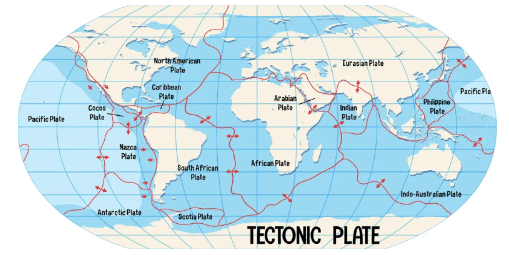
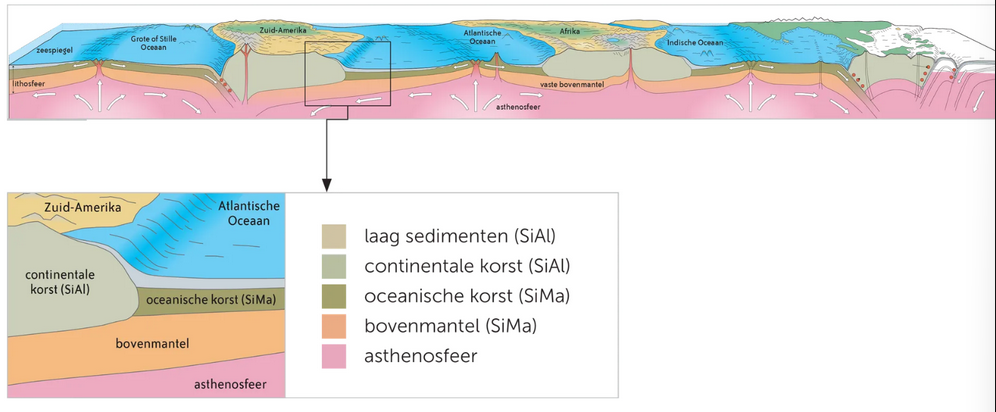
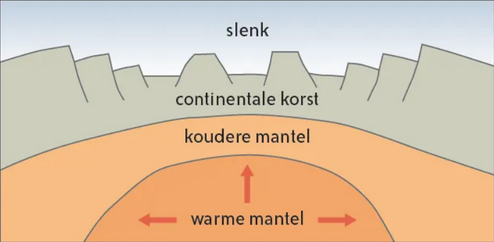
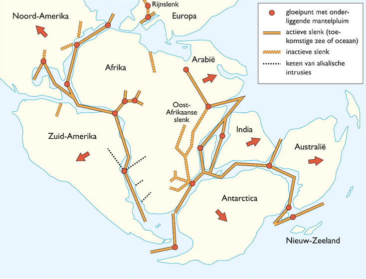
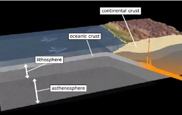
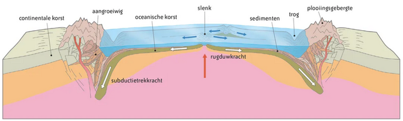

# Hoofdstuk 2 - Platentektoniek
## 1. Van continentendrift tot platentektoniek
### 1.1 Continentendrift
- Theorie van Alfred Wegener 🡪 continenten vormden ooit een geheel
    - Gelijkaardige planten en diersoorten aan beide kanten van de oceaan
    - Fossielen van uitgestorven dieren en planten zijn gelijkaardig
    - Continenten passen in elkaar qua vorm

### 1.2 Platentektoniek
- Vanaf +- 1960: Vervangt theorie van continentendrift 🡪 Ontdekking van mechanisme achter verplaatsende aardplaten
- Continenten drijven niet, maar de platen waarop ze liggen wel

## 2. De lithosfeer bestaat uit vele platen
Overzicht van de belangrijkste platen:

### 2.1 Het korstmateriaal van de platen is niet overal hetzelfde

**Lithosfeer** bestaat uit platen die horizontaal bewegen en een continentale en/of oceanische korst dragen
🡪 grote platen (Euraziatisch/Afrikaans) hebben continentale en oceanische stukken
🡪 Pacifische plaat enkel een oceanische korst

### 2.2 Ontstaan van verschillende platen
🡪 Hete stromen ontstaan aan de ondergrens van de mantel (3000 °C)
🡪 **Mantelpluimen** (opstijgend mantelmateriaal) 🡪 kunnen **hotspots/gloeipunten** veroorzaken dicht bij het aardoppervlak

A) Heet opstijgend materiaal duwt aardkorst omhoog en veroorzaakt breuken

B) Ontstaan breuksysteem met drie slenken (vb. Afar-driehoe bij Oost-Afrikaanse Slenk)

C) Slenk kan uitgroeien tot een oceaan als deze diep genoeg zakt (meestal maar 2 takken) 🡪 mantelmateriaal duwt lithosfeerplaten uit elkaar en zorgt voor ontstaan oceanische korst (bestaande uit basalt)

## 3. De theorie van de platentektoniek
### 3.1 Nieuwe Oceaanbodem ontstaat in de centrale riftvallei
🡪 Oudere oceanische korst beweegt weg en wordt vervangen door jonger gestold materiaal
= **zeebodemspreiding** 🡪 centrale rift wordt ook **spreidingsrug** genoemd
DUS: jongste materiaal = dichtste bij de rug

### 3.2 Oude oceaanbodem verdwijnt in diepzeetroggen
🡪 Oceanische korst verdwijnt bij **subductie** onder continentale korst (zwaarder) 🡪 ontstaan **diepzeetroggen**

### 3.3 NIET TE KENNEN
## 4. Beweging van de platen en soorten plaat randen
### 4.1 Opbouwende plaatranden
= Nieuwe aardkorst komt erbij en er ontstaat een jongere, steeds groter wordende oceaan

### 4.2 Afbrakende plaatranden
= Aardkorst verdwijnt (afhankelijk van de soorten platen)

#### 4.2.1 Botsing van continentale en oceanische plaat
- Oceanische plaat duikt onder continentale plaat
- Ontstaan van kustgebergte
- Aardbevingen in zone waar plaat wegduikt
- Smeltende plaat veroorzaakt vulkanen

#### 4.2.2 Botsing van twee oceanische platen
- Oudste oceanische plaat is zwaarder en gaat in subductie onder de andere plaat 🡪 ontstaan diepzeetrog
- Ontstaan van een keten van vulkanische eilanden  (vb. Japantrog en eilanden, Marianentrog en eilanden)
- Aardbevingen in de wrijvingszone tussen twee platen

#### 4.2.3 Botsing van twee continentale platen
- Continentale blokken (Afrika, India, Euazië) drijven mee op hun platen en bewegen naar elkaar toe
- Afschraping van oceaanbodem 🡪 sedimenten worden mee geplooid in plooiingsgebergte (vb. Himalaya)
- Aardbevingen als gevolg

### 4.3 Transforme plaatranden
= platen die naast elkaar bewegen in de tegengestelde richting
🡪 Ontstaan door dwarsbreuken
🡪 Zeer hevige aardbevingen

---