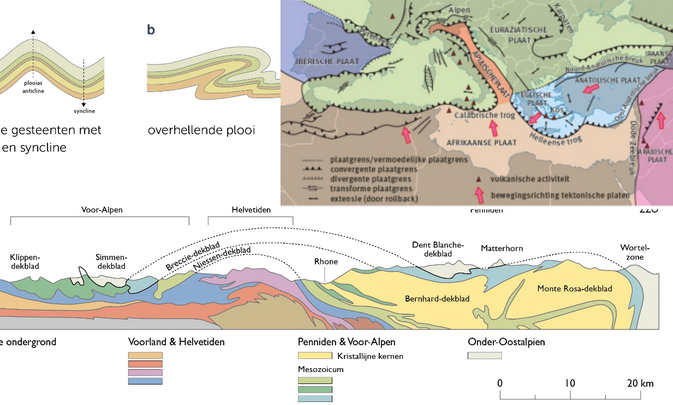
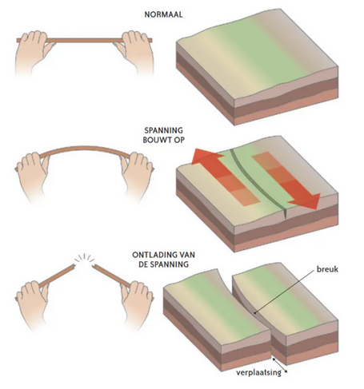
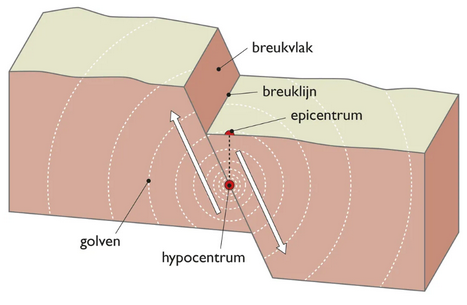
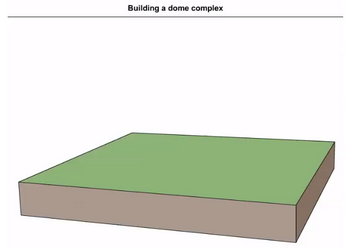
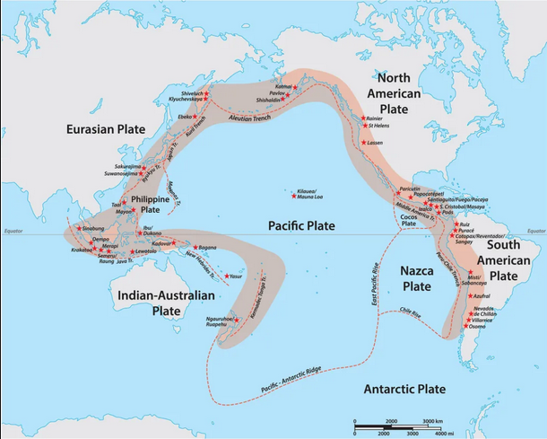

# Hoofdstuk 3: De gevolgen van platentektoniek
## 1. Vorming van plooiingsgebergten
Plooiing van sedimenten door botsing platen 🡪 hoge druk en temperatuur zorgt voor vervorming

Ontstaan:
- **Synclines**: plooidalen
- **Anticlines**: plooiruggen
🡪 Bij hogere druk kunnen lagen over elkaar schuiven 🡪 ontstaan dekbladen

Voorbeeld: Alpen

### Botsing van platen
- Continentale gebergtes
- Kustgebergtes

## 2. Aardbevingen en tsunami’s
### 2.1 Wat is een aardbeving
= trilling bij breken of verschuiven van
gesteentemassa’s

🡪 Volgt na jaren lange opbouw van
spanning

🡪 Nadien plotse ontlading

- **Hypocentrum** = plek onder het aardoppervlak waar aardbeving ontstaat
- **Epicentrum** = plaats op het aardoppervlak loodrecht boven hypocentrum

### 2.2 Registratie van aardbevingen
**NIET TE KENNEN**

### 2.3 De sterkte van een aardbeving (magnitude)
Schaal van Richter 🡪 dient om kracht
van een aardbeving uit te drukken

Logaritmische schaal (elke sprong is 10x)
MAAR: boven 7.0 niet meer correct

Nieuwe schaal = **seismische momentmagnitudeschaal**

### 2.4 Spreiding van aardbeving over de wereld
- Afbrekende platen = zwaardere aardbevingen dan opbouwende platen
- Dwarsbreuken/platen die langs elkaar schuiven 🡪 ook zware aardbevingen

### 2.5 Aardbevingen en Tsunami's
= Sterke aardbeving onder water
(zeebeving) 🡪 ontstaan reuzachtige
golven bij het bereiken van land
🡪 richt veel schade aan, aan kusten

## 3. Vulkanen
### 3.1 De relatie tussen de platentektoniek en vulkanen
- Ontstaan op 2 plekken 
    - Plekken waar onderdruikende plaat smelt
    - Hotspots

### 3.2 De opbouw van een vulkaan
- **Magma** = vloeibaar gesteente onder de grond
- **Lava** = vloeibaar gesteente dat de oppervlakte bereikt
🡪 Samenstelling van lava en manier van uitbarsting hangt af van oorsprong magma
🡪 Bij uitbarsten komen vrij
    🡪 kleine brokstukken en grote brokstukken
    🡪 vulkanische as (fijne materie)

### 3.3 Vulkaantypes - schildvulkaan

🡪 Ontstaan boven hotstpots onder oceanische kortst of boven spreidingsruggen

🡪 Magma rechtstreeks uit asthenosfeer = dun vloeibaar en basaltisch 🡪 stroomt snel en vormt vulkanen met kleine helling

🡪 Erupties: niet explosief

### 3.3 Vulkaantypes - stratovulkaan
🡪 Ontstaan boven hotspots onder continentale korst of waar een oceanische plaat onder een andere plaat schuift

🡪 Magma mengt zich met mineralen 🡪 dikkere lava waar gassen moeilijk uit ontsnappen

🡪 Erupties: krachtig explosief door ophoping gassen

🡪 Vooral Ring of Fire en bij hotspots onder continenten

🡪 Ring of Fire:

---