# Hoofdstuk 1 - Verwering en hellingsprocessen

## 1. Verwering

= Het afbreken of oplossen van gesteenten en mineralen ter plaatse aan het aardoppervlak

**NIET EROSIE**:
→ Erosie = oppikken van losse verweerde materiaal door
wind/water/ijs/...

3 soorten:

- Mechanische verwering
- Chemische verwering
- Biologische verwering

### 1.1 Mechanische verwering
= Het verbrokkelen en vergruizen van gesteenten waarbij er chemisch niet veranderd.
Veroorzaakt door → Verschillen in
temperaturen (tussen warm/koud)

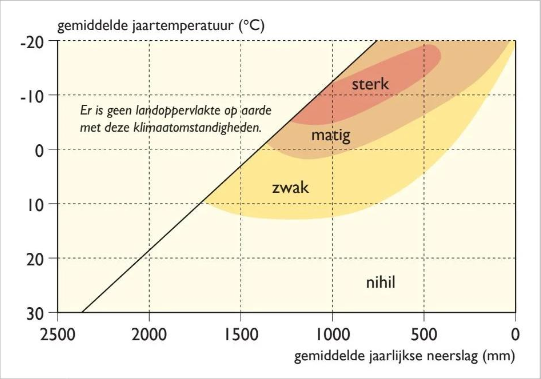

Vooral in Koude vochtige klimaten:

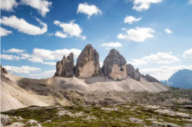

Vorstwering: bevriezen en smelten van water in barsten van gesteenten
→ Hierdoor brokkelt gesteente af

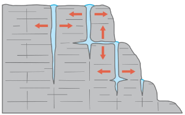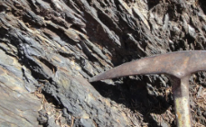

### 1.2 Chemische verwering

= Verwering waarbij de scheikundige samenstelling van de gesteenten veranderd. Dit vooral door stoffen die in het water opgelost zijn en een chemische reactie vormen met het gesteenten.

Klimaat: sterkst in warme en vochtige gebieden.

→ Amper in België

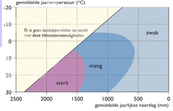

De twee meest voorkomende vormen van chemische verwering in België zijn:

- Oxidatie: ijzerhoudende mineralen gaan roesten door contact met zuurstof (vb. ijzerzandsteen)

- Carbonatie van kalksteenlagen: door zuur water met een hoog CO² gehalte lost kalksteen op. Er ontstaan barsten

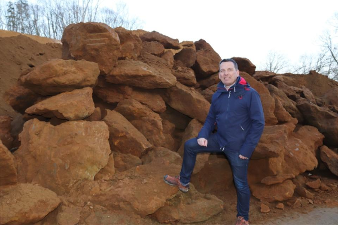
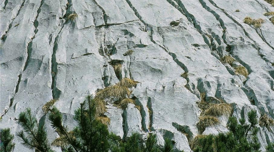

Ijzerzandsteen in de kerk van aarschot:

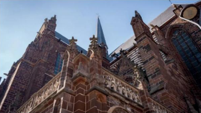

= Oxidatie gesteente met ijzer dat door aanraking met zuurstof roest.

### Karstverschijnselen door carbonatie van kalksteen
- Kalksteen (CaCO3) lost op door CO2-gas of plantenzuur in water →
  onstaan karstverschijnselen zoals grotten

- Soorten karstverschijnselen niet te kennen

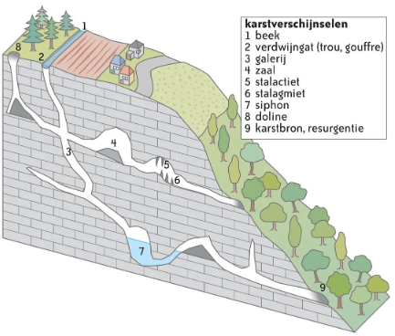

### Organische of biologische verwering
= verwering door inwerking van planten(wortels) of organismen. Hun groei wrikt zich in spleten waardoor gesteente breekt.

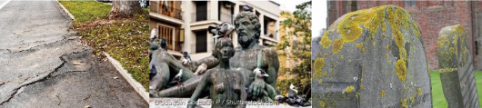

Voorbeelden:
- Uitwerpselen van dieren die gesteenten afbreken
- Korstmossen die door zuur gesteenten verweren.
- Plantenwortels die gesteenten openwrikken.

## 2. Hellingsprocessen
### 2.1 Massabewegingen
= verplaatsen van verweerd gesteente, enkel door zwaartekracht

**AFSTORTING: VALLEN**

→ Afbreken en vallen van harde
rotsen

→ Kan ook bij kliffen nabij water
gebeuren

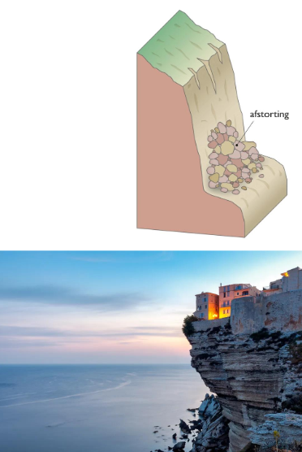

**AARDVERSCHUIVING: GLIJDEN**

→ Glijden van massa los materiaal over
verzadigde klei/leemgrond

→ aardverschuiving

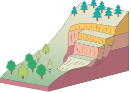

**BODEMKRUIP**

→ Los materiaal kruipt naar beneden (traag)

→ Zichtbaar door kromming in bomen of scheuren in huizen

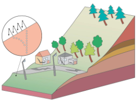

### 2.2 Afspoeling: vloeien
→ Druppels op onbegroeide bodems zorgt voor dichtslibben bodem.

→ Water stroomt over het land via oppervlakte en spoelt bodem weg 

→ ontstaan geulen en zelfs modderstromen

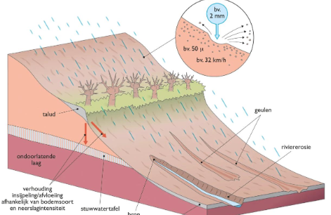

### 2.3 Menselijke activiteiten kunnen hellingsprocessen versnellen
**ONTBOSSING**

→ Weghalen bomen zorgt voor minder samenhouden van grond
door Wortels → spoelt makkelijker weg → minder infiltratie

→ **GEVOLG**: verschillende gebieden
worden minder vruchtbaar → moeilijker om aan landbouw te doen

**LANDBOUW**

→ Samendrukken grond door landbouwmachines

→ Minder infiltratie en afname vruchtbaarheid

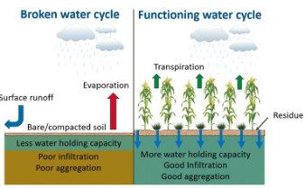

**BEBOUWING**

→ Druk op hellingen neemt toe

→ Instorting mogelijk bij wegspoelen grond onder de bebouwing

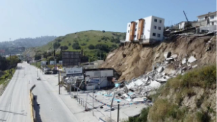

**MIJNBOUW**

→ Trillingen/explosies zorgen voor het instabiel worden van hellingen

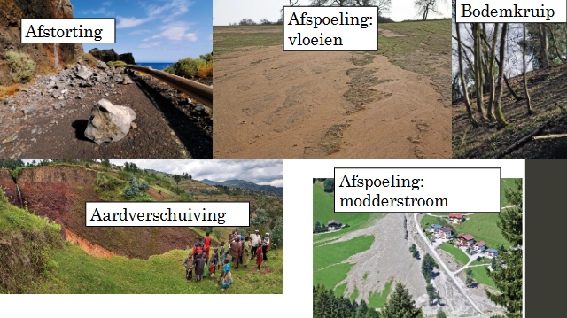

---