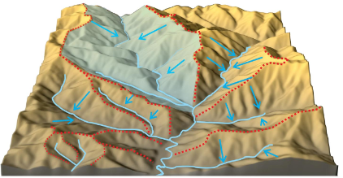
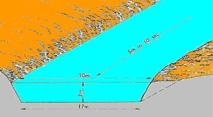
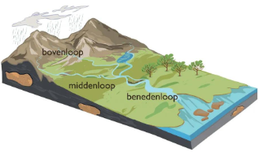
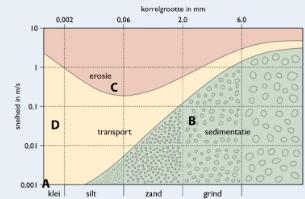
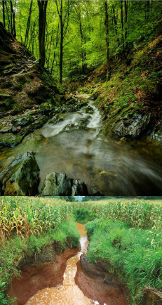
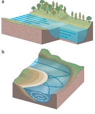
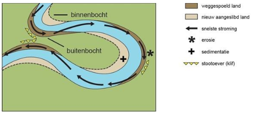
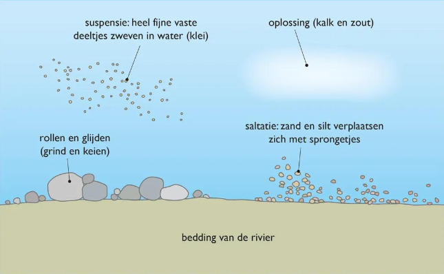
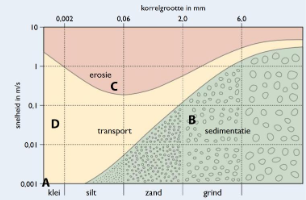
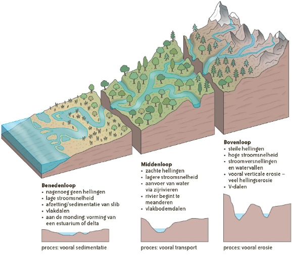

# Hoofdstuk 2 - De werking van stromend water
## 1. Het stroombekken van een rivier
- Water komt in geultjes terecht → beken → grotere rivieren

- **Rivier- of stroombekken** = oppervlakte dat door een rivier/bijrivieren gedraineerd **wordt**

- **Waterscheidingskammen** = grens tussen stroomgebieden

### De kracht van een rivier
- **Verval**: hoogteverschil over een bepaalde afstand in een rivier (in m of km) → hoe groter, hoe sneller → meer snijden in het reliëf/grotere kracht

- **Verhang**: gemiddeld hoogteverschil van een waterloop (meter verval/km)

- **Debiet**: de hoeveelheid water die doorheen een dwarsdoorsnede van een rivier stroomt. → afhankelijk van bodem, klimaat, vegetatie, ... → hoe groter hoe meer kracht

→ bovenloop: groot verhang en verval waardoor er veel meer verweerd gesteente vervoerd kan worden. 

De snelheid vertraagt in de middenloop en stroomt erg traag in de benedenloop

## 2. Rivierenprocessen: erosie, transport en sedimentatie
Erosie: **het oppikken van verweerde deeltjes**

Transport: **het meevoeren van verweerde deeltjes (zweven in het water)**

Sedimentatie: **het afzetten van verweerde deeltjes**

Wat bepaald of een rivier gaat eroderen, transporteren of sedimenteren?

**De stroomsnelheid van de rivier en de korrelgrote van het getransporteerd materiaal.**

### Verticale erosie
→ Snel stromend water neemt losse zanddeeltjes meet

→ Zanddeeltjes schuren vast gesteente los

→ Hellingen worden instabiel

→ Ontstaan **V-dal**

→ **Vooral in de bovenloop, hier stroomt het water sneller**

### Laterale erosie
→ Horizontaal eroderen door wegslaan van oevers en ondergraven van hellingen

→ Materiaal spoelt naar beneden en wordt opgepikt door rivier

→ **Ontstaan vlakbodemdal door verbreding V-dal**

→ Door erosie kan een rivier meanderen

→ **Buitenbocht**: rivier stroomt sneller, erodeert materiaal en schuurt oever uit

→ **Binnenbocht**: water stroom trager waar sediment wordt afgezet

→ **Vooral in middenloop**

### Transport
→ Middenloop gaat vooral transporteren (minder erosie en sedimentatie)

→ Deeltjes komen in rivier terecht door hellingsprocessen

### Sedimentatie
→ Grove deeltjes blijven liggen. Kleinere deeltjes worden afgezet naarmate de snelheid afneemt.

→ Selectieve sedimentatie: Hoe trager de rivier, hoe kleiner de deeltjes zijn die afgezet worden, er komt een scheiding van het vervoerde materiaal.

→ Benedenloop veel kleine deeltjes die afgezet worden (rivierslib)

→ Alluviale afzettingen: sedimenten die afgezet door water

→ Alluviale vlakte: smalle strook waar vruchtbaar slib afgezet is

### 2.4 Niet te kennen
### 2.5 Rivierprocessen veranderen het landschap

### 2.6 Niet te kennen