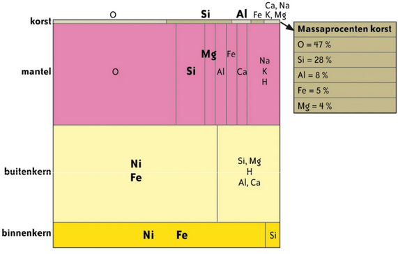
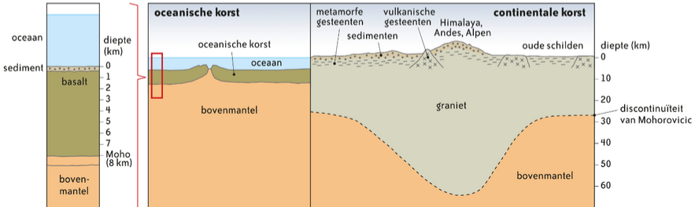

# Hoofdstuk 1 - De schilvormige opbouw van geosfeer

## 1. Informatie uit seismische golven

**NIET TE KENNEN**

## 2. De opbouw van de geosfeer

### 2.1 Indeling volgens fysische eigenschappen

**Geosfeer** = zijn de lagen vast/vloeibaar/plastisch

1. **Lithosfeer**(gesteentelaag):korst en bovenste deel van de mantel (tot 70-125km) bestaande uit vast gesteente
2. **Asthenosfeer**: stijging temperatuur (1280°C) waardoor gesteente plastisch wordt en stroomt
3. **Mesosfeer**: door hoge druk kan materiaal niet smelten 🡪 vaste laag
4. **Buitenkern**: vloeibare kern 🡪 zorgt voor magnetisch veld aarde (vanaf 2900 km)
5. **Binnenkern**: vaste kern door grote druk (vanaf 5100 km) vooral bestaande uit nikkel en ijzer

### 2.2 Indeling volgens chemische eigenschappen
- **Korst**: bovenste laag bestaande uit silicium en aluminium (25-75km dik) 🡪 NIET HETZELFDE ALS DIE LITHOSFEER (lithosfeer bevat ook het eerste vaste gedeelte van de mantel)
- **Mantel**: silicium en magnesium 🡪 Korst en mantel bevatten veel zuurstof
- **Kern**: nikkel en ijzer

## 3. Verschillen tussen oceanische en continentale korst
### 3.1 Verschillen in dichtheid dikte, opbouw en samenstelling

### 3.2 De korst: isostatische beweging
**NIET TE KENNEN**

## 4. De korst: variatie aan reliëfvormen
Korst = onregelmatig door reliëfvormen op het land

Oceaanbodems:
- **Diepzeetroggen**: diepste punten van de oceanen
- **Oceanische** ruggen: bergketens onder de oceaan die boven de bodem uitstijgen 🡪 smalle diepe kloof (slenk) in het midden

- **Continentale platen**: bevinden zich onder continenten/landmassa's
- **Oceanische platen**: bevinden zich onder de oceanen
- Ondiepe zeeën aan randen van continentale platen tot 200m diep 🡪 via **continentale helling** naar diepzee met vrij effen oppervlakte
- Eilanden = onderzeese bergen die boven wateroppervlak uitsteken 🡪 vooral bij diepzeetroggen

---