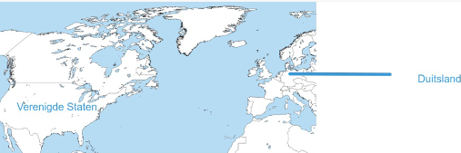
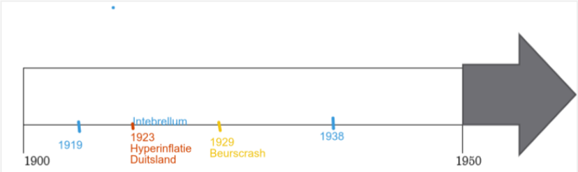

# Hoofdstuk 2 - Het interbellum: De Roaring Twenties 

## Ruimte

## Tijd

- **Interbellum** =  **1919-1939**
- **Hyperinflatie** =  **1923**
- **Beurscrash** =  **1929**

## 1. De Naoorlogse Economische Groei

**Evolutie van economie meteen na WOI**:
- BBP van Verenigde Staten daalt, omdat er minder is vraag voor producten vanuit Europa

**Productie na 1921**:
- Productie stijgt terug

**Wat is massaproductie en de rol ervan**:
- Grote productie van gestandaardiseerde producten in fabrieken, hierdoor daalt de prijs van die goederen

**Toename van consuptie in de jaren 1920**:
-  Daling van de prijs door massaproductie, producten werden gekocht op afbetaling of met leningen, meer gebruik van reclameadvertenties.

**Gevolg van massaconsuptie voor de werkgelegenheid**:
- Een stijgende werkgelegenheid. De producten worden geproduceerd in fabrieken, ze hebben nood aan werknemers. Deze kopen op hun beurt weer producten waardoor de werkloosheid verder daalt.

**Gevolg voor de economie in de Verenigde Staten**:
- Een groeiende economie in de Verenigde Staten door de stijgende productie

**De Duitste Mark in de jaren na WOI**:
- De Duitse Mark verliest massaal zijn waarde = **hyperinflatie**

**Oorzaak van hyperinflatie**:
- Duitsland drukt enorm veel geld bij om zijn herstelbetalingen te doen aan de geallieerden.

**Gevolg voor de bevolking**:
- Geld van de Duitsers werd niet meer waard 
- Spaargeld van de mensen "verdampte" 
- Bedrijven kwamen in de problemen
- Prijzen stegen
- Economische crisis

**Dawes Plan**:
- De herstelbetalingen werden betaald met Amerikaanse leningen op lange termijn.
- De geallieerden gebruikten dit geld om oorlogsschulden aan de VS terug te betalen.

## 2. Cultuur En Emancipatie Tijdens De Roaring Twenties

**Massacultuur**:
- Cultuur gericht op een groot en beeld publiek vb. cinema, nieuwe muziekstijlen zoals Jazz en sportwedstrijden waar veel mensen naar kunnen komen kijken

**Hoe?**:
- Verbetering van transport waardoor mensen mobieler worden, hogere inkomens
en mensen hadden meer vrije tijd

**Positie van de vrouw**:
- De vrouw gaat zich onafhankelijker kunnen gedragen en kortere kledij
dragen. Gaan opkomen voor stemrecht en dit in Amerika ook krijgen
(suffragettes)

**Oorzaken hiervoor**:
- Anticonceptie komt op waardoor de vrouw niet per se "moeder" moet
worden op jonge leeftijd. Door hun inzet op de arbeidsmarkt tijdens de
oorlog. Nieuwe huishoudtoestellen zorgen voor meer vrije tijd voor de vrouw.

## 3. De Grote Depressie

**Beurscrash 1929**:
- Er ontstond een speculatieve bubbel op de aandelenmarkt --> aandelen
waren in realiteit te veel waard. Op een bepaald moment daalt de prijs en
uit paniek beginnen mensen hun aandelen te verkopen waardoor de prijs nog
verder daalt.

**Gevolg voor de mensen, bedrijven en banken die investeerde**:
- Aandelen werden gekocht met geleend geld, waardoor deze niet terugbetaald
konden worden en dus ook banken failliet gingen en mensen hun spaargeld
verloren. Bedrijven gingen ook failliet.

**Ontstaan van economische depressie**:
- Er is minder consumptie, dus er moet minder geproduceerd worden, dus
bedrijven gaan failliet of moeten werknemers ontslaan, hierdoor wordt er nog
minder geconsumeerd etc.

**Invloed depressie op de rest van de wereld**:
- Bedrijven die afhankelijk zijn van Amerikaanse bedrijven in Europa gaan
onderuit. De crisis wordt wereldwijd.

**Oplossing voor depressie**:
- In Amerika werd met de New Deal van Roosevelt getracht om
werkgelegenheid te creëren. Dit deden ze door grote publieke werken te
organiseren voor werklozen. Deze konden dan consumeren waardoor de
werkloosheid verder daalt.

**Wat is een gemengde economie**:
- Economie waarbij de overheid zich mengt naast privé-initiatief.

## Lesschema
Roaring Twenties (1920-1929)

Grote groei **Amerikaanse** economie door
- **Massaproductie** -> goederen betaarlbaarder -> **Massaconsumptie**
- **Reclame** en makkelijk verkrijgen van **Kredieten**
--> versterkend effect consumptie op Werkgelegenheid

Europa pas rond 1924 door **wederopbouw na WOI**

Herstelbetalingen na WOI -> Bijdrukken geld in 1923 door **Duitsland** -> enorme **Waardedaling geld (Hyperinflatie)** --> Verarming Duitse bevolking

Oplossing = **Dawes Plan**

Sociale bewegingen -> meer **Vrije tijd** en hogere **lonen** arbeiders:
- Ontstaan **massacultuur** (films, sportwedstrijden, radio, ...)
- Meer mobiliteit door **auto/openbaar vervoer**
- **Mode** wordt belangrijker

Emancipatie van de vrouw:
- Betere positie vrouwen door **inzet WOI** en dienstensector
- Sufragettes -> eisen **stemrecht** in Europese/Amerikaanse landen
- Gezinsplanning en **anticonceptie**
- **Huishoudtoestellen** meer vrije tijd
--> Cultureel: kortere kledij (flappers), roken/drinken, ...

Investering in **aandelen** met **geleend** geld tijdens de Roaring Twenties --> Prijzen op de aandelenmarkt **stijgen* naar onrealistisch niveau

Beurscrash 1929 -> daling prijzen en **paniekverkoop aandelen** -> economische crisis
- Vermindering productie en **failissementen** -> werkloosheid neemt toe
- Verlies **spaargeld** en **banken** met geldtekort
--> Globalisering: crisis verspreid zich naar **de rest van de wereld** (vooral Europa) **New Deal** (Roosevelt)
- **Openbare Werken** -> werkgelegenheid en consumptie aanzwengelen
- Banken **splitsen** in spaarbanken en beleggingsbanken

--> **Gemengde economie**: privé initiatief en inmenging overheid in de economie

