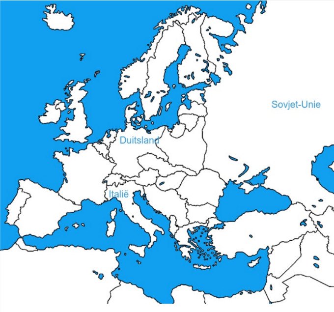

# 📚 Het totalitarisme (Interbellum)

## Ruimte

## Tijd

**Mars op Rome van Mussolini** = **1922**
**Machtsovername van Stalin** = **1923**
**Aanstelling van Hitler als kanselier** = **1932**

## 1. Kenmerken Van Het Totalitarisme

**Verschil tussen dictatuur en een totalitaire staat**:
- De totalitaire staat heeft controle over alles, alle onderdanen en hun
levensaspecten. Een dictatuur heeft enkel alle politiek macht. Totalitaire heersers
zijn altijd dictators, maar niet omgekeerd.

**Kenmerken van een totalitaire staat**:
- Één leider (groep) aan de macht
- De leider moet blindelings gevolgd worden
- Individu is ondergeschikt aan de staat

**Rol van geheime politie in een totalitaire staat**:
- Intimideren en controleren van de bevolking. Vervolgen van "vijanden" van
de staat.

**Propaganda en Censuur**:
- **Propaganda**: het beïnvloeden/overtuigen van mensen met korte politiek
boodschappen
**Censuur**: het verzwijgen, manipuleren of achterhouden van informatie

**Hoe Nazi's de mensen beïnvloeden met een poster**:
- Ze geven aan dat er geen hoop meer is, beelden mensen neerslachtig
af. Alleen Hitler kan ze nog redden en helpen.

**Totalitaire regimes met de jeugd**:
- De Jeugd wordt geïndoctrineerd. Ze krijgen de staatsideologie mee van
kleins af aan via school/jeugdbewegingen,...

## 2. Het Fascisme In Duitsland En Italië 

**Bevolking van Italië en Duitsland kozen voor fascistische partijen en de rol van het Vedrag van Versailles**:
- Ontevredenheid over het **Verdrag van Versailles**. Italië verloor veel soldaten,
maar kreeg amper hun beloofde grondgebied van de geallieerden. Duitsland werd
volgens de **Duitsers** te zwaar gestraft (herstelbetalingen, kleiner leger etc.)
- **Dolkstootmythe**: het idee dat Duitsland nog kon verder vechten tijdens de
Eerste Wereldoorlog, maar een 'dolkstoot" in de rug kreeg door "de
politiek" (en de Joden)

**Oorzaak van populaiteit van Fascistische partijen door politieke en economische situatue na WOI**:
- Tijdens de jaren 1920 krijgt Duitsland te maken met een hyperinflatie en Italië
met een economische crisis. Fascisten beloven hiervoor een oplossing.
Op politiek vlak zijn er in Italië en Duitsland conflicten tussen linkse en
rechtse groeperingen. Dit zorgt voor onrust.

**Mussolini aan de macht in Italië**:
- De fascistische beweging in Italië werd populairder onder Mussolini. Ze wisten
zetels te halen tijdens de verkiezingen.
- Hij richtte de fascistische politieke partij op en organiseerde in 1922 Mars
op Rome waarbij hij werd aangesteld als leider van Italië.
- Het kiessysteem werd aangepast zodat hij een absolute meerderheid kreeg.
Hierdoor kon hij de absolute macht grijpen in 1924-1925.
Hij gebruikte doorheen deze jaren zijn Zwarthemden om kiezers en politici te
intimideren.

**Hoe Hitler intimidatie en democratie gebruikte om aan de macht te geraken**:
- Hij maakte gebruik van gewapende groepering (SA) om zijn tegenstanders
te intimideren. Hij pleegde in 1923 een mislukte staatsgreep. Zijn partij werd
populairder omdat hij oplossingen bood voor de problemen in het land. Hij
werd verkozen tot kanselier.

**Hoe Hitler de absolute macht verkreeg toen hij kanselier werd**:
- Hij heeft een brand in de Reichstag (parlement) gebruikt om politieke
tegenstanders te arresteren en alle macht naar zich toe te trekken.

**Hoe fascistische regimes hun macht probeerden uit te breiden eens ze aan de macht kwamen**:
Door gebruik van propaganda om meer mensen te overtuigen, geheime
staatspolitie (gestapo) moet politieke tegenstanders arresteren en kinderen worden
van jongs af aan geïndoctrineerd worden via jeugdbewegingen (Hitlerjugend).

**Irrationele totalitaire regimes**:
- De leider moet blindelings gevolgd worden en er wordt een zondebok
gezocht voor alle problemen. In Duitsland waren dit de Joden.

**Imperalistische ambities die Hitler en Mussolini hadden**:
- **Hitler**: wilde lebensraum (ruimte om te leven) voor het Duitse volk in
Oost-Europa. Hij wilde ook alle Duitse volkeren verenigen in één land
(pangermanisme)
- **Mussolini**: wil "Mare Nostrum" "onze zee" --> heersen over de
Middellandse Zee zoals het Romeinse Rijk.

## 3. Het Stalinisme In De Sovjet-Unie
**Communisme**:
- Iedereen is gelijk en verdiend ongeveer evenveel
- De staat controleert de economie/productie.
- In de Sovjet-Unie wordt er bestuurd met raden van arbeiders en boeren
(Sovjet)

**Hoe Stalin de macht verkreeg in de Sovjet-Unie**:
- Hij was de secretaris generaal van de communistische partij in de
Sovjet-Unie. Vanuit die positie plaatste hij vertrouwelingen in het bestuur.
Toen Lenin stierf kon hij de macht zo naar zich toetrekken en tegenstanders
uitschakelen.

**Economische hervormingen die Stalin doorvoerde**:
- **Collectivisering van de landbouw**: boeren moesten verplicht samenwerken in
grote landbouwbedrijven
- **Vijfjarenplannen**: productiedoelen voor de industrie die behaald moesten worden
op 5 jaar tijd

**Gevolgen hiervan**:
- Door de collectivisering ontstonden er hongersnoden waarbij veel mensen
stierven, door de vijfjarenplannen industrialiseerde de Sovjet-Unie in een
sneltempo.

**Personencultus**:
- Een personencultus is de verering van een bepaalde persoon. In dit
geval Stalin. Hij moet geprezen worden en iedereen moet zich onderwerpen
aan hem.

**Wat er met de mensen gebeurde die niet meegingen in de hervormingen en de verering van Stalin**:
- Mensen die niet meegingen in dit idee of tegen zijn hervormingen werden
vermoord of naar strafkampen gestuurd om aan zware arbeid te doen.

## Lesschema
= **Totale controle** over bevolking

**Kenmerken**:
- **Individu** is ondergeschikt aan de staat
- **Éen leider** moet gehoorzaamd worden -> **personencultus**
- Beïnvloeden van de bevolking door **propaganda** en **censuur**
- **Indoctrineren** van de jeugd
- **Geheime politie** -> controleren en **intimideren** bevolking

**Régimes**:
- **Communisme/stalinisme**: Stalin in **Sovjet-Unie**
- **Fascisme**: Mussolini in **Italië** en Hitler **Duitsland**

Machtsgreep Hitler en Mussolini door **democratie** en **intimidatie tegenstanders**

**Populair door**:
- Ontevredenheid over **Verdrag van Versailles** en **WOI**
- **Duitsland**: **te zwaar** gestraft en **dolkstootmythe**
- **Italië**: beloofd **gebied** niet gekregen
- **Economische problemen** na WOI (hyperinflatie Duitsland) --> **beloven** economische oplossingen
- **Zwakke democratieën** en conflicten tussen **politieke strekkingen** (links/rechts)

**Fascisme in Italië**:
- **1919**: ontstaan **Fascistische** beweging Mussolini
- **1921**: Fascistische partij grootste in Italië --> intimidatie door **Zwarthemden**
- **1922**: **Mars op Rome** --> machtgreep Mussolini --> infiltratie fascisten in bestuur --> totalitaire staat

**Nazisme in Duitsland**:
- **1919**: ontstaan **NSDAP**
- **1923**: **mislukte** staatgreep Hitler --> gevangenschap
- **1933**: Winst verkiezingen Hitler met behulp van **paramilitaire organisaties** (SS/SA --> brand reichstag --> totaliair Duitsland

Uitbreiding invloed door **jeugdbeweging** (vb. Hitlerjugend), **geheime politie** (vb. Gestapo) en **propaganda**

**Sociaal-economische hervormingen**:
- **Corporaties**: samenwerking werknemers en werkgevers per bedrijfstak --> **belang van de natie**
- Sociale **zekerheid**
- **8-urenwerkdag**
- Grote depressie --> **publieke werken** (vb. autobahn)
- **Irrationeel** politiek
- Leider **blindelings** volgen (geen kritiek)
- Problemen zijn de schuld van **zondebok** (vb. communisten, joden, ...)
- **Imperialistische** ambities
- **Mussolini**: **Mare-Nostrum** (middellandse Zee)
- **Hitler**: **Lebensraum** + **Pangermanisme**

**Communisme** in Rusland door Russische revolutie (1917):
- Bestuur door **Sovjets** (raden van arbeiders en boeren)
- Economie **geleid door de staat** --> nationalisering bedrijven
- Alle mensen zijn **gelijk** en rijkdom wordt **verdeeld**

**Lenin** sterft in 1924 --> staatgreep **Stalin** door installatie van **vertrouwelingen in het bestuur**

**Economische hervormingen**:
- **Vijfjarenplannen** --> toename industrialisering
- **Collectivisering landbouw** --> hongersnoden
--> Kritiek vanuit bestuur en bevolking --> **zuiveren** --> tegenstanders werden **gedood** of naar **strafkampen (goelags)** gestuurd

Ontstaan **personencultus** rond Stalin --> propaganda en kunst