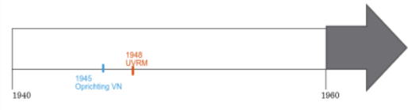

# Hoofdstuk 4 - Internationale Samenwerking Na De Tweede Wereldoorlog

---

## Studie 1

## De VN

## Ruimte

## Tijd

- **Oprichting van de VN** = **1945**
- **Universele Verklaring van de rechten van de Mens** = **1948**

## 1. Het Ontstaan Van De VN
### **Waar de benaming "Verenigde Naties" vandaan komt**:
- Van de landen die streden tegen de As-mogendheden tijdens de Tweede Wereldoorlog

### **Wat er besloten werd op de conferentie van Dumbarton Oaks**:
- Hoe de VN er uit zou moeten zien: veiligheidsraad om de vrede te
bewaren, zelfbeschikkingsrecht voor verschillende volkeren, VN moet militair kunnen ingrijpen (Volkenbond kon dat niet). Het intergouvernementeel.

### **Het verschil tussen een supranationale organisatie en een intergouvermentele organisatie**:
- Supranationaal kan wetten opleggen aan andere landen, intergouvernementeel is samenwerking tussen landen.

### **De doelen van de VN**:
- Internationale vrede en samenwerking tussen landen. Geschillen oplossen met overleg en niet met oorlog
- Zelfbeschikking voor volkeren: op termijn moeten alle volkeren onafhankelijk worden. Moederlanden zijn verantwoordelijk voor hun kolonies.
- Samenwerking op economisch, sociaal, cultureel vlak
- Mensenrechten waarborgen

### **Hoeveel landen er bestonden bij de oprichting van de VN en welke landen later toetreden**:
- 51 landen. Later onafhankelijke kolonies en As-mogendheden die toetreden.
Bijna alle landen zijn lid van de VN

## 2. De Organen Van de VN

### **Wat de algemene vergadering van de VN is en wat ze doet**:
- Ze bestaat uit alle leden van de VN. Bespreken wereldproblemen, keuren nieuwe leden goed en verkiezen leden van de verschillende raden.

### **De rol van de veiligheidsraad en wie hier deel van uitmaakt**:
- Veiligheidsraad: vrede waarborgen en veiligheid in de wereld. Kunnen blauwhelmen sturen naar conflictgebieden en resoluties stemmen over conflicten. Bestaat uit 5 permanente leden (VK, RUS, VSA, FR, CHINA) en 10 niet-permanente leden die verkozen worden door de AV.

### **Waarom de veiliheidsraad vaak niet echt kan optreden in internationale conflicten**:
- Permanente leden hebben vetorecht waarmee ze resoluties kunnen
tegenhouden. Hierdoor zitten sommige conflicten vast.

### **Hoe het internationaal gerechthof in Den Haag werkt**:
- Rechtbank waarbij landen elkaar kunnen aanklagen bij geschillen. Uitspraken van het gerechtshof zijn bindend.

## 3. De Universele Verklaring Van De Rechten Van De Mens

### **Waarover het mensenrechtenverdrag handelt**:
- Gelijkheid, verschillende vrijheden (vb. godsdienstvrijheid).Sociaal, economisch en culturele rechten. Recht op een nationaliteit en asiel, recht op privacy, persoonlijke rechten en vrijheden.

### **Landen waarvan je denkt dat ze verplicht zijn om dit verdrag na te leven**:
- Doelen moeten nagestreefd worden, de meeste landen hebben hier een
groot deel van in hun wetgeving.

### **Een ander historisch document met welk deze veel gelijkenissen heeft**:
- Rechten van de mens en burger uit de Franse Revolutie.

## Lesschema
WOII: nood aan **Organisatie voor internationale vrede** <--> **Volkenbond** (niet machtig genoeg)

Dumbarton Oaks (1944) à Vastleggen grote lijnen van VN (China, USSR, VS, UK):
-**Veiligheidsraad** om vrede te bewaren
-**Zelfbeschikkingsrecht** -> niet voor kolonies **geallieerden**
-**Intergouvermentele organisatie** -> samenwerking tussen landen zonder **soevereiniteit** af te geven

1945: oprichting Verenigde Naties -> doelen
- Bescherming **internationale vrede**
- Samenwerking op **economisch, sociaal, cultureel** en **humanitair**
- Zorgen voor **internationale veiligheid** (mogelijkheid militair in te grijpen).

Algemene vergadering:
- Bespreking en stemming **resoluties** over **wereldproblemen** met alle landen
- Toetreding nieuwe landen en **verkiezing leden** van verschillende raden

Veiligheidsraad:
- 5 Permanente leden (VS, USSR, VK, China, FR) met **vetorecht** -> vaak misbruikt
- 10- **niet-permanente leden**
- Resoluties om**in te grijpen in conflicten**

Internationaal gerechtshof (Den Haag): **geschillen tussen landen** -> bindende uitspraken

Ook andere organisaties (WHO, Unesco, Unicef, Unesco, ...)

1948: goedkeuring **met meerderheid in de algemene vergadering** -> omgezet in wetgeving/basis voor andere **mensenrechtenverdragen**
- **vrijheid**, **gelijkheid** -> Verklaring rechten van de mens uit de Franse Revolutie
- Tegen **slavernij** en **foltering**
- Recht op **privacy**, **asiel** en **nationaliteit**
- **Sociaal/Cultureel/Economische rechten** (vb. recht op werk, onderwijs, cultuur, gezondheid, ...)

---