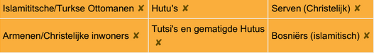
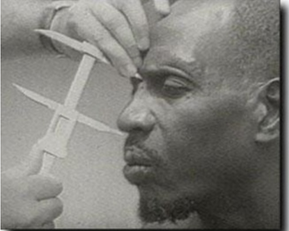
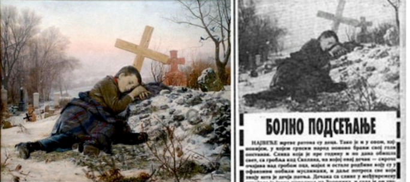
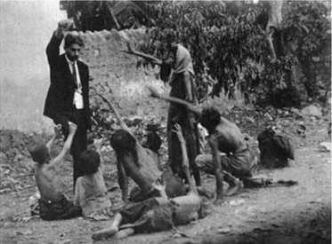
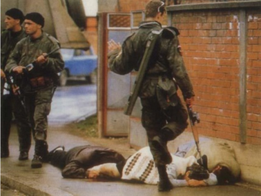
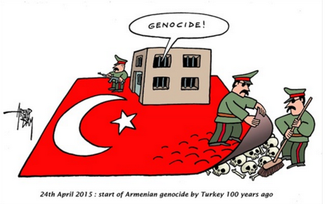

# Draaiboek van een Genocide

**Genocide** = Volkenmoord, de misdaad van stelselmatige en opzettelijke uitroeiing van een etnische groep, of van een deel
daarvan.

## Classificatie
Dit is het verdelen van mensen in de groepen "wij" en "zij". Dit kan een etnische onderverdeling zijn maar ook één op basis van godsdienst. Belangrijk is dat hierbij nog niet tot polarisatie tussen groepen over gaat het gaat enkel over het bestaan van twee groepen.

## Symbolisering
Symbolisering gaat een stapje verder. Hierbij ga je bepaalde symbolen of tekens toeschrijven aan een
bevolkingsgroep. Dit gaat bijvoorbeeld over klederdracht of uiterlijke kenmerken. Hier horen vaak ook stereotypen
bij. Op zich vormt dit samen met classificatie geen probleem tot symbolen opgelegd worden.

## Symbolisering bij de Rwandese Genocide
De grootte van de neus, op basis van huidskleur en hun etniciteit stond op hun paspoort.

## Symbolisering bij de Srebenica Genocide
Afhankelijk van je godsdienst behoorde je tot de groep van de Serven (Orthodoxe christenen) of Bosniër of een Kroaat als je dit niet was.

## Dehumanisering 
Bij dehumanisering gaat de ene groep de menselijkheid van de andere groep ontkennen. Mensen worden
vergeleken met dieren, ongedierte, insecten of ziekten. Dit is een eerste echte stap die gezet wordt naar het
aanzetten tot moorden. Nu dat de andere groep geen “mens” meer is, wordt de drempel naar het overgaan tot
moord kleiner worden. Dit gebeurt vaak door middel van propaganda.

## Dehumanisering bij de Rwandese Genocide
Hutu's noemden de Tutsi's kakkerlakken. Kakkerlakken dien je te bestrijden.

## Organisering
Genocide wordt altijd georganiseerd, meestal door de staat en ook met het gebruik van milities zodat de schuld niet
rechtstreeks op de staat gestoken kan worden. Hier worden ook plannen gemaakt om genocidale moorden te
plegen.

## Organisatie van de Armeense genocide
### Delen van de maatschappij die hierbij betrokken waren
- De overheid zelf en de politieke parij CUP
- Het leger, de administratie van de overheid, de politie, ...

## Polisarisatie
Extremisten beginnen met de twee groepen uit elkaar te drijven. Propaganda wordt zeer polariserend gebruikt om
angst of afgunst tegenover de andere groep op te roepen. Er worden ook wetten uitgevaardigd die het verboden
maken voor de groepen om met elkaar in contact te komen door bijvoorbeeld te trouwen. De “wij” en “zij” groepen
dienen zo gescheiden mogelijk van elkaar te leven. De extremisten beginnen ook met het vervolgen van gematigden
in hun rangen. Zij vormen een gevaar voor het verdere project.

## Wat de Servische kant met polisarisatie wilde bereiken
Woede opwekken ten opzichte van Bosniërs. Dit zodat de christelijke bevolking
zich tegen deze Bosniërs zou keren.

## Voorbereiding
Slachtoffers worden geïdentificeerd en gescheiden omwille van hun etniciteit. Dodenlijsten worden gemaakt. Leden
van de groep van slachtoffers moeten herkenbare symbolen dragen. Hun eigendom wordt afgenomen en ze worden
naar concentratiekampen gestuurd.

## Wat er gebeurde met de Armenen tijdens de Armeense genocide
Ze moesten naar concentratiekampen gebracht worden waar ze onderweg
konden sterven.

## Hoe in de Rwandese genocide men wist tot wie welk volk behoorde
Je etniciteit stond op je identiteitskaart

## Uitroeiing
De uitroeiing begint en wordt al snel wat men een genocide noemt. Voor de moordenaars is het uitroeiing omdat zij
niet geloven dat hun slachtoffers echt mensen zijn. Als de staat de genocide organiseert helpt het leger mee met de
moorden.

## Hoe het mogelijk was voor deze mensen om zo onmenselijk gedrag te vertonen
Door propaganda, dehumanisering en polarisering hebben ze deze mensen ervan
kunnen overtuigen dat hun slachtoffers uitgeroeid dienen te worden.

## Ontkenning
Dit volgt na een genocide. De uitvoerders van de genocide beginnen met het opgraven van massagraven en het
verbranden van lichamen. Ze proberen alle bewijzen weg te werken. Ze ontkennen alle misdaden en beschuldigen
de slachtoffers.

## De positie van Turkije ten opzicht van de Armeense genocide
Turkije ontkent de Genocide. Mensen die hier kritiek op hebben kunnen
vervolgd worden.

## De boodschap die Praljak wilde geven met zijn zelfmoord
Hij wilt tonen dat hij onschuldig is door zelfmoord te plegen. Zodat hij geen
straf kan krijgen.

---