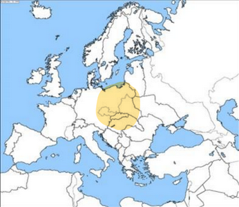
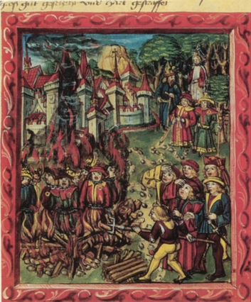
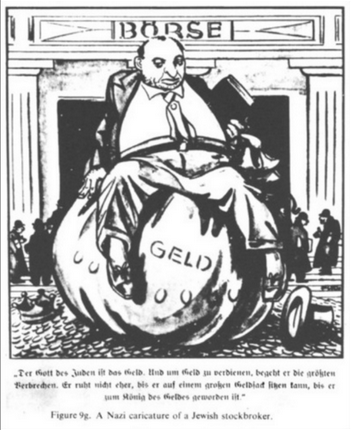
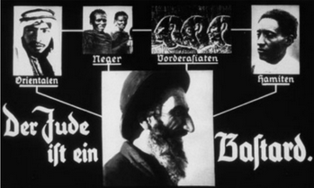
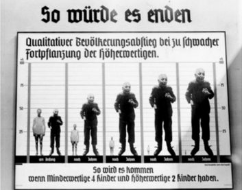
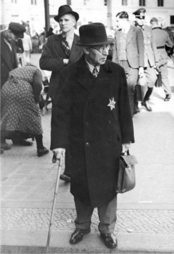
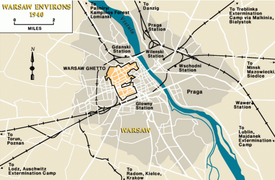
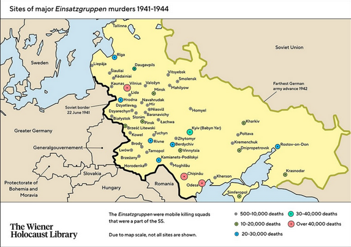
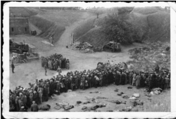
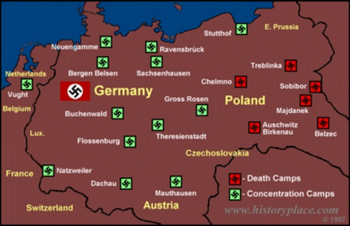

# Casusstudie: De Holocaust

## 1. Ruimte

## 2. Tijd
- **Nürembergwetten** = 1935
- **Kristallnach** = 1938
- **Periode van uitroeïng van de Europese joden** = 1942-1945

## 3. Antisemitisme en jodenvervolging in duitsland

### Antisemitisme/Jodenhaat is niet iets dat ontstaan is tijdens het interbellum
Antisemitisme heeft al een lange geschiedenis. In de middeleeuwen werden
Joden gezien als zondebok voor problemen zoals de pest.

### Waar de Joden de schuld van kregen
De beurscrash, het idee dat de Joden de wereld besturen met hun
geld.

### Hoe Joden afgebeeld worden in de Nazipropaganda
Worden slecht, lelijk afgebeeld met stereoriepe kenmerken zoals een lange
neus, krulhaar, ...

### Hoe de Nazi's keken naar andere rassen en het Joodse ras in het bijzonder
De nazi's vonden het arische (blanke) ras superieur aan alle andere
rassen. Ze zagen de joden als een gevaar omdat ze dachten dat ze het
blanke ras wilden "vervuilen". Om zo de samenleving onderuit te halen.

### Hoe er gezorgd werd voor dehumanisering en polarisatie tegenover Duitse Joden
Door propaganda, door ze af te schilderen als een gevaar voor de
samenleving. Ze noemen ze "onzuiver", worden als duivels afgebeeld, als
de vijand.

### Hoe er gezorgd werd voor verdere polarisatie in Duitsland
Met de Neurenbergwetten (1935) werden de Duitsers en joden zo veel
mogelijk van elkaar gescheiden. Gemengde huwelijken werden verboden, joden
verloren hun burgerrechten en ze moesten verplicht een jodenster dragen. Ze
mochten zich niet meer vrij voortbewegen.

### Tot wat de polarisatie leidde in Duitsland
Een pogrom op de Joodse bevolking in Duitsland. Joden werden op
straat gedood, synagogen werden in brand gestoken, Joodse winkels werden
vernield door nazi's en gewone Duitsers. Velen werden opgepakt en naar
kampen gestuurd

### Hoe de Duitsers reageerden
De Duitsers deden mee of grepen niet in. Omdat ze overtuigd waren
door de propaganda of geen sympathie voelden door polarisering.

## 4. De Holocaust

### Wat er gebeurde met de Europese joden in de door Duitsland veroverde gebieden
Ze werden verzameld in getto's zoals die van Warschau. Deze werden
overbevolkt met een tekort aan voedsel. Hier vielen ook veel doden.

### Waarom ze dit zouden doen
Voorbereiding: ze werden in concentratiekampen/getto's verzameld zodat ze
makkelijk uitgeroeid konden worden.

### Wat de "Holocaust met de kogel" inhield
Het uitmoorden van de Joodse bevolking door ze neer te schieten. Hiervoor
waren er speciale eenheden in het Duitse leger, Einzatsgruppen. Zo vielen er
naar schatting 2 miljoen doden.

### Hoe de voorbereiding en uitroeïng in concentratiekampen verliep
Op de Wannseconferentie werd besloten om de Joden op een industriële
manier uit te moorden. Er werden concentratiekampen gebouwd om mensen aan
dwangarbeid te laten doen en vernietigingskampen met gaskamers om diegnee die
niet konden werken te doden.

### Of enkel de Joden vervolgd werden
Neen, ook Roma, jehova's, communisten, ... werden uitgemoord.

## 5. Vervolging na de holocaust
### Hoe de daders van de Holocaust gestraft werden
In de Neurembergprocessen werden de hooggeplaatste nazi's terechtgesteld
voor hun misdaden. Ze kregen gevangenisstraffen of de doodstraf.

### Of alle daders gestraft werden
Neen, sommigen zijn ontsnapt (Mengele, Eichman), anderen pleegden
zelfmoord (Goebbels, Hitler)

### In welke fase van de genocide je kan afleiden uit bron 21
Ontkenning. Ontkennen en minimaliseren van de Holocaust is verboden in
België

---