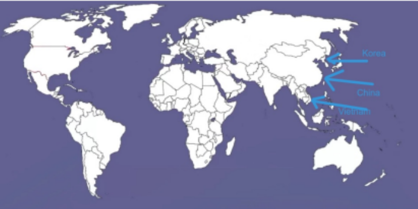

# Hoofdstuk 5 - Studie 3 - De Koude Oorlog in Azië
## 1. Ruimte 

## 2. Tijd
Communistisch China = **1949**
Koreaoorlog = **1950-1953**
Vietnamoorlog = **1955-1975**

## 3. De Koude Oorlog in Azië

