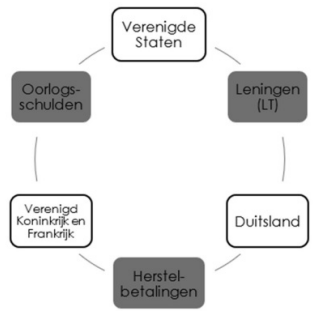
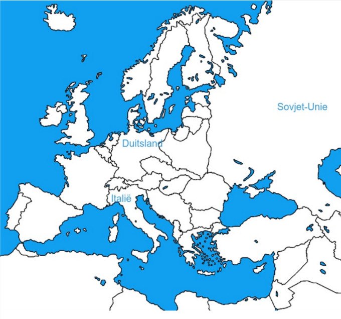
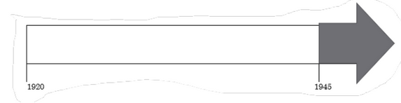
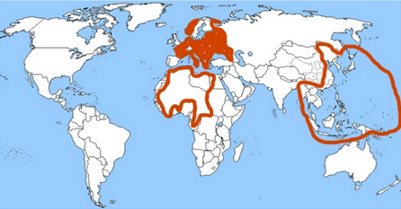
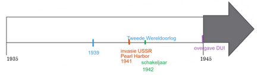
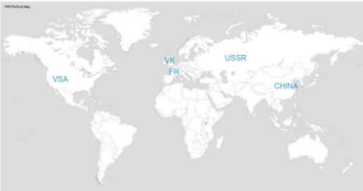
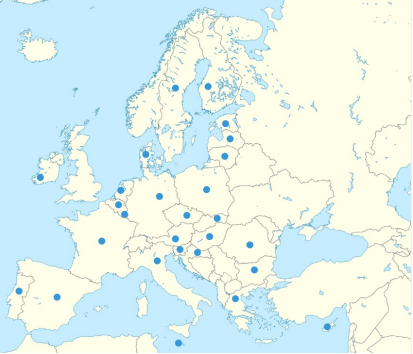
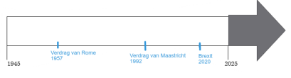

# Geschiedenis - Examen 1

---

## Hoofdstuk 1 - Het Historisch Referentiekader
---

## ⏳ Tijd
### Tijdrekening
* Kiezen van een beginpunt → wanneer is het jaar “1”?  
* Christelijke tijdrekening (algemeen gebruikt in de Westerse wereld)  
	* v.C. = vóór het jaar 1  
* MAAR! ook andere mogelijkheden (vermeld in dia als waarschuwing, geen uitwerking)

### Onderverdelingen
| Eenheid | Uitleg (dia) |
|---------|--------------|
| Jaar | Basismaat |
| Eeuw | Groepering van 100 jaar |
| Millennium | Groepering van 1000 jaar |

### 7 historische periodes (Westerse geschiedenis)
| Periode | Begin | Einde | Grensgebeurtenis (uit dia) |
|---------|-------|-------|----------------------------|
| Prehistorie | Ontstaan mens | ca. 3500 v.C. | Het eerste schrift |
| Oude Nabije Oosten | ca. 3500 v.C. | ca. 800 v.C. | (Overgang naar Klassieke Oudheid / stichting Rome) |
| Klassieke Oudheid | ca. 800 v.C. | 476 | Val van het West-Romeinse Rijk |
| Middeleeuwen | 476 | 1492 | Columbus landt in Amerika |
| Vroegmoderne tijd | 1492 | 1789 | Franse Revolutie |
| De moderne tijd | 1789 | 1945 | Einde WOII |
| Hedendaagse tijd | 1945 | … | (Heden) |

---

## 🌍 Ruimte
### Schaalniveaus & typen ruimten
| Categorie | Voorbeelden / labels uit dia |
|-----------|------------------------------|
| Schaal | Lokaal – Regionaal – Continentaal – Mondiaal |
| Fysiek / ligging | Maritiem – Continentaal |
| Sociaal-economisch / ontwikkelingscontrast | Centrum – Periferie |
| Toegankelijkheid | Open ruimte – Gesloten ruimte |
| Cultuur | Westers (Europees) – Niet-westers |
| Verstedelijking | Stedelijk – Ruraal |

---

## 🧩 Domeinen
### Opmerking (dia)
* Opdeling van fenomenen in thema’s.  
* Niet mooi afgelijnd (overlapping afhankelijk van historische vraag).

### Tabel (dia)
| Politiek | Economisch | Sociaal | Cultureel |
|----------|-----------|---------|-----------|
| bestuur | handel | arm en rijk | Techniek en wetenschap |
| macht | industrie | relaties | taal |
| recht en wetten | landbouw | discriminatie | gewoonten |
| oorlog en territorium | arbeid | standenmaatschappij | godsdienst |
| (—) | nijverheid | (—) | onderwijs |
| (—) | financiën | (—) | Kunst |

---

## � Bronnen & soorten
### Historisch werk vs historische bron
* “Een historische bron is een overblijfsel uit de geschiedenis.”  
* “Een historisch werk is gemaakt op basis van bronnenonderzoek.”

### Primair / Secundair
| Type | Dia-definitie |
|------|---------------|
| Primair | ooggetuige van de gebeurtenis |
| Secundair | gemaakt op basis van andere bronnen |

### Indeling historische bronnen
| Categorie |
|-----------|
| Geschreven |
| Mondeling |
| (Audio)visueel |
| Materieel |

---
## 🔎 Bronnen kritisch bestuderen
### Context – vragen uit dia
Wie maakte de bron? • Met welk doel werd de bron gemaakt? • Waar? • Welke soort bron? • Is de maker betrouwbaar?

### Standplaatsgebondenheid
“Iedereen kijkt vanuit zijn context naar historische gebeurtenissen.”  
* Onszelf – Met welke waarden kijken wij naar het verleden?  
* Personen in de geschiedenis: leeftijd, geloof, plaats in de maatschappij → beïnvloeden kijk op gebeurtenissen.  
* Begrip niet meer te kennen, wel te kunnen gebruiken.

### Multiperspectiviteit
“Meer perspectieven over een zelfde gebeurtenis → geeft een vollediger beeld.”

### Overzichtsvragen (dia-schema)
| Aspect | Vragen (exact uit dia) |
|--------|------------------------|
| Presentatie | Zijn er titels? Is het een vertaling? Is er een legenda? |
| Standplaatsgebondenheid | Welke geloofsovertuiging heeft de maker? Is hij toeschouwer of ooggetuige? Hoe bepaalt zijn context hoe hij kijkt naar de wereld? |
| Context van de bron | Wie maakte de bron? Met welk doel is de bron gemaakt? Waar werd de bron gemaakt? Welke soort bron is het? Is de maker betrouwbaar? |
| Vergelijking & multiperspectiviteit | Zijn er andere bronnen die deze bron bevestigen? Zijn deze bronnen betrouwbaarder? |
| Retorische strategieën | Hoe gebruikt de maker taal en beeldvorming om de lezer van zijn gelijk te overtuigen? |

### Retorische strategieën (dia-lijst)
Zwart-wit denken • Zich in een slachtoffer rol dwingen • Zondebok • Overdrijven (Hyperbolie) • Framing en manipulatie • Cirkelredeneringen • …

---
## 🧠 Kernbegrippen (uit dia’s)
| Begrip | Dia-inhoud (letterlijk / beknopt) |
|--------|----------------------------------|
| Tijdrekening | Keuze beginpunt; christelijke tijdrekening; v.C. vóór jaar 1 |
| Primair / Secundair | Ooggetuige vs op basis van andere bronnen |
| Standplaatsgebondenheid | Iedereen kijkt vanuit zijn context |
| Multiperspectiviteit | Meer perspectieven → vollediger beeld |
| Bron(kritiek) | Context- & betrouwbaarheidsvragen |

---

## Hoofdstuk 2 - Het Interbellum

---

### Studie 1 - Roaring Twenties

## Ruimte

## Tijd

- **Interbellum** =  **1919-1939**
- **Hyperinflatie** =  **1923**
- **Beurscrash** =  **1929**

## 1. De Naoorlogse Economische Groei

### **Evolutie van economie meteen na WOI**:
- BBP van Verenigde Staten daalt, omdat er minder is vraag voor producten vanuit Europa

### **Productie na 1921**:
- Productie stijgt terug

### **Wat is massaproductie en de rol ervan**:
- Grote productie van gestandaardiseerde producten in fabrieken, hierdoor daalt de prijs van die goederen

### **Toename van consuptie in de jaren 1920**:
-  Daling van de prijs door massaproductie, producten werden gekocht op afbetaling of met leningen, meer gebruik van reclameadvertenties.

### **Gevolg van massaconsuptie voor de werkgelegenheid**:
- Een stijgende werkgelegenheid. De producten worden geproduceerd in fabrieken, ze hebben nood aan werknemers. Deze kopen op hun beurt weer producten waardoor de werkloosheid verder daalt.

### **Gevolg voor de economie in de Verenigde Staten**:
- Een groeiende economie in de Verenigde Staten door de stijgende productie

### **De Duitste Mark in de jaren na WOI**:
- De Duitse Mark verliest massaal zijn waarde = **hyperinflatie**

### **Oorzaak van hyperinflatie**:
- Duitsland drukt enorm veel geld bij om zijn herstelbetalingen te doen aan de geallieerden.

### **Gevolg voor de bevolking**:
- Geld van de Duitsers werd niet meer waard 
- Spaargeld van de mensen "verdampte" 
- Bedrijven kwamen in de problemen
- Prijzen stegen
- Economische crisis

### **Dawes Plan**:
- De herstelbetalingen werden betaald met Amerikaanse leningen op lange termijn.
- De geallieerden gebruikten dit geld om oorlogsschulden aan de VS terug te betalen.

## 2. Cultuur En Emancipatie Tijdens De Roaring Twenties

### **Massacultuur**:
- Cultuur gericht op een groot en beeld publiek vb. cinema, nieuwe muziekstijlen zoals Jazz en sportwedstrijden waar veel mensen naar kunnen komen kijken

### **Hoe?**:
- Verbetering van transport waardoor mensen mobieler worden, hogere inkomens
en mensen hadden meer vrije tijd

### **Positie van de vrouw**:
- De vrouw gaat zich onafhankelijker kunnen gedragen en kortere kledij
dragen. Gaan opkomen voor stemrecht en dit in Amerika ook krijgen
(suffragettes)

### **Oorzaken hiervoor**:
- Anticonceptie komt op waardoor de vrouw niet per se "moeder" moet
worden op jonge leeftijd. Door hun inzet op de arbeidsmarkt tijdens de
oorlog. Nieuwe huishoudtoestellen zorgen voor meer vrije tijd voor de vrouw.

## 3. De Grote Depressie

### **Beurscrash 1929**:
- Er ontstond een speculatieve bubbel op de aandelenmarkt --> aandelen
waren in realiteit te veel waard. Op een bepaald moment daalt de prijs en
uit paniek beginnen mensen hun aandelen te verkopen waardoor de prijs nog
verder daalt.

### **Gevolg voor de mensen, bedrijven en banken die investeerde**:
- Aandelen werden gekocht met geleend geld, waardoor deze niet terugbetaald
konden worden en dus ook banken failliet gingen en mensen hun spaargeld
verloren. Bedrijven gingen ook failliet.

### **Ontstaan van economische depressie**:
- Er is minder consumptie, dus er moet minder geproduceerd worden, dus
bedrijven gaan failliet of moeten werknemers ontslaan, hierdoor wordt er nog
minder geconsumeerd etc.

### **Invloed depressie op de rest van de wereld**:
- Bedrijven die afhankelijk zijn van Amerikaanse bedrijven in Europa gaan
onderuit. De crisis wordt wereldwijd.

### **Oplossing voor depressie**:
- In Amerika werd met de New Deal van Roosevelt getracht om
werkgelegenheid te creëren. Dit deden ze door grote publieke werken te organiseren voor werklozen. Deze konden dan consumeren waardoor de werkloosheid verder daalt.

### **Wat is een gemengde economie**:
- Economie waarbij de overheid zich mengt naast privé-initiatief.

## Lesschema
#### 
1. De Naoorlogde Economische Groei

= **Roaring Twenties** (1920-1929)

Grote groei **Amerikaanse** economie door
- **Massaproductie** -> goederen betaarlbaarder -> **Massaconsumptie**
- **Reclame** en makkelijk verkrijgen van **Kredieten**
--> versterkend effect consumptie op Werkgelegenheid

Europa pas rond 1924 door **wederopbouw na WOI**

Herstelbetalingen na WOI -> Bijdrukken geld in 1923 door **Duitsland** -> enorme **Waardedaling geld (Hyperinflatie)** --> Verarming Duitse bevolking

Oplossing = **Dawes Plan**

#### 
2. Cultuur En Emancipatie Tijdens De Roaring Twenties

Sociale bewegingen -> meer **Vrije tijd** en hogere **lonen** arbeiders:
- Ontstaan **massacultuur** (films, sportwedstrijden, radio, ...)
- Meer mobiliteit door **auto/openbaar vervoer**
- **Mode** wordt belangrijker

Emancipatie van de vrouw:
- Betere positie vrouwen door **inzet WOI** en dienstensector
- Sufragettes -> eisen **stemrecht** in Europese/Amerikaanse landen
- Gezinsplanning en **anticonceptie**
- **Huishoudtoestellen** meer vrije tijd
--> Cultureel: kortere kledij (flappers), roken/drinken, ...

#### 
3. De Grote Depressie

Investering in **aandelen** met **geleend** geld tijdens de Roaring Twenties --> Prijzen op de aandelenmarkt **stijgen* naar onrealistisch niveau

Beurscrash 1929 -> daling prijzen en **paniekverkoop aandelen** -> economische crisis
- Vermindering productie en **failissementen** -> werkloosheid neemt toe
- Verlies **spaargeld** en **banken** met geldtekort
--> Globalisering: crisis verspreid zich naar **de rest van de wereld** (vooral Europa) **New Deal** (Roosevelt)
- **Openbare Werken** -> werkgelegenheid en consumptie aanzwengelen
- Banken **splitsen** in spaarbanken en beleggingsbanken

-> **Gemengde economie**: privé initiatief en inmenging overheid in de economie

---

### Studie 2 - Het totalitarisme (Interbellum)

## Ruimte

## Tijd

- **Mars op Rome van Mussolini** = **1922**
- **Machtsovername van Stalin** = **1923**
- **Aanstelling van Hitler als kanselier** = **1932**

## 1. Kenmerken Van Het Totalitarisme

### **Verschil tussen dictatuur en een totalitaire staat**:
- De totalitaire staat heeft controle over alles, alle onderdanen en hun levensaspecten. Een dictatuur heeft enkel alle politiek macht. Totalitaire heersers zijn altijd dictators, maar niet omgekeerd.

### **Kenmerken van een totalitaire staat**:
- Één leider (groep) aan de macht
- De leider moet blindelings gevolgd worden
- Individu is ondergeschikt aan de staat

### **Rol van geheime politie in een totalitaire staat**:
- Intimideren en controleren van de bevolking. Vervolgen van "vijanden" van
de staat.

### **Propaganda en Censuur**:
- **Propaganda**: het beïnvloeden/overtuigen van mensen met korte politiek
boodschappen
**Censuur**: het verzwijgen, manipuleren of achterhouden van informatie

### **Hoe Nazi's de mensen beïnvloeden met een poster**:
- Ze geven aan dat er geen hoop meer is, beelden mensen neerslachtig
af. Alleen Hitler kan ze nog redden en helpen.

### **Totalitaire regimes met de jeugd**:
- De Jeugd wordt geïndoctrineerd. Ze krijgen de staatsideologie mee van
kleins af aan via school/jeugdbewegingen,...

## 2. Het Fascisme In Duitsland En Italië 

### **Bevolking van Italië en Duitsland kozen voor fascistische partijen en de rol van het Vedrag van Versailles**:
- Ontevredenheid over het **Verdrag van Versailles**. Italië verloor veel soldaten, maar kreeg amper hun beloofde grondgebied van de geallieerden. Duitsland werd volgens de **Duitsers** te zwaar gestraft (herstelbetalingen, kleiner leger etc.)
- **Dolkstootmythe**: het idee dat Duitsland nog kon verder vechten tijdens de
Eerste Wereldoorlog, maar een 'dolkstoot" in de rug kreeg door "de
politiek" (en de Joden)

### **Oorzaak van populaiteit van Fascistische partijen door politieke en economische situatue na WOI**:
- Tijdens de jaren 1920 krijgt Duitsland te maken met een hyperinflatie en Italië met een economische crisis. Fascisten beloven hiervoor een oplossing. Op politiek vlak zijn er in Italië en Duitsland conflicten tussen linkse en rechtse groeperingen. Dit zorgt voor onrust.

### **Mussolini aan de macht in Italië**:
- De fascistische beweging in Italië werd populairder onder Mussolini. Ze wisten
zetels te halen tijdens de verkiezingen.
- Hij richtte de fascistische politieke partij op en organiseerde in 1922 Mars
op Rome waarbij hij werd aangesteld als leider van Italië.
- Het kiessysteem werd aangepast zodat hij een absolute meerderheid kreeg. Hierdoor kon hij de absolute macht grijpen in 1924-1925.Hij gebruikte doorheen deze jaren zijn Zwarthemden om kiezers en politici te intimideren.

### **Hoe Hitler intimidatie en democratie gebruikte om aan de macht te geraken**:
- Hij maakte gebruik van gewapende groepering (SA) om zijn tegenstanders te intimideren. Hij pleegde in 1923 een mislukte staatsgreep. Zijn partij werd populairder omdat hij oplossingen bood voor de problemen in het land. Hij werd verkozen tot kanselier.

### **Hoe Hitler de absolute macht verkreeg toen hij kanselier werd**:
- Hij heeft een brand in de Reichstag (parlement) gebruikt om politieke tegenstanders te arresteren en alle macht naar zich toe te trekken.

### **Hoe fascistische regimes hun macht probeerden uit te breiden eens ze aan de macht kwamen**:
Door gebruik van propaganda om meer mensen te overtuigen, geheime
staatspolitie (gestapo) moet politieke tegenstanders arresteren en kinderen worden van jongs af aan geïndoctrineerd worden via jeugdbewegingen (Hitlerjugend).

### **Irrationele totalitaire regimes**:
- De leider moet blindelings gevolgd worden en er wordt een zondebok gezocht voor alle problemen. In Duitsland waren dit de Joden.

### **Imperalistische ambities die Hitler en Mussolini hadden**:
- **Hitler**: wilde lebensraum (ruimte om te leven) voor het Duitse volk in Oost-Europa. Hij wilde ook alle Duitse volkeren verenigen in één land (pangermanisme)
- **Mussolini**: wil "Mare Nostrum" "onze zee" --> heersen over de
Middellandse Zee zoals het Romeinse Rijk.

## 3. Het Stalinisme In De Sovjet-Unie

### **Communisme**:
- Iedereen is gelijk en verdiend ongeveer evenveel
- De staat controleert de economie/productie.
- In de Sovjet-Unie wordt er bestuurd met raden van arbeiders en boeren (Sovjet)

### **Hoe Stalin de macht verkreeg in de Sovjet-Unie**:
- Hij was de secretaris generaal van de communistische partij in de
Sovjet-Unie. Vanuit die positie plaatste hij vertrouwelingen in het bestuur. Toen Lenin stierf kon hij de macht zo naar zich toetrekken en tegenstanders uitschakelen.

### **Economische hervormingen die Stalin doorvoerde**:
- **Collectivisering van de landbouw**: boeren moesten verplicht samenwerken in grote landbouwbedrijven
- **Vijfjarenplannen**: productiedoelen voor de industrie die behaald moesten worden op 5 jaar tijd

### **Gevolgen hiervan**:
- Door de collectivisering ontstonden er hongersnoden waarbij veel mensen stierven, door de vijfjarenplannen industrialiseerde de Sovjet-Unie in een sneltempo.

### **Personencultus**:
- Een personencultus is de verering van een bepaalde persoon. In dit geval Stalin. Hij moet geprezen worden en iedereen moet zich onderwerpen aan hem.

### **Wat er met de mensen gebeurde die niet meegingen in de hervormingen en de verering van Stalin**:
- Mensen die niet meegingen in dit idee of tegen zijn hervormingen werden vermoord of naar strafkampen gestuurd om aan zware arbeid te doen.

## Lesschema

#### 
1. Kenmerken van het totalitarisme

= **Totale controle** over bevolking

**Kenmerken**:
- **Individu** is ondergeschikt aan de staat
- **Éen leider** moet gehoorzaamd worden -> **personencultus**
- Beïnvloeden van de bevolking door **propaganda** en **censuur**
- **Indoctrineren** van de jeugd
- **Geheime politie** -> controleren en **intimideren** bevolking

**Régimes**:
- **Communisme/stalinisme**: Stalin in **Sovjet-Unie**
- **Fascisme**: Mussolini in **Italië** en Hitler **Duitsland**

#### 
2. Het fascisme in Italië en Duitsland

Machtsgreep Hitler en Mussolini door **democratie** en **intimidatie tegenstanders**

**Populair door**:
- Ontevredenheid over **Verdrag van Versailles** en **WOI**
- **Duitsland**: **te zwaar** gestraft en **dolkstootmythe**
- **Italië**: beloofd **gebied** niet gekregen
- **Economische problemen** na WOI (hyperinflatie Duitsland) --> **beloven** economische oplossingen
- **Zwakke democratieën** en conflicten tussen **politieke strekkingen** (links/rechts)

**Fascisme in Italië**:
- **1919**: ontstaan **Fascistische** beweging Mussolini
- **1921**: Fascistische partij grootste in Italië --> intimidatie door **Zwarthemden**
- **1922**: **Mars op Rome** --> machtgreep Mussolini --> infiltratie fascisten in bestuur --> totalitaire staat

**Nazisme in Duitsland**:
- **1919**: ontstaan **NSDAP**
- **1923**: **mislukte** staatgreep Hitler --> gevangenschap
- **1933**: Winst verkiezingen Hitler met behulp van **paramilitaire organisaties** (SS/SA) --> brand reichstag --> totaliair Duitsland

Uitbreiding invloed door **jeugdbeweging** (vb. Hitlerjugend), **geheime politie** (vb. Gestapo) en **propaganda**

**Sociaal-economische hervormingen**:
- **Corporaties**: samenwerking werknemers en werkgevers per bedrijfstak --> **belang van de natie**
- Sociale **zekerheid**
- **8-urenwerkdag**
- Grote depressie --> **publieke werken** (vb. autobahn)
- **Irrationeel** politiek
- Leider **blindelings** volgen (geen kritiek)
- Problemen zijn de schuld van **zondebok** (vb. communisten, joden, ...)
- **Imperialistische** ambities
- **Mussolini**: **Mare-Nostrum** (middellandse Zee)
- **Hitler**: **Lebensraum** + **Pangermanisme**

#### 
3. Het stalinisme in de Sovjetunie

**Communisme** in Rusland door Russische revolutie (1917):
- Bestuur door **Sovjets** (raden van arbeiders en boeren)
- Economie **geleid door de staat** --> nationalisering bedrijven
- Alle mensen zijn **gelijk** en rijkdom wordt **verdeeld**

**Lenin** sterft in 1924 --> staatgreep **Stalin** door installatie van **vertrouwelingen in het bestuur**

**Economische hervormingen**:
- **Vijfjarenplannen** --> toename industrialisering
- **Collectivisering landbouw** --> hongersnoden
--> Kritiek vanuit bestuur en bevolking --> **zuiveren** --> tegenstanders werden **gedood** of naar **strafkampen (goelags)** gestuurd

Ontstaan **personencultus** rond Stalin --> propaganda en kunst

---

# Hoofdstuk 3 - De Tweede Wereldoorlog

---

## Studie 1 - Oorzaken en aanloop naar de Tweede Wereldoorlog

## Ruimte

## Tijd

- **Tweede Wereldoorlog** = **1939-1945**
- **Anschluss en de conferentie van München** = **1938**

## 1. Oorzaken Van De Tweede Wereldoorlog

### **Conferentie van Parijs en het Verdrag van Versailles die mee WOII veroorzaakt had**:
- **Duitsland**: Ze waren ontevreden met de zware straffen, de beperkingen op
hun leger en het verloren gebied.
- **Italië**: Vittoria Mutilata - Ze verloren veel soldaten, kregen beloofde gebied
niet. Ze wonnen de oorlog, maar kregen er weinig voor terug
- **Japan**: amendement waarbij rassengelijkheid werd opgeworpen werd weggestemd door de conferentie.

### **Doelen van Japan op vlak van uitbreiding**:
- Japan wilde heersen over Oost-Azië

### **Voorstel van Japan**:
- Als een soort van welvaartssfeer waar alle Aziatische landen in vrede met
elkaar samenleven en samenwerken.

### **Realiteit en het eigenlijke doel**:
- Neen, de eerste invasies van Japan waren meteen gewelddadig. Ze
wensen gewoon Oost-Azië te overheersen.

### **Expansionistische doelen van Duitsland en Italië**:
- **Duitsland**: **Lebensraum** en vereniging alle Duitse volkeren **(Pangermanisme)**
- **Italië**: **Mare Nostrum** = heersen over de MZ zoals het Romeinse Rijk

### **Reactie van de Volkenbond op de invasie van Mantsjoerije door Japan**:
- Ze veroordeelden de invasie door Japan.

### **Reactie van Japan**:
- Japan verliet de Volkenbond.

### **Waarom Italië de Volkenbond verliet**:
- Italië krijgt (milde) sancties opgelegd voor hun invasie van Ethiopië (Abessinië). Als reactie verlate, ze (en Duitsland) ook de Volkenbond.

### **Waarom de Volkenbond er niet in slaagde om de vrede te bewaren en een nieuwe oorlog te voorkomen**:
- De Volkenbond heeft geen echte drukkingsmiddelen om vrede te verplichten,
niet iedereen is lid (vb. Amerika) en het is een instabiel orgaan.

## 2. Overeenkomsten Voor De Tweede Wereldoorlog

### **As-mogendheden**:
- Italië, Duitsland en Japan 

### **Driemogendhedenpact**:
- Alliantie en afbakening van invloedzones tussen deze landen. 

### **Tegen wie het Anti-Kominternpact gericht was**:
- Tegen communisme/USSR

### **Afspraken van Hitler en Stalin**:
- Ze maken een niet aanvalspact, dus ze zullen elkaar tijdens de oorlog niet aanvallen. Ze spreken invloedssferen af. Ze verdelen ook Polen onder elkaar.

### **Bondgenootschap**:
- Neen, ze beloven enkel om elkaar niet aan te vallen. Ze beledigen
elkaar op de prent.

### **Verschillende perspectieven ten opzichte van het niet-aanvalspact tussen Duitsland en de Sovjet-Unie**:
- Britse cartoonist ziet de afspraak als iets slecht en crimineel, de USSR

### **Geallieerden tijdens de Tweede Wereldoorlog**:
- Verenigde Staten, Verenigd Koninkrijk, China en USSR

### **Waarom deze landen elkaar pas tijdens de oorlog vonden**:
- Omdat ze dezelfde vijanden hebben tijdens de oorlog. Ze strijden tegen de Asmogendheden

## 3. Aanloop Naar De Tweede Wereldoorlog

### **Hermilitarisering van het Rijnland**:
- Hitler stuurt zijn legers terug het Rijnland binnen. Dit was verboden volgens het verdrag van Versailles.

### **Reactie van Frankrijk en het Verenigde Koninkrijk**:
- Ze zouden Duitsland moeten straffen/binnenvallen. Dit gebeurde niet.

### **Naar wie Hitler zijn rijk wilde uitbreidde**:
- Naar **Oostenrijk** en het **Sudetenland** in **Tsjechoslowakije**. Met de Anschluss hechten ze Oostenrijk aan. Dit aan de hand van een referendum. Later willen ze ook het Sudetenland overnemen.

### **Reactie van Frankrijk en het Verenigd Koninkrijk**:
- Dit wordt toegelaten door FR en VK op de conferentie van München.

### **Waarom ze dit deden**:
- Ze doen aan **Appeasementpolitiek**: ze laten Hitler doen, met de hoop dat hij genoeg land heeft en hij stopt. Dit wordt afgesproken in het **verdrag van München**. Dit omdat er weinig oorlogsbereidheid was.

### **Resultaat van deze politiek**:
- Duitsland valt Polen aan, de appeasement werkte niet. De geallieerden verklaren oorlog aan Duitsland

## Lesschema

#### 
1. Oorzaken van de Tweede Wereldoorlog

**Ontevredenheid verdragen na WOI**:
- Ontevreden Japan door weigering amendement van **Gelijkwaardigheid rassen**
- Ontevredenheid Italië en Duitsland over **verdrag van Versailles**

**Expansiedrang**:
- **Duitsland**: veroveren **lebensraum**
- **Italië**: **Mare Nostrum**
- **Japan**: **pan-Asianisme** --> tegen **koloniale overheersing** Azië door Westen MAAR vooral **onderwerping aan Japan** als doel

Falen van de Volkenbond --> niet **machtig** genoeg om **oorlog te vermijden**:
- Veroordeling **Japan** voor invasie van Mantsjoerije (1931) à Japan **stapt uit volkenbond**
- Invasie van **Ethiopië** door Italië (1935) --> sancties Volkenbond geen effect
- Duitsland (1933) en Italië (1937) **verlaten** Volkenbond

#### 
2. Overeenkomsten voor de Tweede Wereldoorlog

**As-mogendheden**: Italië, Duitsland en Japan:
- 1936: **Anti-Kominternpact** --> Tegen **communisme** en de Sovjet-Unie
- 1940: **Driemogendhedenpact** --> steun bij **nieuwe oorlogsverklaring**
**Niet-aanvalspact** tussen Sovjet-Unie en Duitsland --> ook **verdeling Polen** en vastleggen **invloedssferen**

Later in de oorlog (1940-1942): **Geallieerden**: China, Frankrijk, Verenigd Koninkrijk,Verenigde Staten en Sovjet-Unie

#### 
3. Aanloop naar de Tweede Wereldoorlog

**Uitbreiding Duitsland**:
- **1936**: **Hermilitarisering** --> amper reacties **geallieerden**
- **Maart 1938**: **anschluss** --> aanhechting **Oostenrijk** bij Duitsland
- **September 1938**: conferentie van München --> Sudetenland **aangehecht** door Duitsland met toestemming **geallieerden** --> **appeasement politiek** door weinig **oorlogsbereidheid**
- Aanval op **Polen** in 1939 --> oorlogsverklaring **Frankrijk** en **Verenigd Koninkrijk**

---

## Studie 2 - De Tweede Wereldoorlog

## Ruimte

## Tijd

- **Tweede Wereldoorlog** = **1939-1945**
- **Invasie van Rusland en de aanval op Pearl Harbor** = **1941**
- **Overgave van Duitsland** = **1944**
- **Schakeljaar** = **1942**

## 1. De AS-Mogendheden Aan De Winnende Hand

### **Gebieden veroverd tijdens de eerste maanden van de oorlog**:
- **Europa**: Polen wordt veroverd door de Sovjet-Unie en Duitsland
- **Azië**: Japan valt verschillende delen van China verder aan. Ze bezitten het Noord-Oosten en verschillende steden aan de kust

### **Acties van de geallieerden deze eerste maanden**:
- De geallieerden in Europa ondernemen nog niet echt veel. Ze wachten
vooral af.

### **De Tweede Wereldoorlog die zou zorgen voor veel menselijk leed en massageweld**:
- Zowel de Sovjet-Unie (bloedbad van Katyn), Duitsland (arrestatie en vervolging Poolse burgers) en Japan (slachtpartij in Nanking) begingen verschillende oorlogsmisdaden tegen de burgerbevolking van de gebieden die ze overnamen.

### **Gebieden die werden veroverd in de beginjaren van de oorlog in Europa**:
- In het Westen verovert Duitsland Denemarken en Noorwegen. In het
Oosten neemt de Sovjet-Unie de Baltische Staten en een stuk Finland in.

### **Invasies voor de agressor-landen**:
- Invasie van Noorwegen en Denemarken wel. Er werd door de Duitsers
even gevochten met de Britten. In het Oosten liep het voor de
Sovjet-Unie moeizamer. Ze verloren veel soldaten in de oorlog met Finland waardoor ze maar een klein deel konden overnemen.

### **Waarom deze gebieden werden aangevallen**:
- **Noorwegen** en **Denenmarken**: veiligstellen noordgrens Duitsland en grondstoffen
- **Oost-Europa**: USSR neemt gebieden over in hun invloedssfeer (afgesproken in
het Niet-Aanvalspact)

### **Gebieden die werden aangevallen door Nazi-Duitsland**:
- België, Nederland, Luxemburg en Frankrijk

### **Het plan van de Duitsers**:
- België en Nederland binnenvallen om de geallieerde legers naar het Noorden te lokken. De echte aanval ging door de Ardennen. Zo konden ze de geallieerden omsingelen.

### **Blitzkrieg**:
- **Blitzkrieg**: met snelle gemechaniseerde aanvallen de tegenstander verrassen,
zodat ze niet goed kunnen terugvechten.

### **Hoe het gebruik van vliegtuigen en bombardementen veranderde met de manie waarop oorlog gevoerd werd**:
- Aanvallen op infrastructuur (wegen, vliegvelden), parachutisten die achter de linies kunnen springen om gebieden over te nemen. Bombarderen van steden om landen tot overgave te dwingen.

### **Gevolg van de Blitzkrieg voor Frankrijk en het Verenigd Koninkrijk in de oorlog**:
- De Franse legers en het Engelse expeditieleger worden omsingeld door de Duitsers. Ze moeten uit Duinkerke geëvacueerd worden met alle schepen die ze kunnen vinden.

### **Opdeling van Frankrijk na de overgave**:
- Frankrijk werd verdeeld in een bezette zone langs de kust en in het Noorden. Dit om grenzen te kunnen verdedigen bij een aanval vanuit het VK. Oprichting Vichy-Frankrijk: Een marionettenstaat onder leiding van Pétain.

### **Wat er gebeurde met de Franse kolonies**:
- Worden deel van Vichy-Frankrijk en wordt dus niet rechtstreeks bestuurd door de Duitsers.

### **Battle of Britain**:
- Aanval van Duitsland met vliegtuigen op het Verenigd Koninkrijk. VK gaat winnen met het gebruik van radar.

### **Wat de Duitsers nog deden om de Britten onder druk te zetten**:
- Bombardementen van steden om de Britten tot overgave te dwingen. Dit had het tegenovergestelde effect.

### **Gebieden die door Italië werden aangevallen**:
- Italië valt Griekenland en Egypte binnen. Enerzijds voor de controle over de Middelandse zee (Mare Nostrum). Anderzijds om het Suezkanaal te veroveren.

### **Hoe de invasiess verliepen voor Italië**:
- Italië kan Griekenland en de Britten in Egypte niet verslaan, ze moeten hulp vragen aan Duitsland om deze gebieden toch te veroveren.

### **Operatie Barbarrossa**:
- Invasie van de Sovjet-Unie door Duitsland. Ze veroverden een groot deel van Oost-Europa en stonden aan de poorten van Moskou en
Sint-Petersburg

### **Stalin zijn verwachting over deze aanval**:
- Neen, hij had een niet-aanvalspact gesloten met Hitler.

### **Wat deze invasie betekende voor de bevolking**:
- Veel vluchtelingen en burgerdoden. Er vinden massale executies van Joden plaats door speciale eenheden van het Duitse leger (Einzatsgruppen).

### **Gebieden die de Japanners veroverden in de jaren na het uitbreken van de wereldoorlog**:
- De Franse, Nederlandse en Engelse kolonies in Azië worden veroverd.

### **Wat de reactie was van de Verenigde Staten hier op**:
- Ze voelden zich bedreigd door deze uitbreiding en plaatsen een embargo op de uitvoer van grondstoffen zoals olie naar Japan.

### **Hoe Japan hierop reageerde op dit embargo**:
- Japan bombardeert de Amerikaanse vloot in Pearl Harbor. De VS mengt zich hierdoor in de Tweede Wereldoorlog en zal ook mee vechten tegen Duitsland.

## 2. Het Tij Keert Eind 1942

### **De gebeurtenis die het kantelmoment vormde aan het Pacifistische front**:
- De slag bij Midway waarbij een groot deel van de Japanse zeemacht
vernietigd wordt door de Amerikanen. Hierdoor hebben ze de vrije hand in de Atlantische Oceaan.

### **Hoe de verdere aanvallen verliepen van de geallieerden hier**:
- Bij het veroveren van de eilanden bleken de Japanners zich niet over te geven en vochten ze tot de dood met veel slachtoffers aan Amerikaanse kant tot gevolg.

### **De veldslag die zich vormde in Noord-Afrika voor een keerpunt**:
- De slag bij El-Alamein. Ze verslaan de Duitse en Italiaanse legers in Noord-Afrika.

### **De andere gebieden die werden bevrijd door de Britten (en later door de Amerikanen)**:
- Marokko, Algerije en Tunesië

### **De weg waar de geallieerde Europa nu bevrijden**:
- Vanuit Tunesië kunnen de geallieerden oversteken naar Italië

### **De veldslag die zorgde vor een ommekeer in het Oostfront**:
- De slag bij Stalingrad. De Duitsers werden omsingeld door het Russische leger in een tegenaanval.

### **Hoe het mogelijk was voor de Sovjet-Unie om genoeg materiaal te verzamelen voor de tegenaanval**:
- Door materiële steun van de andere geallieerden (vooral de Verenigde Staten).

## 3. Het Einde Van De Tweede Wereldoorlog

### **De invasie van Italië door de geallieerden**:
- De geallieerde vielen via Sicilië Italië binnen. Mussolini werd afgezet en gevangen genomen. Italië voegde zich bij de geallieerden en werd binnengevallen door Duitsers. Ze konden de opmars van de geallieerden in Italië stoppen.

### **De weg waar langs Europa bevrijd werd**:
- De geallieerden landen op D-Day in Normandië. Ze bevrijden langs
deze weg de rest van Frankrijk en België.

### **Hoe de Duitsers probeerden het tij te doen keren**:
- Met het Ardennenoffensief probeerden ze Antwerpen te bereiken. Ze werden echter gestopt in de Ardennen.

### **Hoe de oorlog in Europa eindigde**:
- Duitsland wordt via het Oosten aangevallen door de USSR en het
Westen door de andere geallieerden. Uiteindelijk bereiken de Sovjet legers Berlijn. Hitler pleegt zelfmoord en Duitsland geeft zich over.

### **Hoe de invasie van Duitsland voor de Duitse burgers verliep**:
- Steden werden gebombardeerd door de geallieerden met veel burgerslachtoffers tot gevolg. Sovjet soldaten begingen oorlogsmisdaden (executies burgers, verkrachtingen, ...)

### **Kamikazes**:
- Zelfmoordpiloten die Amerikaanse schepen aanvallen.

### **Reden dat de Verenigde Staten gekozen heeft om de atoombom te gebruiken**:
- Japan dwingen tot overgave, invasie Japan zou te veel
mensenlevens kostten aan geallieerden.

## 
Lesschema

#### 
1. As-mogendheden aan de winnende hand

**Invasie Polen door Duitsland en USSR (1939)**:
- Oorlogsverklaring door **Frankrijk** en **Verenigd Koninkrijk** aan Duitsland
- Executie **burgers** door **Duitsland** en vermoorden **krijgsgevangenen** door **USSR**

**Uitbreiding in invloedssferen (1939-1940)**:
- **USSR**: **Baltische Staten** en **Finland** (grotendeels mislukt)
- **Duitsland**: verovering **Denemarken** en **Noorwegen** --> grondstoffen en grens oceaan

**Blitzkrieg (mei 1940) Snelle gemechaniseerde aanval**:
- Verovering Benelux ✘ à afleiding voor echte aanval door Ardennen ✘
- Duitse legers bereiken snel de Noordzee enomsingelen ✘ geallieerden legers --> evacuatie bij
Duinkerke
- Overgave **Frankrijk** (juni 1940) --> verdeling in **bezet gebied** en **marionettenstaat** onder Pétain (Vichy Frankrijk) met **kolonies**
--> massaal gebruik van **vliegtuigen** voor **bombardementen infrastructuur** en **burgerdoelwitten** (dwingen tot overgave)

Battle of Britain (juli 1940) à luchtoorlog tussen Duitsland en Britten --> **overwinning Britten** 

Invasie Balkan (Griekenland) en Noord-Afrika (Egypte) door **Italië** --> Italiaanse legers **verliezen** --> vragen hulp aan **Duitsland** (1941) waardoor overname wel lukt

**Uitbreiding Japan (1937-1941)**:
- Verdere verovering in **China** (vanaf 1937) en **Franse kolonies** in Azië (1940)
- Uitbreiding bedreigt **Verenigde Staten** --> **Embargo op uitvoer** grondstoffen zoals olie naar Japan
- Reactie op embargo --> **aanval op Amerikaanse vloot** bij Pearl Harbor --> Oorlogsverklaring van **Amerika aan Japan** (Duitsland verklaart ook de oorlog)
- Verdere verovering van Nederlandse, Amerikaanse en Franse **Kolonies** --> veel burgerslachtoffers

#### 
2. Het tij keert eind 1942

Pacifisch Front: Slag bij Midway --> Japanse vloot **in de valgelokt** --> **zeemacht** Japan verslagen --> start verovering **kolonies** in de Stille Oceaan --> **Veel Amerikaanse soldaten sneuvelen** door fanatisme Japan

Noord Afrika: Slag bij El-Alamein (eind 1942) --> Legers van **Britse Rijk** verslaan **Duitse/Italiaanse** legers
teruggedreven naar Tunesië à Invasie **Marokko** en **Algerije** (1943) en bevrijding rest Noord-Afrika

Oostfront: Omsingeling **Duitse** legers bij **Stalingrad** --> mogelijk door hulp van **Verenigde Staten** (grondstoffen en oorlogsmaterieel) --> verdrijven Duitse legers uit de Sovjet-Unie

#### 
3. Het einde van de Tweede Wereldoorlog

Invasie van Italië via **Noord-Afrika** (zomer 1943) --> overgave Italië en **gevangenschap Mussolini** --> **Duitsland** valt Italië binnen en **geallieerde opmars**

**Bevrijding van Europa**:
1. **D-day**: landing geallieerden in Normandië (zomer 1944) --> Bevrijding Frankrijk en Benelux
2. Ardennenoffensief (winter 1944): **tegenaanval Duitsland** om Antwerpse haven te bereiken --> **mislukt**
3. **Bombardementen Duitse steden** om overgave te dwingen --> **burgerslachtoffers**
4. Geallieerden vallen Duitsland binnen (lente 1945)
5. Verovering **Berlijn** in mei 1945 door de **Sovjet-Unie** --> zelfmoord Hitler

**Einde van de oorlog in Azië**:
1. Verovering **eilanden nabij Japanse vasteland** (Saipan) --> **vuurbombardementen** met veel burgerslachtoffers om te dwingen tot overgave (1945)
2. **Kamikaze aanvallen** en zelfmoordacties tonen **onbevreesdheid** Japanners.
3. Invasie Japan zou lang duren en veel slachtoffers eisen aan **Amerikaanse zijde** --> gebruik **atoombommen** op Hiroshima en Nagasaki --> **overgave Japan** (15 augustus)

---

# Hoofdstuk 4 - Internationale Samenwerking Na De Tweede Wereldoorlog

---

## Studie 1 - De VN

## Ruimte

## Tijd

- **Oprichting van de VN** = **1945**
- **Universele Verklaring van de rechten van de Mens** = **1948**

## 1. Het Ontstaan Van De VN
### **Waar de benaming "Verenigde Naties" vandaan komt**:
- Van de landen die streden tegen de As-mogendheden tijdens de Tweede Wereldoorlog

### **Wat er besloten werd op de conferentie van Dumbarton Oaks**:
- Hoe de VN er uit zou moeten zien: veiligheidsraad om de vrede te
bewaren, zelfbeschikkingsrecht voor verschillende volkeren, VN moet militair kunnen ingrijpen (Volkenbond kon dat niet). Het intergouvernementeel.

### **Het verschil tussen een supranationale organisatie en een intergouvermentele organisatie**:
- Supranationaal kan wetten opleggen aan andere landen, intergouvernementeel is samenwerking tussen landen.

### **De doelen van de VN**:
- Internationale vrede en samenwerking tussen landen. Geschillen oplossen met overleg en niet met oorlog
- Zelfbeschikking voor volkeren: op termijn moeten alle volkeren onafhankelijk worden. Moederlanden zijn verantwoordelijk voor hun kolonies.
- Samenwerking op economisch, sociaal, cultureel vlak
- Mensenrechten waarborgen

### **Hoeveel landen er bestonden bij de oprichting van de VN en welke landen later toetreden**:
- 51 landen. Later onafhankelijke kolonies en As-mogendheden die toetreden.
Bijna alle landen zijn lid van de VN

## 2. De Organen Van de VN

### **Wat de algemene vergadering van de VN is en wat ze doet**:
- Ze bestaat uit alle leden van de VN. Bespreken wereldproblemen, keuren nieuwe leden goed en verkiezen leden van de verschillende raden.

### **De rol van de veiligheidsraad en wie hier deel van uitmaakt**:
- Veiligheidsraad: vrede waarborgen en veiligheid in de wereld. Kunnen blauwhelmen sturen naar conflictgebieden en resoluties stemmen over conflicten. Bestaat uit 5 permanente leden (VK, RUS, VSA, FR, CHINA) en 10 niet-permanente leden die verkozen worden door de AV.

### **Waarom de veiliheidsraad vaak niet echt kan optreden in internationale conflicten**:
- Permanente leden hebben vetorecht waarmee ze resoluties kunnen
tegenhouden. Hierdoor zitten sommige conflicten vast.

### **Hoe het internationaal gerechthof in Den Haag werkt**:
- Rechtbank waarbij landen elkaar kunnen aanklagen bij geschillen. Uitspraken van het gerechtshof zijn bindend.

## 3. De Universele Verklaring Van De Rechten Van De Mens

### **Waarover het mensenrechtenverdrag handelt**:
- Gelijkheid, verschillende vrijheden (vb. godsdienstvrijheid).Sociaal, economisch en culturele rechten. Recht op een nationaliteit en asiel, recht op privacy, persoonlijke rechten en vrijheden.

### **Landen waarvan je denkt dat ze verplicht zijn om dit verdrag na te leven**:
- Doelen moeten nagestreefd worden, de meeste landen hebben hier een
groot deel van in hun wetgeving.

### **Een ander historisch document met welk deze veel gelijkenissen heeft**:
- Rechten van de mens en burger uit de Franse Revolutie.

## 
Lesschema

#### 
1. Het ontstaan van de VN

WOII: nood aan **Organisatie voor internationale vrede** <--> **Volkenbond** (niet machtig genoeg)

Dumbarton Oaks (1944) à Vastleggen grote lijnen van VN (China, USSR, VS, UK):
-**Veiligheidsraad** om vrede te bewaren
-**Zelfbeschikkingsrecht** -> niet voor kolonies **geallieerden**
-**Intergouvermentele organisatie** -> samenwerking tussen landen zonder **soevereiniteit** af te geven

1945: oprichting Verenigde Naties -> doelen
- Bescherming **internationale vrede**
- Samenwerking op **economisch, sociaal, cultureel** en **humanitair**
- Zorgen voor **internationale veiligheid** (mogelijkheid militair in te grijpen).

#### 
2. De Organen van de VN

Algemene vergadering:
- Bespreking en stemming **resoluties** over **wereldproblemen** met alle landen
- Toetreding nieuwe landen en **verkiezing leden** van verschillende raden

Veiligheidsraad:
- 5 Permanente leden (VS, USSR, VK, China, FR) met **vetorecht** -> vaak misbruikt
- 10- **niet-permanente leden**
- Resoluties om**in te grijpen in conflicten**

Internationaal gerechtshof (Den Haag): **geschillen tussen landen** -> bindende uitspraken

Ook andere organisaties (WHO, Unesco, Unicef, Unesco, ...)

#### 
3. De Universele verklaring van de rechten van de mens

1948: goedkeuring **met meerderheid in de algemene vergadering** -> omgezet in wetgeving/basis voor andere **mensenrechtenverdragen**
- **vrijheid**, **gelijkheid** -> Verklaring rechten van de mens uit de Franse Revolutie
- Tegen **slavernij** en **foltering**
- Recht op **privacy**, **asiel** en **nationaliteit**
- **Sociaal/Cultureel/Economische rechten** (vb. recht op werk, onderwijs, cultuur, gezondheid, ...)

---

## Studie 2 - De Europese Unie

## Ruimte

## Tijd

- **Verdrag van Rome** = **1957**
- **Verdrag van Maastricht** = **1992**
- **Brexit** = **2020**

---

## 1. De Europese Eenmaking
### **Het doel van de Raad van Europa**:
- Zorgen voor samenwerking en vrede in Europa. Is geen deel van de
Europese Unie

### **De gelijkenissen en verschillen tussen het UVRM en het EVRM**:
- Gelijkenissen: gaan ook over basisrechten en vrijheden, bescherming, ...  
Verschil: amper culturele/sociale/economische rechten

### **Deze landen kunnen aanklagen indien deze rechten overtreden worden**:
- Elke persoon of organisatie waarvan de rechten geschonden worden door een land van de Raad van Europa.

### **De samenwerking tussen de Europese landen die groeide in de jaren 1950 en 1960**:
- 1951 - oprichting van de EGKS -> steenkool en staal worden onder
gemeenschappelijk toezicht geplaatst
1957: Verdrag van Rome - Europese Economische gemeenschap: vrij verkeer van goederen/personen, eengemaakte markt
1960: ontstaan van Europees parlement
1968: afschaffing douanerechten binnen EEG

### **Landen die toen samenwerkte**:
- FR, DU, ITA, BENELUX

### **Het effect dat dit had op economisch vlak voor deze landen**:
- Economische groei door toegenomen handel

### **Landen die zich bij de Europese Economische Gemeenschap in de jaren 1970-1980 bijvoegde**:
- Portugal, Spanje, Verenigd Koninkrijk, Ierland, Denemarken, Griekenland

### **Hoe de Europese Economische Gemeenschap democratischer werd**:
- Door het Europees Parlement vanaf 1979 te laten verkiezen door de
Europese bevolking

### **Wat er opgericht werd met het verdrag van Maastricht**:
- Oprichting Europese Unie

### **Afspraken die gemaakt werden in dit verdrag**:
- Gemeenschappelijke munt (Euro), een eengemaakte markt, afschaffing van grenscontroles en vrij verkeer van goederen, personen en diensten.

### **Wat het Schengenverdrag inhoudt**:
- Afschaffing van grenscontroles tussen de meeste landen van Europa.
Iedereen kan visa vrij reizen tussen alle lidstaten

### **De Europese Unie die zich verder uitbreidt**:
- Polen, Hongarije, Tsjechië, Slovakije, Slovenië, Bulgarije, Malta, Cyprus, Roemenië, Oostenrijk, Zweden, Finland, Baltische Staten

### **Veranderingen die weren ignevoerd door het verdrag van Lissabon**:
- Europese Unie krijgt meer bevoegdheden en het Europees parlement krijgt meer macht.

### **Eurosceptische partijen**:
- Partijen die minder macht willen voor Europa, of uit de Europese Unie willen stappen. Ze worden populairder na het verdrag van Lissabon

### **Waarom het anti-EU sentiment de laatste decennia toenam**:
- Gebrek aan transparantie
- Vluchtelingencrisis
- Financiële crisis (2008)

### **Het gevolg dat het Euroscepticisme in Euroscepticisme in Europa voor het Verenigd Koninkrijk**:
- De Britten houden een referendum (2016) en stappen uit de Europese Unie (2020).

## 2. De Bevoegdheden Van De Europese Unie

### **Het onderscheid dat wordt gemaakt op basis van de bevoegdheden van de Europese Unie**:
- Exclusieve bevoegdheden waar de EU alleen over mag beslissen,
gedeelde/ondersteunende bevoegdheden waarmee ze in samenspraak met lidstaten zaken mogen beslissen.

### **De vlakken waar de EU het meeste macht heeft**:
- Douane-unie (invoerrechten, handelsverdragen), monetair beleid voor landen die de Euro gebruiken

### **Waar de Europese Unie nog een belangrijke rol in speelt**:
- Regels over kwaliteit, productie, economische samenwerking, energie, transport, .... zaken die best op Europees niveau beslist kunnen worden (subsidiariteitsprincipe)

### **Welke organisatie de EU is**:
- Supranationaal: Europese wetten gelden voor alle landen van de Europese Unie.

## 
Lesschema

#### 
1. De Europese eenmaking

1949: oprichting **Raad van Europa**
- **Samenwerking** tussen Europese landen
- Ondertekening **Europees verdrag voor de rechten van de mens**
- Europees hof voor de mensenrechten -> iedere **persoon** waaarvan de mensenrechten geschonden worden door **lid van de Raad van Europa**

Economische samenwerking in de jaren 1950-1960
- 1951: **Europese Gemeenschap voor Kolen en Staal (EKGS) -> eengemaakte kolen en staalmarkt (Benelux, Italië, Frankrijk, Duitsland)
- 1957: Verdrag van Rome -> **Europese Economische Gemeenschap**
  - Vrij verkeer van **perosnen en goederen**
  - Eerste **Europees parlement**
  - Afschaffing **invoertarrieven** (1968)

Jaren 1970 en 1980: Verdere **uitbreiding Europese Gemeenschap** en meer samenwerking door **Economische crisis**
  - Verenigd Koninkrijk, Denemarken, Ierland, Spanje en Portugal
  - Eerste **Europese verkiezingen**

1992: Verdrag van Maasricht -> oprichting **Europese Unie**
  - Vrij verkeer van **perosnen, goederen en diensten**
  - Meeste landen gebruiken dezelfde **munt** (Euro) in 1999
  - Schengenverdrag 1995: **afschaffing grenscontroles**
  - Uitbreiding 1993: Finland, Oostenrijk, Zweden

Jaren 2000: Verdrag van Lissabon: Meer macht naar **EU en Europees parlement** + democratischer

Uitbreiding:
  - 2004: Baltische staten, Malta, Polen, Slovenië, Hongarije, Cyprus, Slovakije; Tsjechië
  - 2007: Roemenië en Bulgarije
  - 2013: Kroatië

<--> Tegenbeweging tegen Europese Unie = **Eurosceptici** -> minder macht voor **Europese Unie**, populariteit neemt toe door:
  - **Financiële crisis** (2008)
  - Terroristische aanslagen
  - **Vluchtelingencrisis** (na 2011)
  - **Gebrek aan** transparantie 
-> 2016: Referendum in **Verenigd Koninkrijk** voor het verlaten van de EU: **Brexit**

#### 
2. Bevoegdheden van de Europese Unie

Belangrijkste bevoegdheden
  - Organiseren van **Douane-unie en eengemaakte economie
  - Monetair beleid via **Europe Centrale Bank** (Euromunt)

Gedeelde bevoegdheden met **lidstaten**
  - Samenwerking op **economoisch vlak** (energie, vervoer, landbouw, ...)
  - Samenwerking op **cultureel vlak** (vb. Erasmus, onderzoek, ...)

MAAR: enkel zaken die belangrijk zijn op **Europees niveau** -> Wetten gelde voor alle staten = **supranationale organisatie**

#### 
3. De Europese Instellingen

|  | **Taken** | **Hoe wordt bepaald wie er in zit?** | **Voorzitter** |
|-------|-------|-----------------------------------|------------|
| **Raad van de Europese Unie** | Wetgeving mee opstellen, coördinatie beleid, opstellen EU-begroting | Ministers van lidstaten afhankelijk van onderwerp | Denemarken |
| **Europees Parlement** | Europese wetgeving goedkeuren/bespreken, goedkeuren begroting | 720 parlementsleden verkozen door EU-burgers | Roberta Metsola |
| **Europese Raad** | Bepaalt algemene richting en prioriteiten van de EU, bespreekt moeilijke zaken | Leiders van de EU landen | Antonio Costa (Portugal) |
| **Europese Commissie** | Wetsvoorstellen doen, toezien op naleving EU-wetgeving, uitvoerende macht | 27 commissarissen, 1 uit elk EU land | Ursula Von Der Leyen |
| **Europees Hof van Justitie** | Toezicht op naleving EU-wetten, geschillen tussen landen oplossen | één rechter per lidstaat | Koen Lenaerts |

---