# Van gen tot eiwit

# 1. Genexpressie
## 1.1 DNA als drager van erfelijk materiaal
Genen worden omgezet in eiwitten die leiden tot specifieke kenmerken van een organisme.
- Genotype: de unieke DNA-sequenties
- Fenotype: uitingsvorm van die kenmerken
Genen komen tot expressie = vertaling naar eiwitten

Genexpressie:

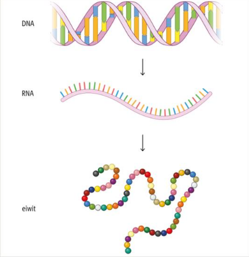

Invloed van de omgevingsfactoren:

## 1.2 De bouw van DNA en RNA
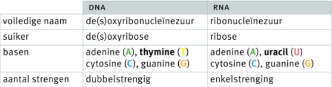

## Eiwitsynthese: van DNA naar eiwit
**Eiwitsynthese** = aanmaak van eiwitten door gebruikmaking van de info van een gen
- In meerdere stappen
- Op meerdere plaatsen in de cel
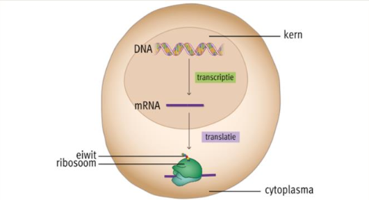

### A. Transcriptie
- In de kern 
- DNA wordt geopend
- RNA - polymerase: synthetiseert een complementaire RNA-streng
- Resultaat: **mRNA**
- mRNA verlaat de kern en gaat naar cytoplasma

### B. Genetische code
- Eiwitten = **aaneengeschakelde aminozuren**
- 3 opeenvolgende nucleotiden = **codon**
- Bijvoorbeeld: UGC = Cytosine

Codon:
- Start/stopcodon
- Elk codon = één aminozuur

Genetische code:

### C. Translatie

- In cytoplasma
- tRNA bindt met zijn **anticodon** aan het codon op mRNA
- Anticodon van tRNA:
    - Heeft 3 nucleotiden
    - Verbindt met codon van mRNA
    - Brengt aminozuur naar ribosomen
- Ribosomen: zijn verantwoordelijk voor eiwitsynthese

Transcriptie- en translatieproces:
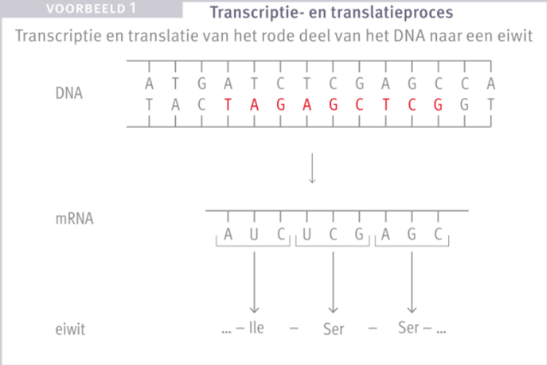

---

# 2. Veranderingen in het erfelijk materiaal
Ontwikkeling van een individu: nature en nurture

**Nature**: aangeboren eigenschappen en genetische factoren
**Nurture**: omgevingsinvloeden waaraan een individu wordt blootgesteld

## 2.1 Omkeerbare veranderingen in het genetische materiaal
Modificaties: **identiek genotype**, maar **variaties in het fenotype** die het resultaat zijn van **omgevingsfactoren**
- Omkeerbaar: makkelijk of heel traag
- Overerfbaar:
    - Niet
    - Indien wel: epigenetische modificaties

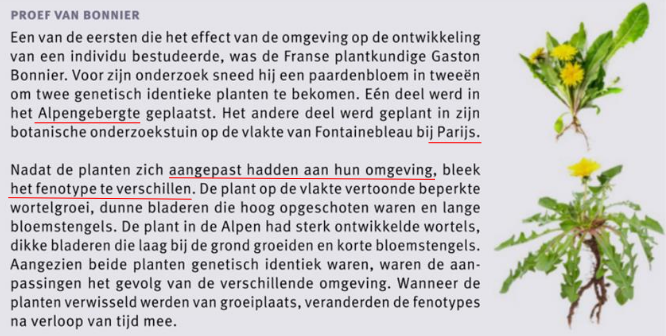

**Epigenetica**:
- Veranderingen in genexpressie zonder wijzigingen in DNA
- Als reactie op omgevingsinvloeden (voeding, stress, chemicaliën, levensstijl)
- Wel overerfbaar
- Opvouwing van DNA = beinvloedt genexpressie
    - Sterk gecondenseerd = moeilijk toegankelijk
    - Minder gecondenseerd = makkelijker toegankelijk

## 2.2 Mutaties
- Niet-omkeerbare verandering in DNA
- Erfelijk
- Neemt toe met de ouderdom

Effecten:
- Niet merkbaar
- Onschadelijke ziekten
- Ontwikkelingsproblemen
- Kanker

Spontane mutaties:
- Tijdens DNA-replicatie

Oorzaken van geïnduceerde mutaties:
- **Chemisch**: asbest, alcohol, sigarettenrook
- **Fysisch**: UV-, röntgen- en gammastraling
- **Biologisch**: virussen, bacteriën, schimmels

Mutaties in de voortplantingscellen: erfelijk
Mutaties in lichaamscellen: niet erfelijk, wel invloed op organisme

Variaties:
- Genmutaties
- Chromosoommutaties
- Genoommutaties

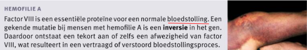

### Genmutaties:
- Verandering van één of meer nucleotiden
- Meestal maar één gen geaffecteerd = één eiwit
- Één nucleotide die wijzigt = puntmutatie

Variaties:
- Substitutie
- Inversie
- Insertie
- Deletie

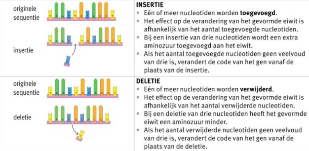

Puntmutatie:
- Kan ernstige gevolgen hebben

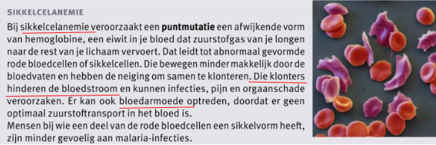

### Chromosoommutaties:
- Verandering van een deel van het chromosoom
- Deletie
- Inversie
- Translocatie

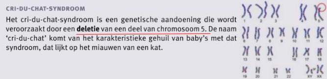

### Genoommutaties:
- Wijziging aantal chromosomen
- Vaak ernstige gevolgen
- Meestal niet levensvatbaar

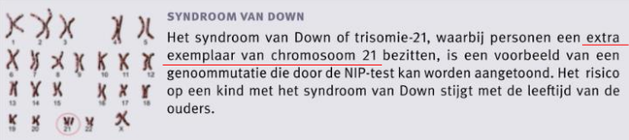

## 2.3 Oorzaken van mutaties
Oorzaken van geïnduceerde mutaties:
A. Chemische factoren
B. Fysische factoren
C. Biologische factoren

### A. Chemische factoren
- Mutagene stof
- Leidt mogelijk tot kanker = carcinogene stof

Voorbeelden:
- Asbest
- PAK's of polyaromatische koolwaterstoffen
- Teer, nicotine, ammoniak uit sigaretten en vapes
- ...

### B. Fysische factoren
- Straling: UV-, röntgen-, gammastraling

### C. Biologische factoren
- HPV = **virus** dat baarmoederhals kan infecteren
- Helicobacter pylori = **bacterie** dat slijmvlies van maagwand kan infecteren
- Aspergus flavus = **schimmel** op pinda's, maïs ...

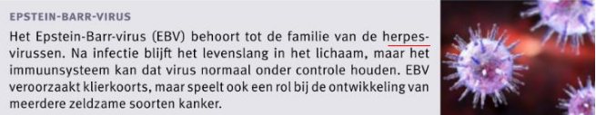

---