# Biomoleculen
---
# 1. Biochemie
## 1.1 Atomen in levende organismen
- Biochemie: chemie achter biologische processen
- We starten vanuit ons lichaam
- 4 meest vooorkomende elementen:
    - Koolstof, waterstof, stikstof
    - Mineralen (Ca, Fe, Cl ... Pb, As)
- Binden tot anorganische en organische moleculen

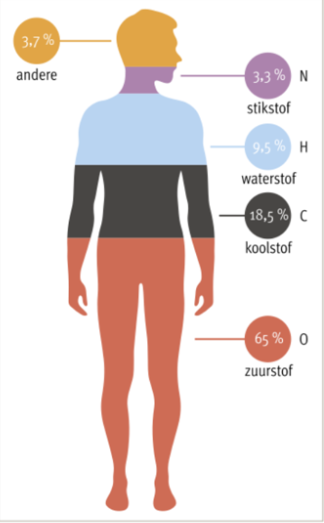

## 1.2 Anorganische moleculen in levende organismen
- H₂O: Meest voorkomende: 65%
- O₂, CO₂, zuren, basen, zouten
- Wateroplosbaar of hydrofiel, polair
- Niet of slecht wateroplosbaar: hydrofoob, apolair
- Voorbeeld?
- Functie water in het lichaam?
    - Transport (bloed), warmteregulatie, afvoer van afvalstoffen, stevigheid plantencellen ...

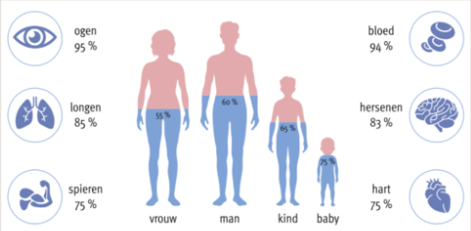

## 1.3 Organische moleculen in levende organismen
**Koolstof**:
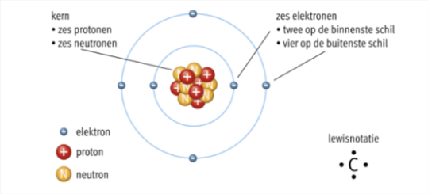

**Koolwaterstoffen stofklassen**:
- Alkanen 
- Alkenen
- Alcoholen
- Ethers
- Carbonzuren
- Esters

**Alkanen en Alkenen**:
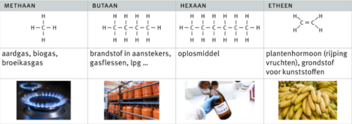

**Alcoholen**:
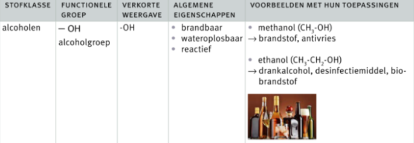

**Ethers, Carbonzuren en Esters**:
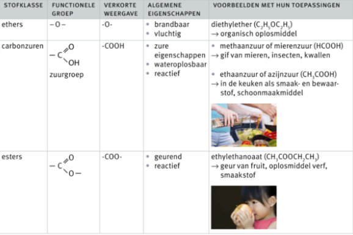

**Koolstofverbindingen**:
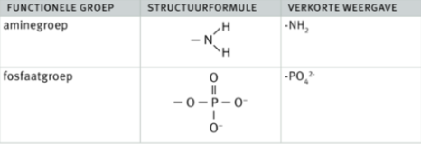

Organische stoffen door levende organismen aangemaakt = biomoleculen

Kunstmatig aangemaakt = kunststoffen

# 2. Sachariden
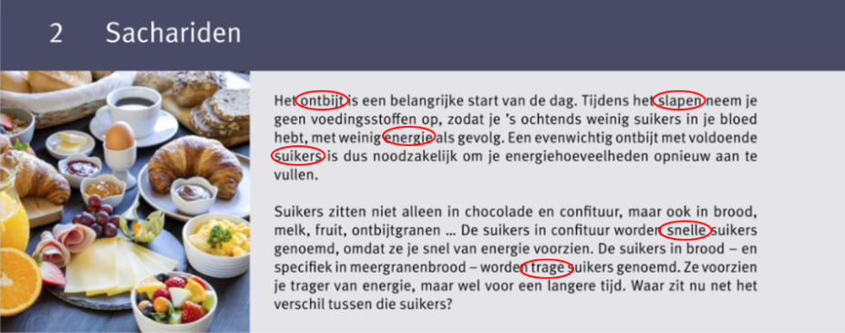

## 2.1 Functies van sachariden
- Sachariden - koolhydraten
- Suikers?

- Directe energiebron
- Reservestof voor energieproductie
- Bouwstoffen voor structuur en stevigheid in plantencellen (cellulose)
- Bouwstoffen voor het genetische materiaal (DNA)

## 2.2 Soorten sachariden
- Monosachariden - eenvoudige suikers (glucose, fructose)
- Disachariden - twee suikers (sucrose, lactose, maltose)
- Polysachariden - lange ketens (zetmeel, glycogeen, cellulose)

## 2.3 Monosachariden
- Enkelvoudige suikers, snelle suikers
**Glucose: C₆H₁₂O₆**

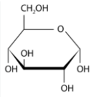
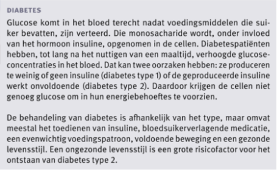

**Glucose - fructose: C₆H₁₂O₆:**
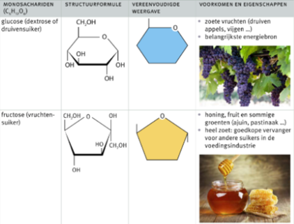

## 2.4 Disachariden
- **C₁₂H₂₂O₁₁**
- 2 monosachariden: **C₆H₁₂O₆ + C₆H₁₂O₆ -> C₁₂H₂₂O₁₁ + H₂O**

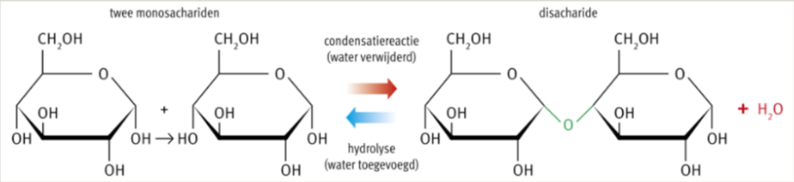
 - Twee monosachariden
 - Condensatiereactie vs hydrolyse
 - Glycosidebinding

 - Voorbeelden:
    - Sucrose: kristalsuiker uit suikerriet en suikerbiet
    - Lactose: melksuiker uit melk en melkproducten
    
**TER INFO - NIET KENNEN**:
- **CₙH₂ₙOₙ**
- Maltose: moutsuiker uit bierbrouwen en producttie van alcohol  
- **Peking Duck**:
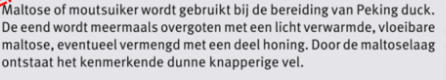

## 2.5 Polysachariden
- 10 tot 1000'en gebonden monosachariden
- Condensatiereacties - polymerisatie - biopolymeer
- Zetmeel - glycogeen - cellulose
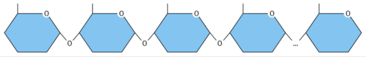

**Zetmeel**:
- Energieopslag in planten 
    - Aardappelen en maïs
    - Bindmiddel
    - Trage suiker

**Glycogeen**:
- Dieren - reserve
    - Spieren en lever
    - Sterk vertakt - snel vrijmaken

**Cellulose**:
- Planten - celwand
    - Lange, lineare ketens
    - Onderling verbonden - extra stevig
    - Structuur, stevigheid, bescherming

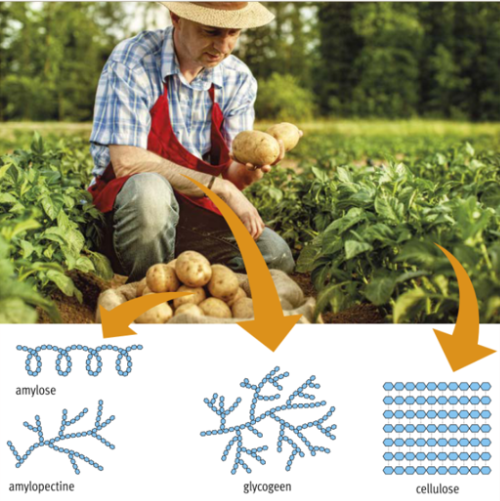

**TER INFO - NIET KENNEN**:
- Amylose + amylopectine
- **Voedingsvezels**:
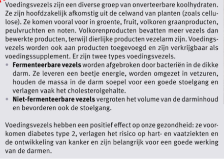

# 3. Lipiden
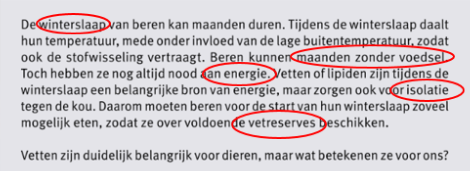

## 3.1 Functies van lipiden
- Triglyceriden:
    - **Energieopslag** = reserve
    - Thermische **isolatie** bij dieren
    - Bescherming tegen uitdroging
    - Bescherming van organen en gewrichten
    - Waterafstotende eigenschappen van de vacht en veren van dieren

- Fosfolipiden:
    - Bouwstenen voor de opbouw van **celmembraan**

- Steroïden:
    - Beweeglijkheid van membranen
    - **Hormonale regeling** van het lichaam

- (Vitaminen)

## 3.2 Triglyceriden
- Glycerol +  3 vetzuren
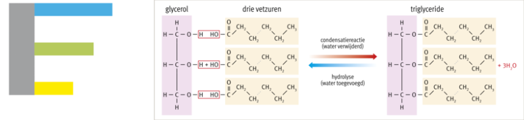

**Verzadigd**:
- Enkelvoudig, goed stapelbaar, vast
- Dierlijke vetten, cacaoboter, kokosvet
- Ongezond

**Onverzadigd**:
- Dubbele binding(en), knik, niet goed stapelbaar, vloeibaar
- Plantaardige oliën, vis
- Gezond

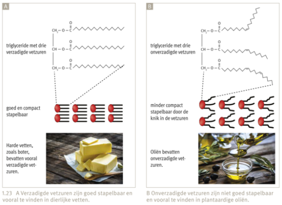

- Waarom is het eten van (te) veel verzadigde vetzuren ongezond?
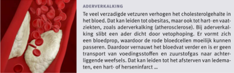

- Waarom is het eten van onverzadigde vetzuren wel gezond?
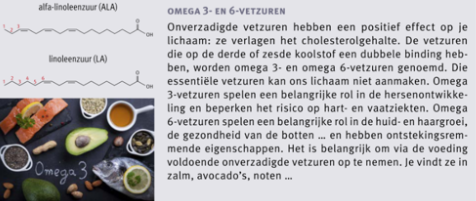

## 3.3 Fosfolipiden
- Glycerol + 2 vetzuren + 1 negatief geladen fosfaatgroep en klein organische polaire molecule

=> hydrofiele kop + hydrofobe staart

= celmembraan

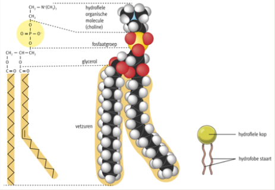

**TER INFO - NIET KENNEN**:
- **Lecithine**:

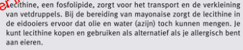

## 3.4 Steroïden
- 4 koolstofringen + functionele groep
- Hoofdzakelijk een hormonale werking
- Gevormd vanuit cholesterol
- Geslachtshormonen
    - Testosteron
    - Progresteron
    - Oestrogeen
    
**TER INFO - NIET KENNEN**:
- Anabole steroïden
- Katabole steroïden

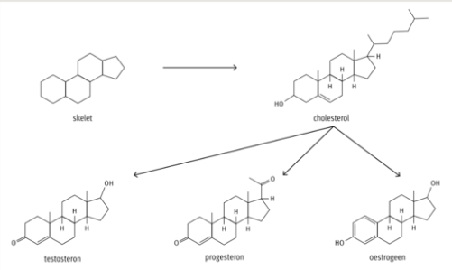

## 3.5 Vitaminen
- Vita en amine -  essentieel - tekort aan vitaminen
- Niet of slechts in beperkte mate in staat zelf vitaminen aan te maken
- Essentiële voedingsstoffen
- Vetoplosbare vitaminen
- Wateroplosbare vitaminen

- Belangrijk tijdens zwangerschap = **foliumzuur**

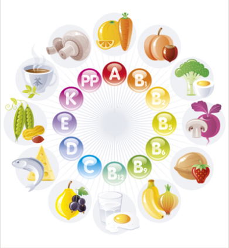

# 4. Proteïnen
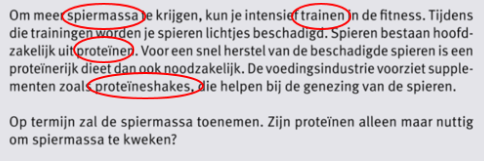

## 4.1 Functies vana proteïnen
- Zeer diverse groep biomoleculen - in alle levende organismen
- **Bouwstoffen**: stevigheid van de huid, de nagels en het haar (keratine)
- Beweging door **spiersamentrekkingen** (actine en myosine)
- Waarneming van prikkels en signalen (foto-, thermo- en chemoreceptoren)
- Transport van moleculen (hemoglobine)
- Regeling van het glucosegehalte in het bloed (**insuline**)
- Versneller van chemische reacties (**enzymen**)
- Afweer en immuniteit
- ...

## 4.2 Aminozuren
- **Bouwstenen** of monomeren: aminozuren
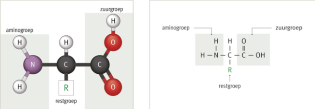

- Restgroep: 20 varianten - **20 aminozuren**
    - 11 door lichaam geproduceerd
    - 9 essentiële - via voeding

    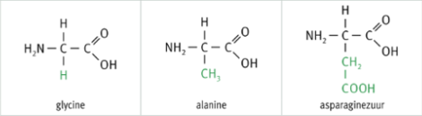

**TER INFO - NIET KENNEN**:
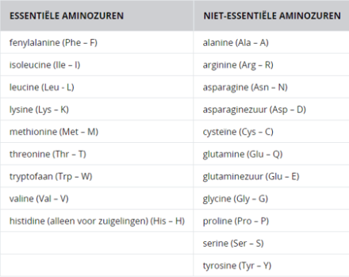

## 4.3 Peptiden
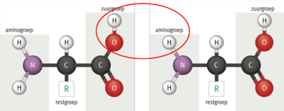
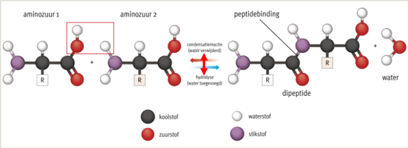

**TER INFO - NIET KENNEN**:
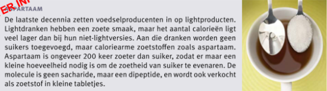

## 4.4 Structuur van polyypeptiden

- Tripeptide - oligopeptide - polypetide: kan tot duizenden aminozuren bevatten!
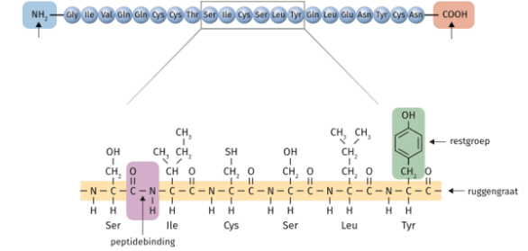

- Structureren: 
    - Primair en secundair:
    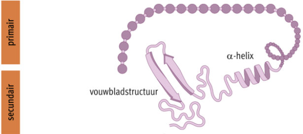

    - Tertiair:
    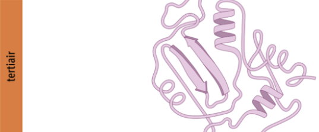

    - Quaternair:
    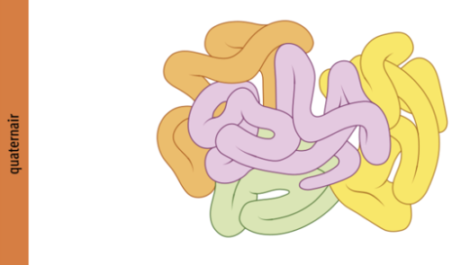

## 4.5 Denaturatie
- Verlies van structuur en functie door hoge termperatuur, pH of beweging

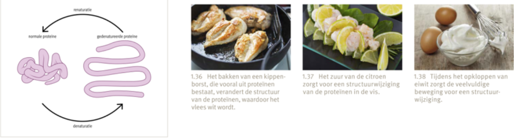

## 4.6 Belang en voorkomen van enzymen
- Enzymen zijn **biokatalysatoren**
- Versnellen reacties: afbraak of vorming van producten
- Via **sleutel-slotprincipe**

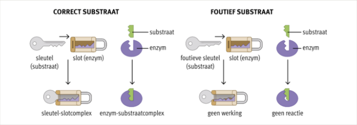

- Naamgeving enzymen
- Amyl**ase** - afbraak van amylose
- Lact**ase** - afbraak van lactose
- Ook opbouw!

- Werking wordt beïnvloed door:
    - Temperatuur
    - Zuurgraad
    - Concentratie van enzym of substraat
    - Aanwezigheid van andere stoffen die werking van enzym verbeteren of blokkeren

---