# Natuurwetenschappen - Examen 1

---

## Evolutie

### Lamarckisme

- Wet van gebruik en ongebruik
- Organismen worden groter en dit is overerfbaar

### Darwinisme

- Ontdekkingsreis met schip **Beagle**
- **Variatie** binnen een populatie
- Struggle for life:
  - Concurrentie tussen soortgenoten
- Teveel nakomelingen
- **Survival of the fittest**
- **Natuurlijke selectie**:
  = Individuen met eigenschappen die beter aangepast zijn aan de omgeving hebben een grotere kans om te overleven en zich voort te planten. Hun gunstige eigenschappen worden zo doorgegeven aan de volgende generatie.

  #### 3 voorwaarden:

  1. Fenotypische en genotypische variatie moet aanwezig zijn in de populatie
  2. Deze variatie moet leiden tot verschillen in reproductief succes
  3. Deze variatie moet doorgegeven worden aan de volgende generaties

  - **Selectie door predatie**:

    - Populaties die leven op rotsen, zijn eerder donker
    - Populaties die leven op zandgrond, zijn eerder wit

  - **Fitness**:
    Aantal overlevende nakomelingen per individu - Individuen die meer nakomelingen laten -> Fitness omhoog

  #### Hangt af van verschillende factoren:

  - Survival of the fittest
  - Reproductief succes
  - Variatie in aantal nakomelingen per paring

  #### 1. Darwinvinken:

  - 31 vogels op de **Galapagos**-eilanden

  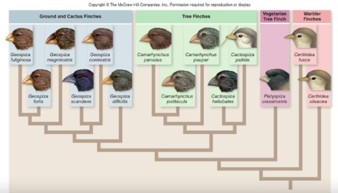

  - 14 nauwverwante soorten, enkel verschillend in **de vorm van de bek**
  - Vorm van de bek hangt samen met he type voedsel -> natuurlijke selectie - Grote, harde zaden -> Grote, sterke bek - Kleine zaden en insecten -> Kleine, fijne bek
    -> **Adaptieve radiatie**

  #### 2. Industrieel Melanisme

  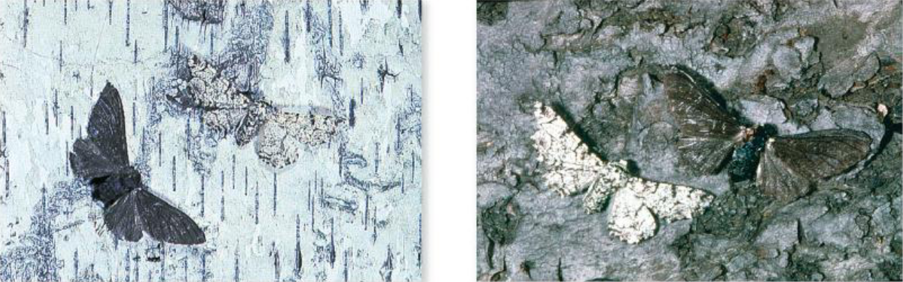

  - Tot 1850 waren donkere berkenspanners zeldzaam
  - Vanaf toen steeg de hoeveelheid donkere berkenspanners in de populatie tot ± 100%  
    -> Waarom? - Populatie wordt donkerder door **industrie** - Door de fabrieken werd de witte schors van berken bedekt met roet - Witte berkenspanners werden beter waargenomen en verdwenen door predatie
  - Dankzij pollutiecontrole zijn berken tegenwoordig wit

  #### 3. Artificiële selectie

  - Verandering door **mens**elijke inmenging  
    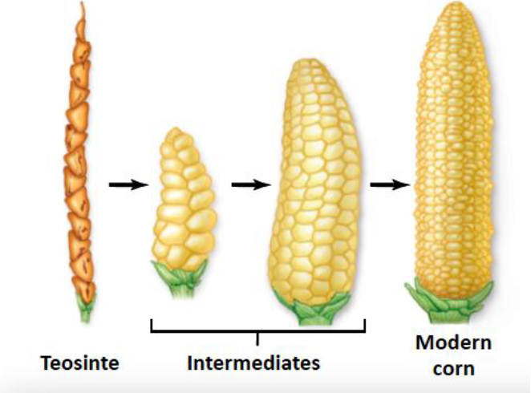
    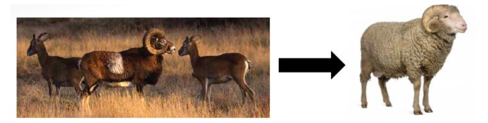
    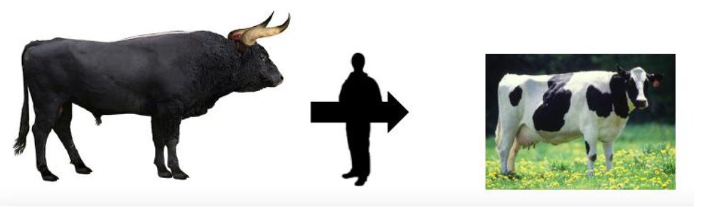

  #### Domesticatie:

  - **Honden**:
    - Windhonden -> snelheid
    - Teckels -> dassenjacht
    - Herdershonden -> herden  
      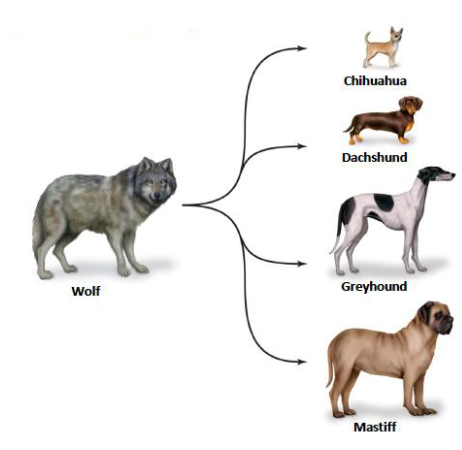
  - **Katten**:
    - Geschikter als huisdier  
      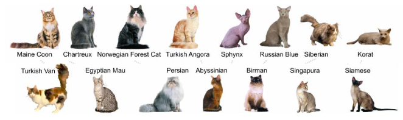

  #### Criticasters evolutietheorie

  **Intelligent Design (ID)**:
  Pseudowetenschap 
  "We zijn te complex om willekeurig te zijn ontstaan" 
  -> Intelligente ontwerper

  **Kritiek** 
  - Wie heeft de ontwerper gemaakt? 
  - Geen empirisch bewijs voor een "intelligente ontwerper"

  Wel empirisch bewijs voor evolutietheorie

---

### Hardy-Weinberg principe

#### 5 drijvende krachten achter veranderingen:

1. Mutatie  
   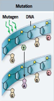

2. Genoverdracht  
   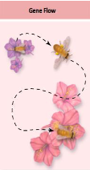

3. Onwillekeurige paring  
   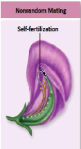

4. Genetische drift    
   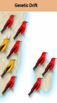

5. Selectie    
   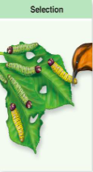

---

### 3 domeinen, 6 rijken

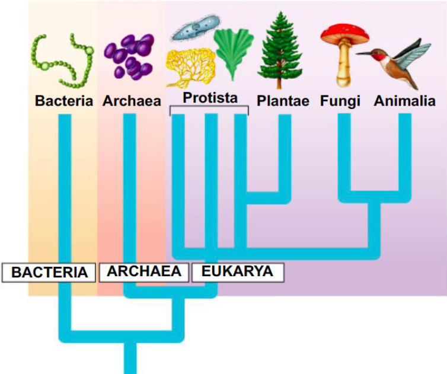
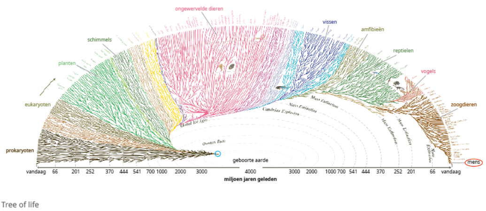

---

### Argumenten voor evolutie

#### **Evolutie**:

- het proces van het geleidelijk veranderen van een soort van generatie op generatie in de loop van de tijd
  - dezelfde **biologische soort** als ze onderling in natuurlijke omstandigheden vruchtbare nakomelingen kunnen krijgen
  - een **populatie**:
- Via de evolutietheorieën is aangetoond dat alle soorten op aarde ontstaan zijn uit andere soorten. Die evolutionaire verwantschap tussen alle soorten organismen kan weergegeven worden in een stamboom: de **tree of life**.
  - relaties tussen de biologische soorten en hun gemeenschappelijke voorouders getoond.
  - takken in de tree of life stellen bestaande en uitgestorven biologische soorten voor
  - op elk knooppunt of elke vertakking staat een gemeenschappelijke voorouder
  - één gemeenschappelijke voorouder, oercel, zo’n 3,8 miljard jaar geleden

---

### Paleontologie

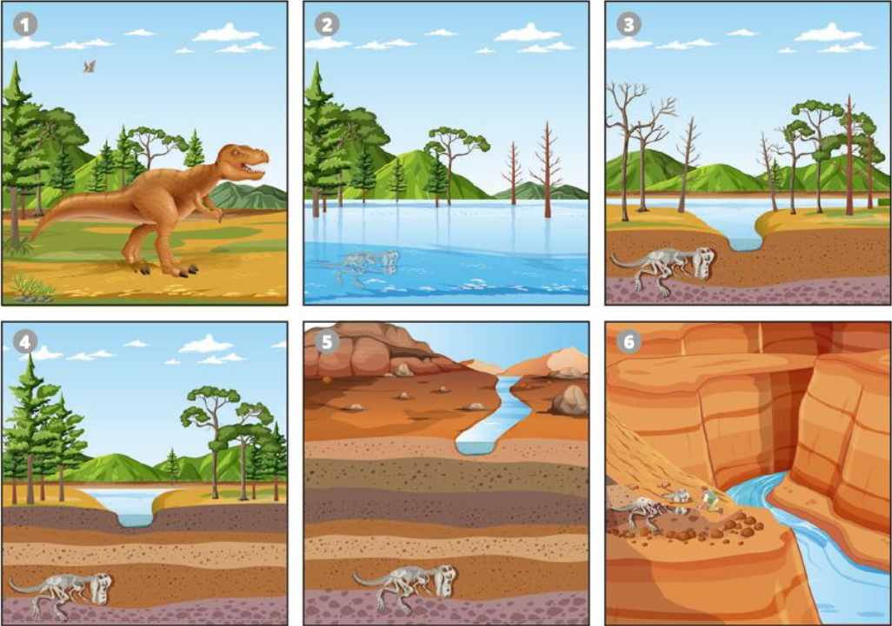

**Paleontologie** is de wetenschapstak die **fossielen** bestudeert. 
- **fossielen**: - overblijfselen van organismen - natuurlijke manier bewaard - beeld van evolutie - gegevens vergelijken met elkaar en met hedendaagse soorten

- **fossilisatie**: - het ontstaan van fossielen is een **zeldzaam** proces, omdat een organisme na zijn dood vaak volledig vergaat tot er niets meer van overblijft. - **verstenen**: dood organisme wordt bedekt met slib of zand - verstenen tot amber of barnsteen: organisme kwam vast te zitten in hars

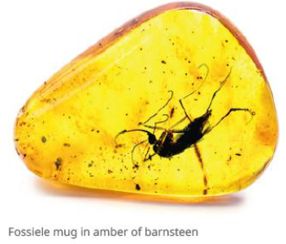
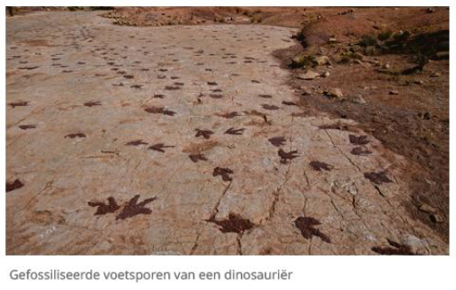

#### dateringsmethoden

- ouderdom van de geologische laag waarin het fossiel wordt gevonden
- **het verval van radioactieve isotopen**: 
    - isotopen zijn atomen van hetzelfde chemische element en bezitten dus hetzelfde aantal protonen, maar hebben een ander aantal neutronen in de kern
    - sommige isotopen hebben een instabiele kern -> **radioactief verval**
    - vergelijk de hoeveelheid van een bepaald radioactief isotoop in het fossiel met de hoeveelheid in een ander fossiel of levend organisme

voorbeeld: koolstofdatering of 14C-datering
- stabiel: 12C
- onstabiel: 14C
- levende organisme: constante 14C/12C verhouding
- dood organisme: opname koolstof stopt en 14C heeft radioactief verval
- 14C/12C bepalen en ouderdom ongeveer afleiden

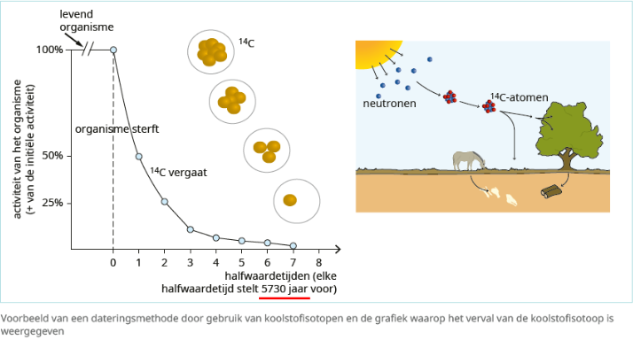

argument voor evolutie: **fossiele overgansvormen**
- fossielen die kenmerken van twee afzonderlijke, verwante 
dierengroepen bevatten
- voorbeeld: **Archaeopteryx** (1861 in Beieren)
    - huidige vogels stammen af van de uitgestorven dinosauriërs (reptielen)  
        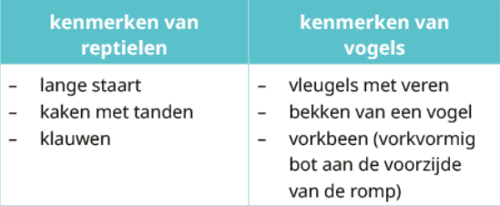
- een fossiele overgangsvorm bevat primitieve kenmerken in vergelijking met modernere,verwante levensvormen
- markeren cruciale stappen in de evolutie van organismen

    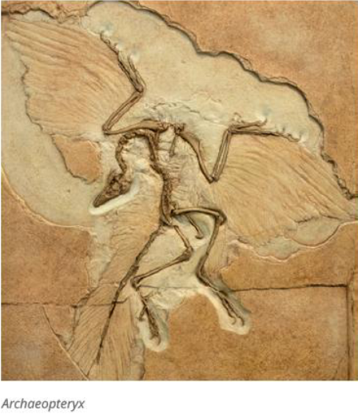

- voorbeeld: **Ichthyostega**
    - van vis naar amfibie
    - dierlijk leven op land werd mogelijk

    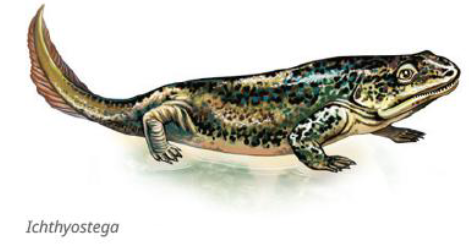

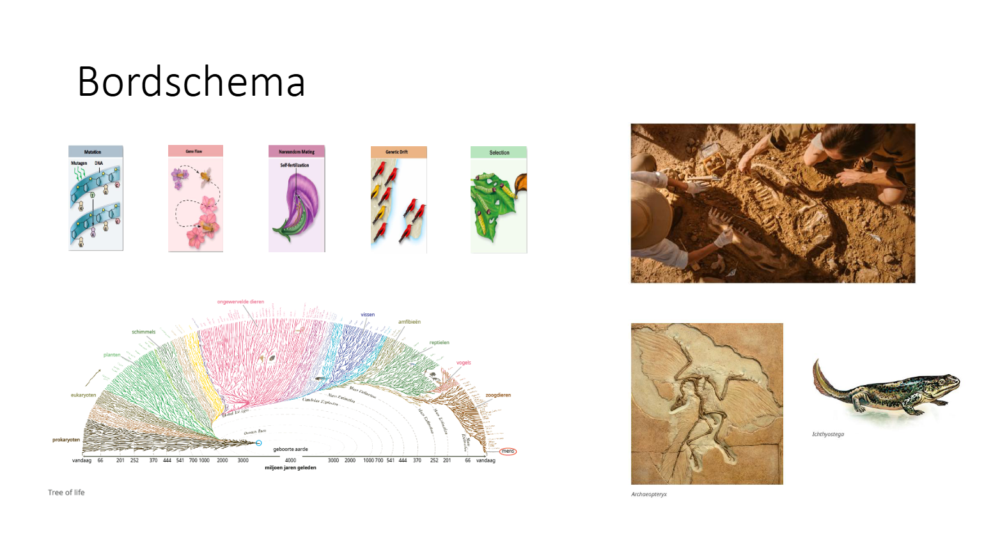

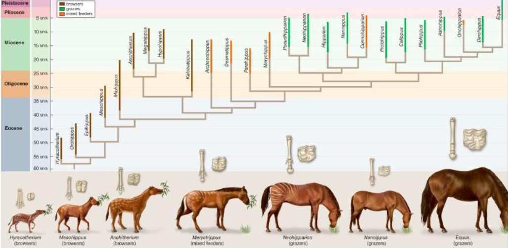

#### **Evolutiereeks**:
verschillende fossielen van verwante soorten
- fossielen rangschikken van oud naar jong
- voorbeeld: paardachtigen
    - de **gestalte** evolueerde van klein naar groot 
    - het aantal **vingers** evolueerde van vier naar één, waarbij een hoef ontstaat
    - het **tandoppervlak** evolueerde van knobbelig naar ribbelig en werd groter
    - primitieve paarden: in wouden en waren bladeters
    - huidige paarden: in grasvlakten of steppen en zijn graseters

- andere evolutiereeksen
    - zeezoogdieren
    - hondachtigen
    - olifantachtigen
    - huisjesslakken

- 'missing links'
    - ontbreken van bepaalde schakels
    - gebruikt door tegenstanders van de evolutietheorieën
    - fossilisatie is een zeldzaam proces, evolutiereeksen kunnen daardoor onvolledig zijn

---

### Embryologie
voorbeeld: **embryonale ontwikkeling** van verschillende gewervelde diersoorten
- aanleg voor **kieuwbogen** en **kieuwspleten**
    - vissen ontwikkelen functionele kieuwen
    - bij de rest verdwijnt de kieuwaanleg

- ontwikkeling van een **staart**
    - mens: eerste maand wel nog een staart en later verdwijnt de staart en blijft enkel een staartbeentje over

- hoe ouder het embryo, hoe groter de verschillen
- de overeenkomsten in het begin zijn een bewijs dat al deze diersoorten een **gemeenschappelijke voorouder** hebben

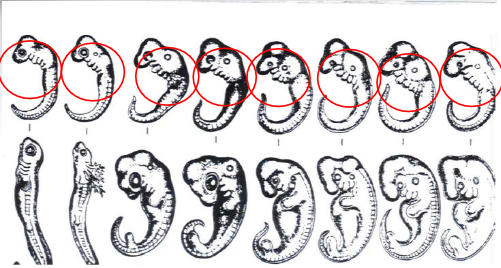

---

### Vergelijkende anatomie
voorbeeld: beenderen van de ledematen van gewervelde dieren
- hetzelfde bouwplan
- aangepast aan de levenswijze van het dier
- de overeenkomsten in het bouwplan zijn een bewijs dat deze diersoorten een **gemeenschappelijke voorouder** hebben

#### **homologe organen**
organen die op dezelfde manier ontstaan zijn, maar 
een verschillende functie hebben

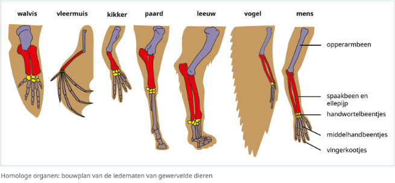

#### **rudimentaire organen**
organen die hun functie verloren hebben
- nu: niet meer gebruikt en minder ontwikkelt
- vroeger: wel nog een functie in een gemeenschappelijke voorouder
- voorbeelden bij de mens
    - staartbeentje
    - lange handpalmspier (vroegere functie: om te klimmen)
    - oorspieren
    - wijsheidstanden (vroegere functie: groter kauwoppervlak voor rauw voedsel)
    - lichaamsbeharing
    - knipvliesje aan de ogen
    - ...

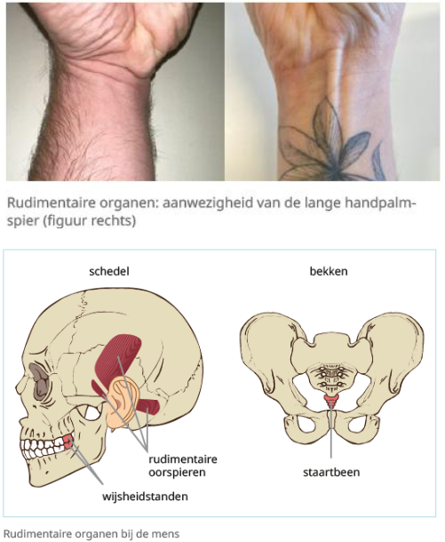

voorbeelden bij andere dieren 
- bekkengordel met heupbeen en dijbeen bij walvissen
    - vroegere functie: voorouders van zeezoogdieren leefde op het land
- uitlopers van poten bij slangen
    - voorouders hadden poten

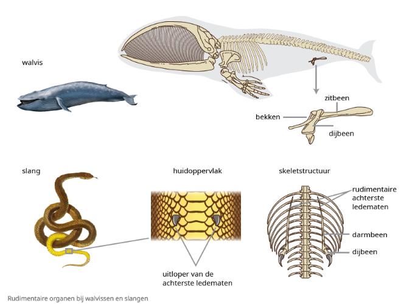

---

### Geologie
- vroeger was de algemene opvatting
    - 'intelligent designer'
    - aarde maar 6000 jaar oud

#### **platentektoniek**
- **de beweging van aardplaten**
    - bergen, vulkanen en troggen in oceanen ontstaan
    - erosie en sedimentatie -> ° valleien en rivieren
    - aardoppervlak verandert 
    -> soorten moeten mee veranderen om te overleven

- geologische onderzoek
    - aarde is 4,54 miljard jaar oud
    - isotopisch onderzoek van meteorieten

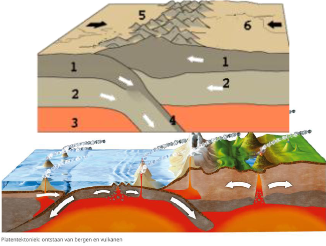

- verschillende argumenten voor evolutie
    - fossiele schelpen in het Andesgebergte -> vroeger een oceaan
    - haaientanden in Antwerpen -> vroeger een zee

- veranderingen van het aardoppervlak verlopen heel traag, waardoor veranderingen amper waar te nemen zijn
- Darwin gebruikte dit principe: **soorten veranderen heel traag**, waardoor **veranderingen amper tot niet waarneembaar** zijn

---

### Biogeografie
- loopvogels terug te vinden in Zuid-Amerika, Afrika, Zuidoost-Azië en Australië

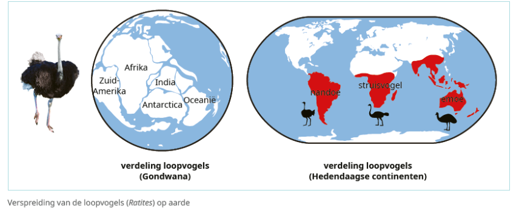

#### **biogeografie**
de studie van het verspreidingsgebied van soorten organismen op aarde
- paarden komen oorspronkelijk uit Noord-Amerika
    - fossielen van voorouders worden daar teruggevonden

- loopvogels terug te vinden in Zuid-Amerika, Afrika, Zuidoost-Azië en Australië
verklaring door de platentektoniek - **continentendrift**
    - 250 miljoen jaar geleden: Pangea
    - aardplaten gaan uit elkaar en twee continenten ontstaan: Laurazië en Gondwana
    - 50 miljoen jaar geleden: huidige continenten ontstaan

loopvogels vroeger op Gondwana, nu op de continenten die daaruit zijn ontstaan

- buideldieren en eierleggende zoogdieren
    - overal in Pangea buideldieren
    - in Laurazië ontstonden later placentale zoogdieren
    - beter aangepast en concurreren met buideldieren
    - buideldieren sterven uit behalve in Australië, eerder afgescheurd en geen concurrentie in Australië

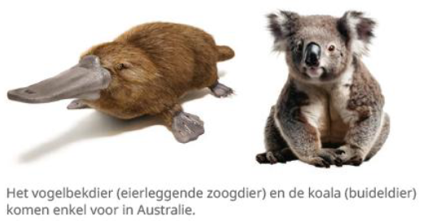
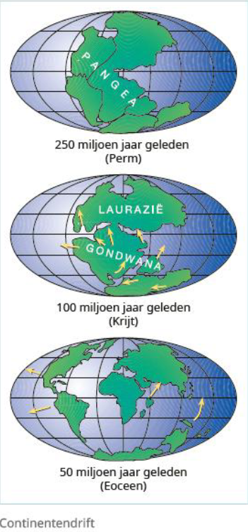

verspreiding van fossielen
- verspreid over continenten
- heel specifieke strook van het continent
- verklaring door de oorspronkelijke vorm van de continenten
    - fossielen van een uitgestorven varensoort worden teruggevonden in Zuid-Amerika, Afrika, India, Australië en Antarctica, vroeger een aaneensluitende zone
    - jaguar in Zuid-Amerika en luipaard in Afrika en Azië
    - neusapen uit Borneo verwant met soorten in Afrika en Zuid-Amerika

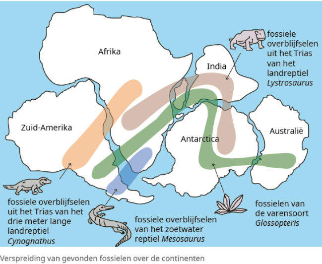

---

### Biochemie en moleculaire biologie
voorbeeld: zeehonden zijn meer verwant met wasberen en stinkdieren dan met honden

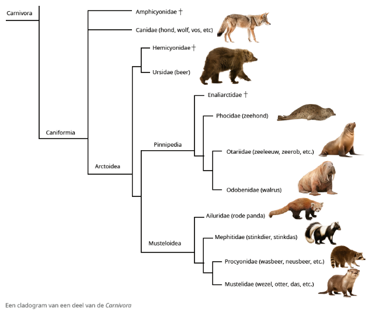

- **eiwitten** op dezelfde manier opgebouwd uit 20 aminozuren
- **universele genetische code**: codons coderen voor dezelfde aminozuren
- opbouw van **eiwitsynthese** gebeurt op dezelfde manier door transcriptie en translatie
- **ATP** is een energieleverende molecule en is in alle organismen aanwezig

-> biochemische gelijkenissen in alle organismen: aanwijzing voor het ontstaan van het leven uit één oercel

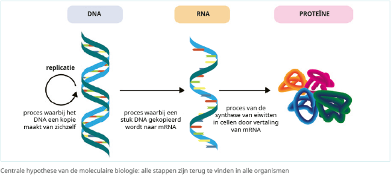

verwantschap tussen verschillende soorten
- aminozuursequenties van verschillende eiwitten vergelijken
- basensequenties van DNA vergelijken en analyseren
    - hoe meer nucleotiden verschillen, hoe minder de soorten met elkaar verwant zijn
    - gemeenschappelijke voorouder heeft langer geleden geleefd

- vroeger stambomen op basis van morfologische verschillen
- nu stambomen op basis van moleculaire gegevens

#### **cladogram**
- computerprogramma’s verwerken basensequenties van 
verschillende soorten
- reconstructie van verwantschap tussen verschillende organismen op basis van genetische eigenschappen
- hoeveelheid vertakkingspunten geeft een beeld van verwantschap
- soorten A en B zijn meer verwant dan soorten A en C

---

### Ecologie en ethologie
#### **antibioticaresistentie**
- sommige bacteriën overleven antibiotica
- nieuwe populatie bacteriën die resistent zijn voor een bepaald antibioticum ontstaan

gelijkaardig is de resistentie van insecten en 
onkruiden tegen pesticiden

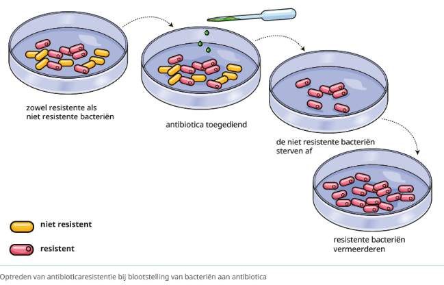

blinde holenvis
- voorkomen: Mexicaanse grotten zonder licht en weinig voedsel
- de vis heeft geen ogen, omdat ze geen functie hebben
- ogen zouden een energieverspilling zijn
- verwanten holenvissen met ogen
    - in Mexico waar wel licht is

---

