# Engels - Examen 1

---

# Unit 1

---

## Vocabulary

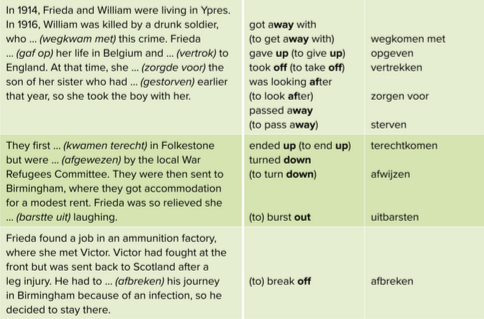
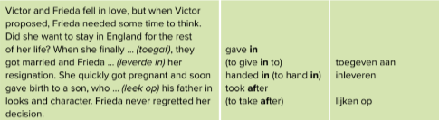

---

## Grammar

### The Present Simple Tense
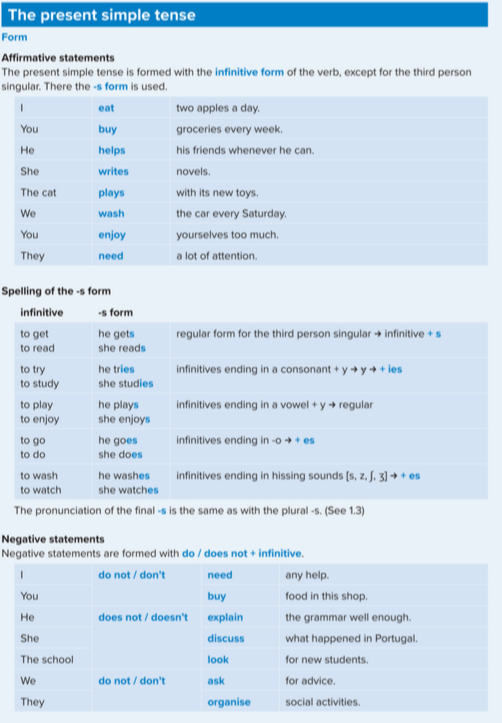
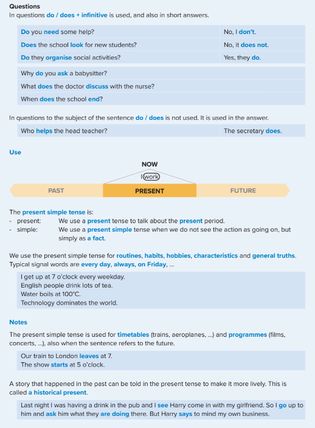

### The Present Continuous Tense
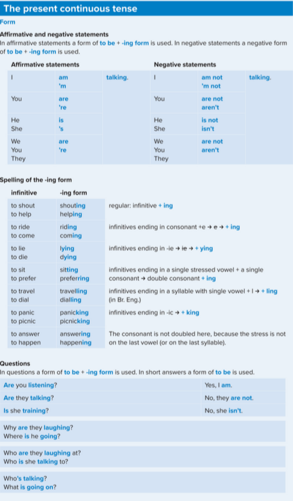

### The Past Simple Tense

### The Past Continuous Tense
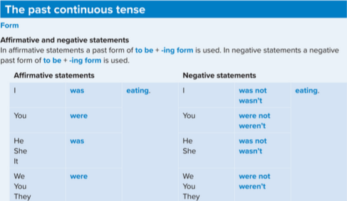

### The Present Perfect Tense
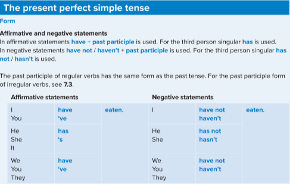
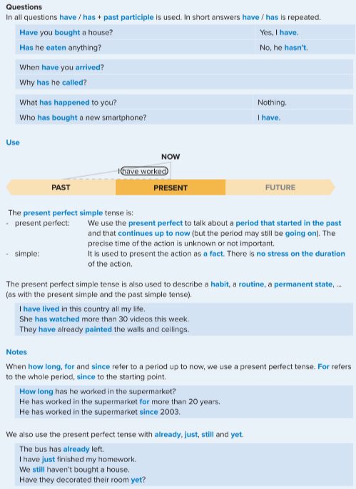

### The Future Simple Tense

### The Past Perfect Simple Tense

### The emphatic use of to do
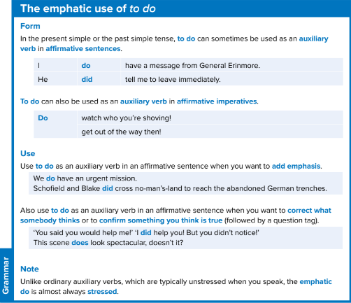

---

# Unit 2 
 
 ---

## Vocabulary
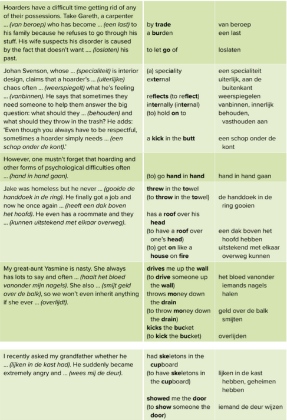

---

## Grammar

### Used To

### Semi-auxiliaries

---

# Unit 3
 
 ---

## Vocabulary
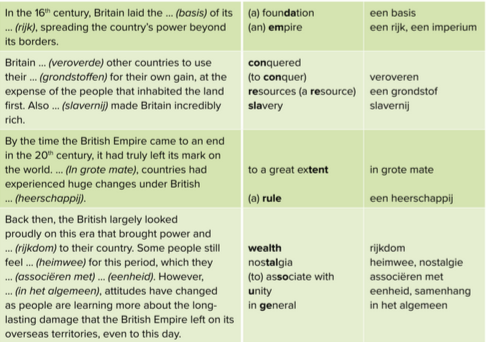
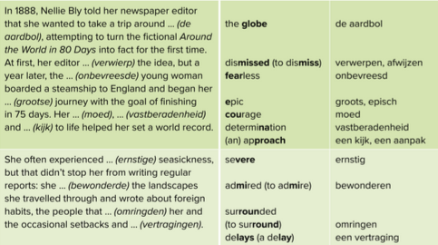
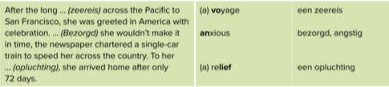

---

## Grammar
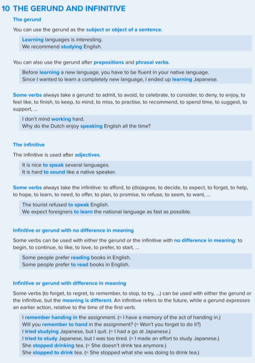

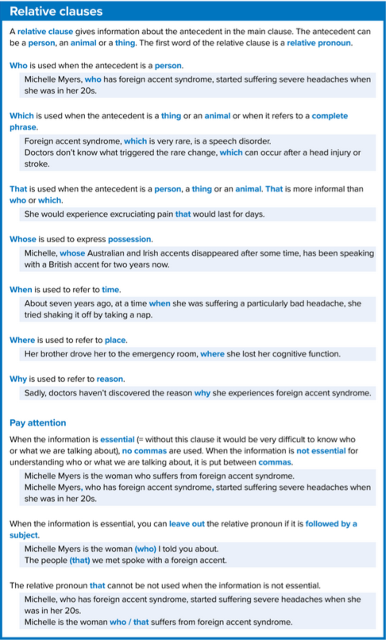

---
